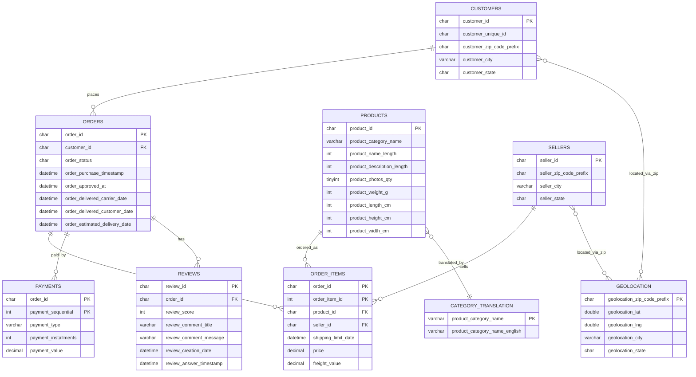

# 数据库设计（Database Design）

> 项目：电商运营管理与智能分析平台
> 对应论文章节：系统设计
> 建表脚本：`data/database_create.sql`

## 1. 数据库分层

| 层 | 用途 | 表 |
|----|------|----|
| raw | 保留原始导入结果 | （原始 CSV，未建库） |
| business | 供业务 API 查询 | customers / orders / order_items / products / sellers / payments / reviews / geolocation / category_translation |
| application | 项目新增业务能力 | inventory / inventory_log / system_user / role / permission / operation_log / ai_analysis（后续开发） |

## 2. 业务表结构

当前已完成 9 张业务表，命名规则 `olist_<表名>_dataset_clean`。

| 表 | 主键 | 关键索引 |
|----|------|----------|
| customers | customer_id | customer_unique_id |
| geolocation | geolocation_zip_code_prefix | — |
| orders | order_id | customer_id、order_purchase_timestamp |
| order_items | (order_id, order_item_id) | product_id、seller_id |
| order_payments | (order_id, payment_sequential) | payment_type |
| order_reviews | review_id | order_id、review_score |
| products | product_id | product_category_name |
| sellers | seller_id | — |
| category_translation | product_category_name | — |

## 3. 字段类型规范

- **ID 类字段**：`char(35)`（哈希字符串，32 位 + 余量）
- **邮编前缀**：`char(5)`（保留前导 0）
- **金额**：`decimal(12,2)`
- **时间**：`datetime`（可空 NULL）
- **州缩写**：`char(2)`
- **城市/类目**：`varchar(40~50)`
- **字符集**：`utf8mb4`

## 4. 索引设计

索引依据实际查询条件，不冗余、不过度：

| 索引 | 服务场景 |
|------|----------|
| customers(customer_unique_id) | 客户归并、复购分析 |
| orders(customer_id) | 客户 → 订单查询 |
| orders(order_purchase_timestamp) | 时间趋势、Dashboard |
| order_items(product_id) | 产品分析 |
| order_items(seller_id) | 卖家分析 |
| order_payments(payment_type) | 支付方式分析 |
| order_reviews(order_id) | 订单 → 评价 |
| order_reviews(review_score) | 满意度统计 |
| products(product_category_name) | 类目分析 |

> 说明：order_items 的 order_id、payments 的 order_id 已被复合主键最左前缀覆盖，不再单独建索引；小表（sellers 3,095 行、geolocation 1.9 万、translation 71）不建；低基数字段（order_status）不建。

## 5. ER 图（Mermaid）

> 渲染方式：将上面代码块复制到 mermaid.live、Typora、或 VS Code（安装 Mermaid 插件）即可生成 ER 图，导出 PNG 放到 `docs/figures/er_diagram.png`。
