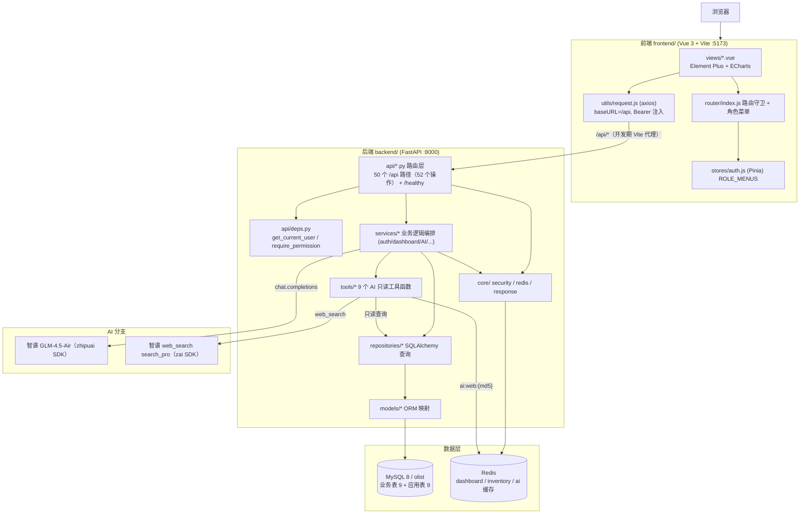
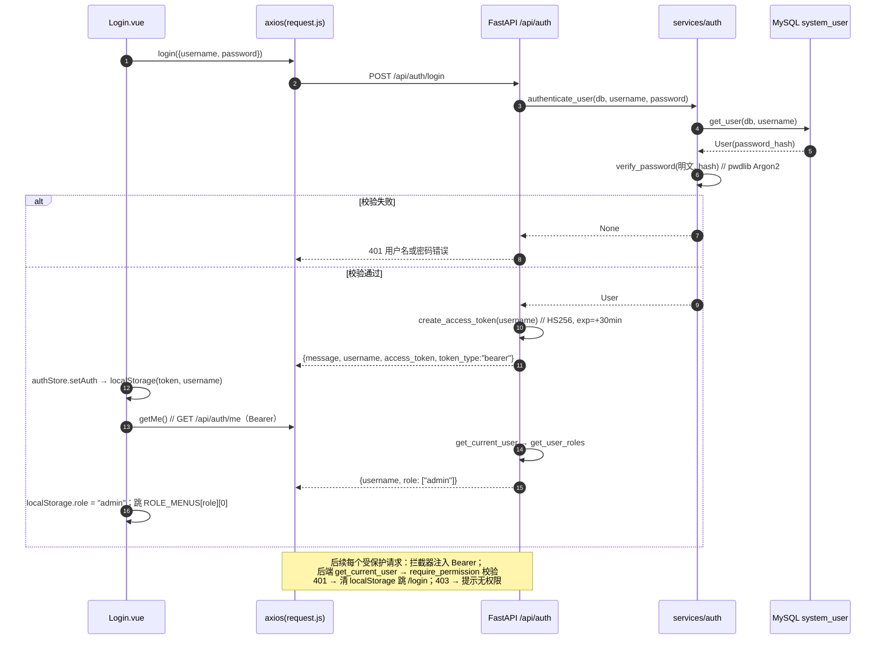
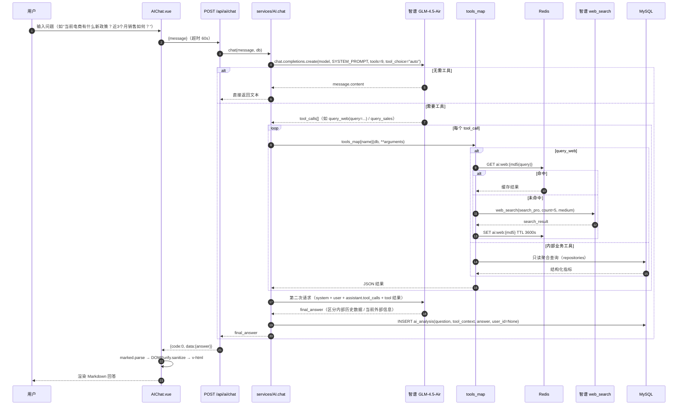
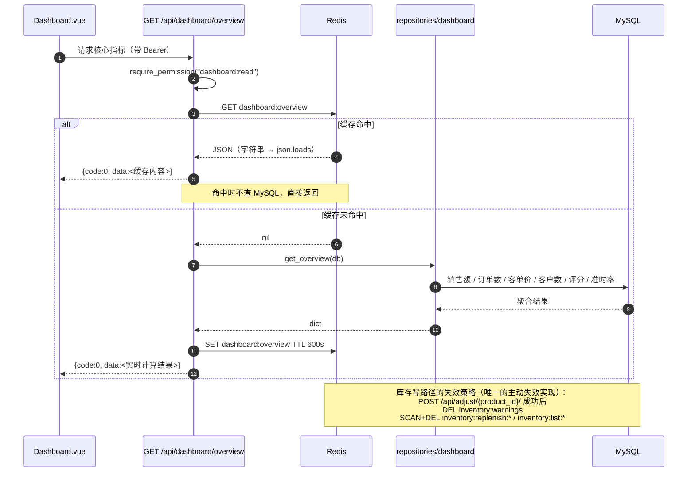

# 系统设计（System Design）

> 项目：电商运营管理与智能分析平台
> 对应论文章节：系统设计与实现
> 依据：项目总蓝图第 4、6、8、9、11、13 章 + 后端 / 前端代码核对
> 原则：架构图、缓存 key、错误码、目录结构均以**实际代码**为准；与蓝图不一致处集中在第 10 章说明。

## 1. 设计目标与约束

设计目标：分层清晰（Router → Service → Repository → MySQL 单向调用）、接口契约统一（`{code,message,data}` + 分页）、高频聚合走 Redis 缓存、AI 只读且可独立关闭（AI 为独立 router + service，不参与核心业务链路）、历史数据只读（唯一写路径为库存调整与系统管理）。

约束：Olist 数据为 2016-09 ~ 2018-10 历史样本；products 无商品名称；原始数据无库存字段（库存为应用自建模型）。

## 2. 总体架构

### 2.1 架构图



分层调用链（与蓝图 8.3 一致）：

```
Router → Pydantic Schema → Service（业务规则）→ Repository（SQL/ORM）→ MySQL
                                   ↑
                              Redis（可选缓存）
```

> 现状说明：简单查询存在"api 路由直接调用 repository"的短路写法（如 `api/logistics.py`、`api/order.py`），未经过 service；这是分层上的实际偏差，见第 10 章 D-04。

### 2.2 技术栈（实际使用）

| 层 | 技术 | 版本/说明 |
|----|------|-----------|
| Web / ASGI | FastAPI 0.141.1 + Uvicorn 0.53.0 | — |
| ORM / 驱动 | SQLAlchemy 2.0.52（`select()` 风格）+ PyMySQL 1.2.0 | `mysql+pymysql://` |
| 校验 / 契约 | Pydantic 2.13.5 | `schemas/*` |
| 数据库 / 缓存 | MySQL 8（库 `olist`，`utf8mb4`）+ Redis（redis-py 8.1.0） | — |
| 认证 / 口令 | JWT（python-jose，HS256）+ pwdlib（Argon2） | 见 `11_security_design.md` |
| AI 对话 | 智谱 GLM，`zhipuai` 2.1.5，模型 `GLM-4.5-Air` | `services/AI.py` |
| 联网搜索 | 智谱 web_search，`zai` SDK，`search_pro`，`count=5` | `tools/web_search.py` |
| 前端 | Vue 3 + Vite 6 + Element Plus 2.9 + ECharts 5.5 + Pinia 2.3 + vue-router 4.5 | `frontend/package.json` |
| Markdown 渲染 | marked 18 + DOMPurify 3.4 | `AIChat.vue` |
| 数据处理 | Pandas 3.0 / NumPy 2.5 | 离线清洗脚本 |

> `requirements.txt` 已收录 `zai-sdk==0.2.3`（联网搜索 SDK）与 `pytest==9.1.1`，依赖复现缺口已闭合（见第 10 章 D-08）。

## 3. 分层职责

| 层 | 目录 | 职责 | 禁止事项 |
|----|------|------|----------|
| 路由层 | `app/api/` | 声明路径、依赖注入鉴权、参数解析、拼装响应 | 不写复杂业务 SQL |
| 依赖层 | `app/api/deps.py` | JWT 解析（`get_current_user`）、权限校验（`require_permission`）、分页参数（`page_params`） | — |
| 业务层 | `app/services/` | 业务规则编排、缓存读写、AI 流程 | 不直接拼接原生 SQL |
| 数据访问层 | `app/repositories/` | SQLAlchemy `select()` 查询、聚合、分页 | 不处理 HTTP 语义 |
| 模型层 | `app/models/` | ORM 表映射 | 不含业务逻辑 |
| 契约层 | `app/schemas/` | Pydantic 请求/响应模型 | — |
| 基础设施层 | `app/core/` | 安全（security）、缓存（redis）、响应（response） | — |
| 工具层 | `app/tools/` | 面向 LLM 的只读查询函数，统一签名 `tool(db, **kwargs)` | 不执行写操作 |

鉴权链：`HTTPBearer 解析 → decode_access_token（HS256 校验 exp）→ get_user(db, sub) → get_user_permissions(db, user.id)（3 表 JOIN）→ 权限名集合成员判断`；解码异常返回 401，用户不存在返回 401，权限不足返回 403（`deps.py`）。

## 4. 目录结构

实际结构与蓝图第 8.2 章的对照：

| 路径 | 蓝图 | 实际状态 |
|------|------|----------|
| `backend/app/main.py` | 是 | 存在：FastAPI 实例 + 16 个 router 注册（`include_router`）+ 2 个异常处理器 + `Base.metadata.create_all` |
| `backend/app/core/` | 是（config/security/logging） | 仅 `security.py`、`redis.py`、`response.py`；**无 config.py、无 logging** |
| `backend/app/db/` | 是 | 仅 `session.py`（engine / SessionLocal / Base / get_db），无 base.py |
| `backend/app/models/` | 是 | 17 个文件 ↔ 18 张表（`inventory.py` 内含 `inventory` 与 `inventory_log` 两个模型） |
| `backend/app/schemas/` | 是 | 13 个文件（含通用响应 `response.py`） |
| `backend/app/repositories/` | 是 | 15 个文件 |
| `backend/app/services/` | 是 | 8 个文件（含 `AI.py`） |
| `backend/app/api/` | 是 | 17 个文件（16 个路由模块 + `deps.py`） |
| `backend/app/ai/` | 是（client / prompts / tools / web_search） | **不存在**；AI 实现于 `services/AI.py`（含 SYSTEM_PROMPT）+ `tools/*` |
| `backend/tests/` | 是 | **不存在** |
| `frontend/src/` | 是 | `api/`(11 个模块) `views/`(16 个视图) `layouts/` `router/` `stores/` `utils/` |
| `data/` `docs/` `README.md` | 是 | 存在；`data/` 另有 `database_create.sql` |
| `docker/`、`docker-compose.yml` | 是 | **不存在** |

前端要点：`layouts/MainLayout.vue` 负责侧边菜单（按角色过滤）与 AI 悬浮入口；`stores/auth.js` 内置 `ROLE_MENUS`；`utils/request.js` 为 axios 实例（`baseURL=/api`、注入 Bearer、解包统一响应、401 跳登录）。

## 5. 关键流程时序图

### 5.1 登录与鉴权



### 5.2 AI 问答（Tool Calling + 联网搜索）



> 安全注意：`/api/ai/chat` 当前**无鉴权、无权限校验**；`ai_analysis.user_id` 恒为 `None`。该链路 3 处风险详见 `11_security_design.md` 第 7、10 章。

### 5.3 仪表盘缓存读写



## 6. 缓存设计

读取 `core/redis.py`（`get_cache` / `set_cache(key, value, expire=600)` / `delete_cache` / `delete_cache_pattern`）与各路由文件得到的**实际缓存清单**：

| 模块 | Key 命名 | TTL | 是否主动失效 | 代码位置 |
|------|----------|-----|--------------|----------|
| Dashboard 总览 | `dashboard:overview` | 600s（10 min） | 否 | `api/dashboard.py:15` |
| Dashboard 趋势 | `dashboard:trend` | 600s | 否 | `api/dashboard.py:29` |
| 类目排行 | `dashboard:category-ranking:{top}` | 600s | 否 | `api/dashboard.py:39` |
| 卖家排行 | `dashboard:seller-ranking:{top}` | 600s | 否 | `api/dashboard.py:50` |
| 商品排行 | `dashboard:products-ranking:{top}` | 600s | 否 | `api/dashboard.py:68` |
| 库存列表 | `inventory:list:page={page}:page_size={page_size}` | 600s | 调整后 `SCAN` 批量删 | `api/inventory.py:15` |
| 库存预警 | `inventory:warnings` | 600s | 调整后 `DEL` | `api/inventory.py:37` |
| 补货建议 | `inventory:replenish:{replenish_days}` | 600s | 调整后 `SCAN` 批量删 | `api/inventory.py:49` |
| AI 联网结果 | `ai:web:{md5(query)}` | 3600s（1 h） | 否（自然过期） | `tools/web_search.py:11` |
| 不缓存的查询 | `dashboard/send_time`、`dashboard/alerts`、库存明细、库存流水 | — | — | `api/dashboard.py:60,78`、`api/inventory.py:23,57` |

设计要点与现状：Dashboard 按"指标 + 参数"拆分 key，`top` 参与 key 计算，避免不同 `top` 互相污染；主动失效仅库存写路径实现，Dashboard 数据源为静态历史数据，靠 TTL 自然过期即可；序列化为 `json.dumps(ensure_ascii=False, default=str)`，`datetime` 自动转字符串；**缺失能力**：无缓存击穿保护（无互斥锁）、无 Redis 不可用兜底、无命中率监控 → 见第 10 章 D-06。

## 7. 统一响应与分页

### 7.1 统一响应结构（`core/response.py`）

响应统一为 `{ "code": 0, "message": "success", "data": {} }`，由三个函数产出：

| 函数 | 用途 | 输出 |
|------|------|------|
| `ok(data, message)` | 成功响应 | `{code:0, message, data}` |
| `ok_page(items, total, page, page_size)` | 分页响应 | `{code:0, message:"success", data:{items,total,page,page_size}}` |
| `fail(code, message)` | 失败响应 | `{code:<code>, message, data:null}` |

`schemas/response.py` 用 Pydantic 泛型 `ApiResponse[T]` / `PageData[T]` 声明响应模型，供 `response_model=` 使用。

> 蓝图 9.1 的响应结构含 `request_id` 字段，实际实现**未产出**（`fail`/`ok` 均无该字段），见第 10 章 D-05。

### 7.2 分页标准

| 项 | 约定 | 实际实现 |
|----|------|----------|
| 参数名 | `page`、`page_size` | 一致 |
| 默认值 | `page=1`、`page_size=20` | `/orders`、`/customers`、`/sellers`、`/inventory`、`/users`、`/logs` 为默认值或 `page_size=10`；`/products` 的 `page`、`page_size` 为**必填**无默认 |
| 上限 | 限制最大 `page_size` 防拖库 | `deps.page_params` 定义了 `le=100`，但**无任何路由引用**，上限未生效 |
| 返回结构 | `items, total, page, page_size` | 业务接口一致；**例外**：`/api/logs` 返回 `ok(result)`，而 `repositories/operation_log.py::get_logs` 只构造 `{total, items}`，缺 `page`/`page_size` 两字段（`schemas/operation_log.py::OperationLogListResponse` 也只声明这两个字段） |

## 8. 异常与错误码设计

### 8.1 已实现的异常处理器（`main.py`）

| 处理器 | 触发条件 | 输出 | HTTP 状态 |
|--------|----------|------|-----------|
| `http_exc_handler` | 业务代码抛出 `HTTPException` | `fail(exc.status_code, exc.detail)` | 同 `exc.status_code` |
| `validation_exc_handler` | Pydantic 参数校验失败 | `fail(422, "参数校验失败")` | 422 |
| （缺失） | 未捕获异常 | FastAPI 默认 `{"detail":"Internal Server Error"}` | 500 |

### 8.2 错误码与消息清单（从代码中抄录）

| HTTP | 业务 code | message | 来源 |
|------|-----------|---------|------|
| 200 | 0 | `success` / `登录成功` / `注册成功` / `密码修改成功` | `response.py`、`api/auth.py`、`api/user.py` |
| 400 | 400 | `用户名已被占用` | `api/auth.py:35`、`api/user.py:41` |
| 401 | 401 | `用户名或密码错误` | `api/auth.py:18` |
| 401 | 401 | `token 无效或已过期` / `用户不存在` | `api/deps.py:28,32` |
| 403 | 403 | `没有权限执行此操作` | `api/deps.py:47` |
| 404 | 404 | `Order not found` / `Product not found` / `Customer not found` / `Seller Not Found !` / `User not found` | `api/order.py:48`、`products.py:53`、`customer.py:54`、`seller.py:37`、`user.py:29,70,82` |
| 422 | 422 | `参数校验失败` | `main.py:60` |

### 8.3 未纳入统一处理的接口（8 个）

| 接口 | 返回格式 | 问题 |
|------|----------|------|
| `GET /api/reviews` / `order_items` / `payments` / `geolocation` / `translation` | `{"items":[...]}` 或 `{"translations":[...]}` | 无 `code`/`message`，且无鉴权 |
| `POST /api/auth/login` | `{message, username, access_token, token_type}` | 未包装（前端已兼容） |
| `POST /api/auth/register` | `{message, username}` | 未包装 |
| `GET /api/auth/me` | `{username, role:[...]}` | 未包装；返回的 `role` 与 `role_name` 语义混用 |

前端兼容逻辑：`utils/request.js` 判断响应体是否同时含 `code`/`message`/`data`，是则解包 `data`，否则原样返回 —— 这是双格式并存的直接证据。

## 9. 前端路由与角色菜单

15 个业务视图 + 1 个兜底视图（`Placeholder.vue`）对应 11 个菜单路由：`/dashboard`、`/orders`(+/:id)、`/products`(+/:id)、`/customers`(+/:id)、`/sellers`(+/:id)、`/logistics`、`/inventory`、`/ai`、`/users`、`/logs`，加公开的 `/login` 与兜底 `Placeholder.vue`。可见角色由 `ROLE_MENUS` 决定：admin 全部；operator 为 dashboard/orders/products/customers/sellers/logistics/ai；warehouse 为 products/inventory/ai。

守卫逻辑（`router/index.js`）：① 无 token 且目标非 `/login` → 跳 `/login`；② 已登录但 `localStorage.role` 为空 → 提示"账号暂无权限，请联系管理员分配角色"并回登录页；③ 目标路径不在 `ROLE_MENUS[role]` 内 → 提示"没有访问该模块的权限"并跳该角色首个可访问菜单；④ 根路径 `/` 重定向到 `ROLE_MENUS[role][0]`（因 warehouse 无 dashboard 权限，硬编码 `/dashboard` 会被守卫拦截）。

> 前端菜单控制仅为**体验层**，真正的权限边界在后端 `require_permission`；`/api/ai/chat` 与 5 个裸接口在前端有入口但后端不校验，属前后端权限边界不一致，详见 `11_security_design.md`。

## 10. 与设计文档的架构偏差清单

| 编号 | 蓝图要求 | 实际实现 | 影响 | 建议 |
|------|----------|----------|------|------|
| D-01 | `app/ai/{client,prompts,tools,web_search}.py` | 实现于 `app/services/AI.py`（含 SYSTEM_PROMPT）+ `app/tools/*.py` | 目录结构与文档不一致，AI 逻辑与业务 service 混放 | 或在文档中固定实际结构，或后续拆出 `app/ai/` |
| D-02 | `app/core/{config,security,logging}` | 仅 `security.py`、`redis.py`、`response.py` | 配置散落在各模块（各文件各自 `load_dotenv`），无统一配置对象；无日志模块 | 抽出 `core/config.py` 统一读取环境变量 |
| D-03 | 全局异常处理 + 结构化日志 | 仅 `HTTPException` + `RequestValidationError` 两个 handler；无 `Exception` 兜底、无日志 | 500 时返回非统一格式，无法排查线上问题 | 增加 `Exception` handler 与结构化日志（含 request_id） |
| D-04 | Router → Schema → Service → Repository | 部分路由（order/customer/seller/logistics/products）直接调用 repository | 业务规则可能下沉到 SQL，测试与复用变差 | 补齐薄 service 层或明确允许简单查询直连 |
| D-05 | 统一响应 `{code,message,data,request_id}` | 无 `request_id`；8 个接口未包装 | 契约不统一，排障无链路 ID | 统一包装 + 引入 request_id 中间件 |
| D-06 | Redis 缓存 dashboard / 排行 / 热点查询 | 已实现（9 处 `set_cache` 写入点：dashboard 5 + inventory 3 + AI 联网搜索 1），但无击穿保护、无 Redis 故障兜底 | Redis 不可用时相关接口 500 | 加 try/except 降级为直查 MySQL |
| D-07 | 分页最大 `page_size` 限制 | `page_params` 定义未使用；`/products` 的 `page/page_size` 必填 | 可被超大分页拖库 | 统一改用 `Depends(page_params)` |
| D-08 | 依赖可复现（requirements.txt） | ~~`zai`（联网搜索 SDK）未列入~~ **已修复**：已补 `zai-sdk==0.2.3`、`pytest==9.1.1`；同时新增 `backend/.env.example` 作为环境变量模板。仍保留未使用的 `passlib`/`bcrypt` | 已消除 ImportError 风险 | 剩余可选项：清理未使用依赖（requirements.txt 为 `pip freeze` 全量导出，含 jupyter 等冗余） |
| D-09 | 生产关闭 debug + 结构化日志 | `FastAPI()` 未开 debug，但无日志配置 | 无访问/错误日志 | 接入 uvicorn 日志配置或 logging 模块 |
| D-10 | Docker Compose 一键启动 | 无 `docker-compose.yml`、无 Dockerfile | 部署验收项未达成 | 补齐 backend/frontend/mysql/redis 四服务编排 |
| D-11 | 后端配置 CORS 供独立部署 | 未配置 `CORSMiddleware`，仅靠 Vite 代理 | 前端独立域名部署时跨域失败 | 生产环境按白名单开启 CORS |
| D-12 | 接口路径 `/api/dashboard/sales-trend`、`/api/inventory/{id}/adjust`、`/api/operation-logs` | 实际为 `/api/dashboard/trend`、`/api/adjust/{product_id}/`、`/api/logs` | 文档与实现不符 | 已在 `01_requirements.md` 第 7.3 节记录，建议以代码为准更新文档 |

## 11. 待补充

- 请求全链路 `request_id` 中间件设计（当前缺失）。
- Redis 降级/熔断策略与缓存命中率监控方案（当前缺失）。
- 部署拓扑（Nginx / Docker Compose）与前端构建产物托管方式：容器编排与网络拓扑设计待补充。
- CI 流水线（当前只有本地 `pytest`，无用例自动运行、无构建/部署流水线）。