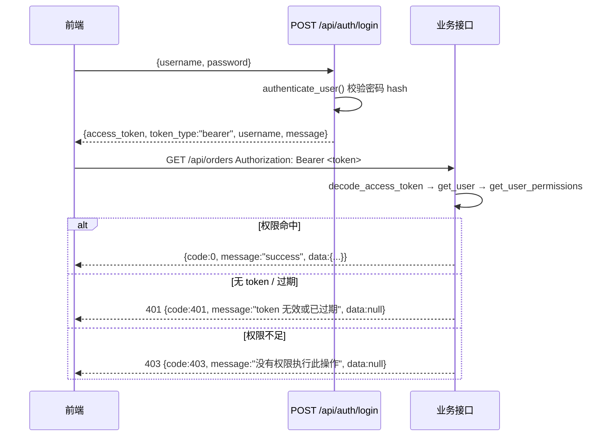
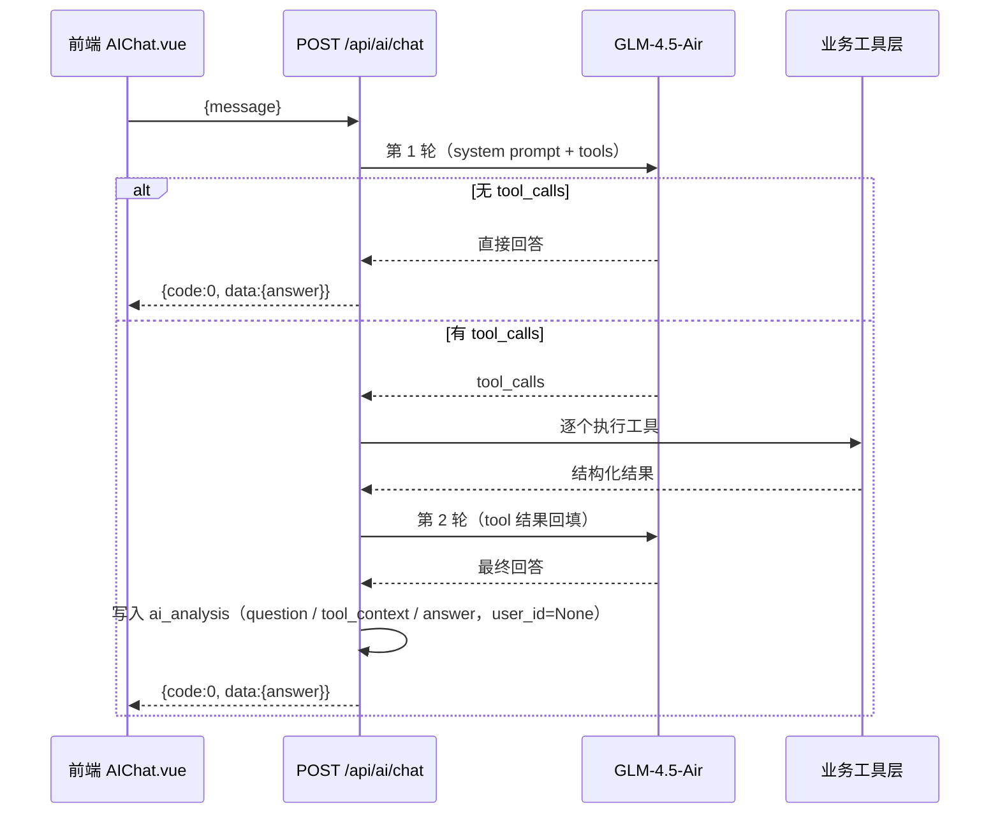

# 08 接口设计文档（API Design）

> 项目：电商运营管理与智能分析平台　对应设计蓝图：第 9 章《API 接口总体设计》、第 14 章
> **本文档所有接口、参数名、必填项、权限名、返回字段均逐个核对真实代码得出，以代码为准。**
> 核对范围：`backend/app/main.py` 与 `backend/app/api/` 全部路由文件（auth / dashboard / order / order_items / order_payments / order_reviews / products / customer / seller / logistics / inventory / user / log / AI / geolocation / translation），响应字段取自 `backend/app/schemas/`。
> V1.0　核对日期：2026-09-21

## 1. 设计约定

### 1.1 路由前缀与注册方式

所有路由在 `main.py` 中通过 `app.include_router()` 注册，共 **51 条路径**：`/api` 下 **50 条**（按 HTTP 方法计 **52 个操作**：GET 45 / POST 5 / PUT 2），另有 1 条公开健康检查 `GET /healthy`（不在 `/api` 前缀下）。

| 子路由模块 | 注册前缀 | 文件 | 子路由模块 | 注册前缀 | 文件 |
|---|---|---|---|---|---|
| auth | `/api/auth` | `api/auth.py` | dashboard | `/api/dashboard` | `api/dashboard.py` |
| seller | `/api` | `api/seller.py` | inventory | `/api` | `api/inventory.py` |
| products | `/api` | `api/products.py` | logistics | `/api` | `api/logistics.py` |
| customer | `/api` | `api/customer.py` | user | `/api` | `api/user.py` |
| order | `/api` | `api/order.py` | log | `/api` | `api/log.py` |
| order_reviews | `/api` | `api/order_reviews.py` | AI | `/api/ai` | `api/AI.py` |
| order_payments | `/api` | `api/order_payments.py` | translation | `/api` | `api/translation.py` |
| order_items | `/api` | `api/order_items.py` | geolocation | `/api` | `api/geolocation.py` |

### 1.2 鉴权约定

- 请求头：`Authorization: Bearer <access_token>`。
- JWT 由 `app/core/security.py` 签发，算法 `HS256`，载荷 `{"sub": <username>, "exp": ...}`，**有效期 30 分钟**（`timedelta(minutes=30)`）。
- 依赖链：`HTTPBearer()` → `get_current_user()` → `require_permission("xxx:yyy")`（`app/api/deps.py`）。token 无效/过期 → 401 `"token 无效或已过期"`；用户不存在 → 401 `"用户不存在"`；权限集合不含目标权限 → 403 `"没有权限执行此操作"`。



### 1.3 统一响应格式

定义于 `app/core/response.py`：`ok(data)` / `ok_page(items,total,page,page_size)` / `fail(code,message)`。

```json
{ "code": 0, "message": "success", "data": { } }
```

异常由 `main.py` 全局处理器包装（**HTTP status 与 body 的 `code` 数值相同**）：

| 场景 | HTTP | 响应体 |
|---|---|---|
| 参数校验失败 `RequestValidationError` | 422 | `{"code":422,"message":"参数校验失败","data":null}` |
| 业务异常 `HTTPException`（401/403/404/400） | 原样 | `{"code":<status>,"message":"<detail>","data":null}` |

> ⚠️ 设计蓝图 9.1 中的 `request_id` 字段**未实现**。

### 1.4 分页约定

统一结构：`{"items": [], "total": 0, "page": 1, "page_size": 20}`。`deps.py::page_params` 描述为 `page ≥ 1`、`1 ≤ page_size ≤ 100`，但**各接口实际默认值与上限并不统一**（代码为准）：

| 接口 | page | page_size | 是否必填 | 接口 | page | page_size | 是否必填 |
|---|---|---|---|---|---|---|---|
| `GET /orders` | 1 | 20 | 否 | `GET /users` | 1 | 20 | 否 |
| `GET /products` | — | — | **是** | `GET /logs` | 1 | 20 | 否 |
| `GET /customers` | 1 | 10 | 否 | `GET /order_items` | 1 | 20 | 否 |
| `GET /sellers` | 1 | 10 | 否 | `GET /payments` | 1 | 20 | 否 |
| `GET /inventory` | 1 | 20 | 否 | `GET /reviews` | 1 | 20 | 否 |
| `GET /inventory/logs` | 1 | 10 | 否 | `GET /geolocation`、`/translation` | 不分页 | | |

### 1.5 数据类型与时间格式

| 项目 | 约定 |
|---|---|
| 主键 ID | 字符串（32 位十六进制），不转整数 |
| 时间字段 | ISO 8601，形如 `2018-07-03T15:04:05`，无时区后缀，缺失返回 `null` |
| 金额字段 | 数据库 `DECIMAL(12,2)` |
| 数值返回形态 | ⚠️ 声明了 `response_model` 的接口中，`Decimal` 经 Pydantic v2 序列化**可能为字符串形式的数字**（如 `"1324567.89"`）；Redis 缓存路径经 `json.dumps` 后亦为字符串。前端用 `Number()` 兜底，表现正常 |
| 请求体 | `application/json`；查询参数走 URL query |

### 1.6 缓存约定（Redis，`app/core/redis.py`）

| 接口 | Key | TTL | 写操作后的失效 |
|---|---|---|---|
| `/dashboard/overview` | `dashboard:overview` | 600s | 无 |
| `/dashboard/trend` | `dashboard:trend` | 600s | 无 |
| `/dashboard/category-ranking` | `dashboard:category-ranking:{top}` | 600s | 无 |
| `/dashboard/seller_ranking` | `dashboard:seller-ranking:{top}` | 600s | 无 |
| `/dashboard/products_ranking` | `dashboard:products-ranking:{top}` | 600s | 无 |
| `/inventory` | `inventory:list:page={page}:page_size={page_size}` | 600s | `delete_cache_pattern("inventory:list:*")` |
| `/inventory/warnings` | `inventory:warnings` | 600s | `delete_cache("inventory:warnings")` |
| `/inventory/replenish` | `inventory:replenish:{replenish_days}` | 600s | `delete_cache_pattern("inventory:replenish:*")` |
| `/dashboard/send_time`、`/alerts` | 不缓存 | — | — |

### 1.7 权限清单（去重后共 11 个）

| 权限名 | 接口数 | 涉及接口 |
|---|---|---|
| `dashboard:read` | 7 | dashboard 全部 7 个接口 |
| `order:read` | 4 | 订单列表、状态分布、月度趋势、订单详情 |
| `product:read` | 5 | 商品列表、类目分析、评分排行、类目下拉、商品详情 |
| `customer:read` | 6 | 客户列表、消费排行、复购、地域、州列表、客户详情 |
| `seller:read` | 5 | 卖家列表、州列表、卖家详情、销售排行、评分表现 |
| `logistics:read` | 3 | 物流总览、地域分布、延迟评分关联 |
| `inventory:read` | 5 | 库存列表、单商品库存、预警、补货建议、库存流水 |
| `inventory:adjust` | 1 | 库存调整（**唯一写操作**） |
| `user:read` | 4 | 用户列表、用户详情、角色列表、操作日志 |
| `user:create` | 1 | 创建用户 |
| `user:update` | 2 | 修改密码、分配角色 |

角色与权限存于 `system_role / system_permission / system_role_permission / system_user_role`，由 `repositories/permission.py::get_user_permissions()` 三表联结查询。**代码库中无 RBAC 种子数据脚本**，角色-权限实际绑定关系以运行库为准（**待补充**）。

### 1.8 操作日志写入点

`repositories/operation_log.py::create_log(db, operator, action, target, detail)`，当前仅 3 处：

| action | 触发接口 | target | detail 示例 |
|---|---|---|---|
| `create_user` | `POST /api/users` | 新用户 ID | `username=xxx` |
| `assign_role` | `PUT /api/users/{user_id}/roles` | 用户 ID | `role_ids=[1, 2]` |
| `adjust_inventory` | `POST /api/adjust/{product_id}/` | `product_id` | 见 `repositories/inventory.py` |

登录、修改密码、查询类接口**不记录**日志。

## 2. 认证模块 `/api/auth`

| # | 方法与路径 | 权限 | 参数 | 响应字段 | 失败 |
|---|---|---|---|---|---|
| 2.1 | `POST /api/auth/login` | **公开** | Body `{username, password}`（均必填） | ⚠️ 裸 JSON：`message`(固定"登录成功")、`username`、`access_token`、`token_type`(固定"bearer") | 401 `用户名或密码错误` |
| 2.2 | `POST /api/auth/register` | **公开** | Body `{username, password}`（均必填） | ⚠️ 裸 JSON：`message`("注册成功")、`username` | 400 `用户名已被占用` |
| 2.3 | `GET /api/auth/me` | 已登录（`get_current_user`，不校验具体权限） | 无 | ⚠️ 裸 JSON：`username`、`role`(string[]，如 `["admin"]`) | 401 |

```http
POST /api/auth/login
Content-Type: application/json

{ "username": "admin", "password": "admin123" }
```

```json
{ "message": "登录成功", "username": "admin",
  "access_token": "eyJhbGciOiJIUzI1NiIs...xxxxx", "token_type": "bearer" }
```

```json
{ "username": "admin", "role": ["admin"] }     // GET /api/auth/me
```

> 注册接口**不分配角色**，注册用户 `get_user_roles()` 为空；前端登录后拿不到角色会提示「账号暂无权限，请联系管理员分配角色」并退出。

## 3. Dashboard 模块 `/api/dashboard`

7 个接口权限均为 `dashboard:read`，均用统一响应。

| # | 方法与路径 | 参数（默认） | 响应 `data` 字段 | 缓存 |
|---|---|---|---|---|
| 3.1 | `GET /api/dashboard/overview` | 无 | `total_orders`、`delivered_orders`、`canceled_orders`、`total_sales`、`average_order_value`、`customer_count`、`avg_review_score` | `dashboard:overview` |
| 3.2 | `GET /api/dashboard/trend` | 无 | `trend[]`: `{month, sales}` | `dashboard:trend` |
| 3.3 | `GET /api/dashboard/category-ranking` | `top`(10) | `category_ranking[]`: `{category_name, sales}` | `:{top}` |
| 3.4 | `GET /api/dashboard/seller_ranking` | `top`(10) | `seller_ranking[]`: `{seller_id, sales}` | `:{top}` |
| 3.5 | `GET /api/dashboard/send_time` | 无 | `send_time_rate`(float，百分数) | 无 |
| 3.6 | `GET /api/dashboard/products_ranking` | `top`(10) | `product_ranking[]`: `{product_id, sales, sold_count}` | `:{top}` |
| 3.7 | `GET /api/dashboard/alerts` | 无 | `low_stock_count`(int)、`delayed_order_count`(int)、`low_review_count`(float) | 无 |

```json
// GET /api/dashboard/overview
{ "code": 0, "message": "success",
  "data": { "total_orders": 99441, "delivered_orders": 96478, "canceled_orders": 625,
            "total_sales": "13245678.90", "average_order_value": "137.42",
            "customer_count": 96096, "avg_review_score": 4.09 } }
```

> 3.4 路径用**下划线** `seller_ranking`，与同模块 `category-ranking`（连字符）风格不一致，前端已按此拼写对接。

## 4. 订单模块 `/api/orders`

### 4.1 `GET /api/orders` — 订单列表（权限 `order:read`）

| 参数 | 类型 | 必填 | 默认 | 说明 |
|---|---|---|---|---|
| `page` | int | 否 | 1 | 页码 |
| `page_size` | int | 否 | 20 | 每页数量 |
| `order_status` | string | 否 | null | 订单状态精确匹配 |
| `start_time` | datetime | 否 | null | 下单时间 ≥ |
| `end_time` | datetime | 否 | null | 下单时间 ≤ |

`data.items[]`（`OrderResponse`）：`order_id`、`customer_id`、`order_status`（均非空）、`order_purchase_timestamp`、`order_approved_at`、`order_delivered_carrier_date`、`order_delivered_customer_date`、`order_estimated_delivery_date`（均可空）；另含 `total` / `page` / `page_size`。

```http
GET /api/orders?page=1&page_size=2&order_status=delivered&start_time=2018-01-01&end_time=2018-03-31
Authorization: Bearer <token>
```

```json
{ "code": 0, "message": "success",
  "data": { "items": [ { "order_id": "e481f51cbdc54678b7cc49136f2d6af7",
      "customer_id": "9ef432eb6251297304e76186b10a928d", "order_status": "delivered",
      "order_purchase_timestamp": "2018-01-05T11:22:33", "order_approved_at": "2018-01-05T12:00:11",
      "order_delivered_carrier_date": "2018-01-08T14:05:00",
      "order_delivered_customer_date": "2018-01-15T10:31:22",
      "order_estimated_delivery_date": "2018-01-22T00:00:00" } ],
    "total": 42125, "page": 1, "page_size": 2 } }
```

### 4.2–4.4 其余订单接口

| # | 方法与路径 | 权限 | 参数 | 响应 `data` |
|---|---|---|---|---|
| 4.2 | `GET /api/orders/status-distribution` | `order:read` | 无 | `items[]`: `{status, count}`，按数量倒序 |
| 4.3 | `GET /api/orders/monthly-trend` | `order:read` | 无 | `items[]`: `{month, order_count, sales}`，按 month 升序；口径为**排除 `canceled`**，`sales` 取 `SUM(order_payments.payment_value)` |
| 4.4 | `GET /api/orders/{order_id}` | `order:read` | 路径 `order_id` | 聚合对象 `{order, customer, items[], payments[], reviews[]}`；不存在 → 404 `"Order not found"` |

4.4 子字段：`order` = `OrderResponse`；`customer` = `CustomerResponse`；`items[]` = `{order_id, order_item_id(int), product_id, seller_id, shipping_limit_date, price, freight_value}`；`payments[]` = `{order_id, payment_sequential(int), payment_type, payment_installments(int), payment_value}`；`reviews[]` = `{review_id, order_id, review_score(int), review_comment_title(可空), review_comment_message(可空), review_creation_date(可空), review_answer_timestamp(可空)}`，默认 `[]`。

## 5. 商品与类目模块 `/api/products`

全部权限 `product:read`。

| # | 方法与路径 | 参数 | 响应 `data` |
|---|---|---|---|
| 5.1 | `GET /api/products` | `page`(**必填**)、`page_size`(**必填**)、`product_category_name`(可选) | 分页；`items[]` = `product_id`、`product_category_name`、`product_name_length`、`product_description_length`、`product_photos_qty`、`product_weight_g`、`product_length_cm`、`product_height_cm`、`product_width_cm`（后 7 项可空） |
| 5.2 | `GET /api/products/category-analysis` | `top`(10) | `{top, category_analysis[]: {category_name, sales, order_count, avg_price}}` |
| 5.3 | `GET /api/products/rating_rank` | `top`(10)、`order`(`'desc'`)、`min_reviews`(10) | `{top, rating_rank[]: {product_id, avg_score, review_count}}` |
| 5.4 | `GET /api/products/categories` | 无 | `{categories: ["agro_industry_and_commerce", ...]}` |
| 5.5 | `GET /api/products/{products_id}` | 路径 `products_id`（**变量名带复数 s**） | 单个 `ProductResponse`；不存在 → 404 `"Product not found"` |

```json
// GET /api/products/category-analysis?top=2
{ "code": 0, "message": "success",
  "data": { "top": 2, "category_analysis": [
    { "category_name": "health_beauty", "sales": 1258681.34, "order_count": 8836, "avg_price": 141.0 },
    { "category_name": "watches_gifts", "sales": 1205005.68, "order_count": 5622, "avg_price": 201.3 } ] } }
```

## 6. 客户模块 `/api/customers`（权限均 `customer:read`）

| # | 方法与路径 | 参数（默认） | 响应 `data` |
|---|---|---|---|
| 6.1 | `GET /api/customers` | `page`(1)、`page_size`(10)、`customer_city`、`customer_state` | 分页；`items[]` = `customer_id`、`customer_unique_id`、`customer_zip_code_prefix`、`customer_city`、`customer_state` |
| 6.2 | `GET /api/customers/ranking` | `top`(10) | `{top, customer_rank[]: {customer_unique_id, sales, count_order}}` |
| 6.3 | `GET /api/customers/repurchase` | 无 | `{total_customers, repeat_customers, repurchase_rate}` |
| 6.4 | `GET /api/customers/geo` | 无 | `{items[]: {city, state, customer_count, lat, lng}}` |
| 6.5 | `GET /api/customers/states` | 无 | `{states: [...]}` |
| 6.6 | `GET /api/customers/{customer_id}` | 路径 `customer_id` | 单个 `CustomerResponse`；不存在 → 404 `"Customer not found"` |

```json
{ "code": 0, "message": "success",
  "data": { "items": [ { "customer_id": "06b8999e2fba1a1fbc88172c00ba8bc7",
      "customer_unique_id": "861eff4711a542e4b93843c6dd7febb0", "customer_zip_code_prefix": "14409",
      "customer_city": "franca", "customer_state": "SP" } ],
    "total": 99441, "page": 1, "page_size": 10 } }
```

> 6.1 按 `customer_id`（订单级客户键）分页，6.2/6.3 按 `customer_unique_id`（真实客户）聚合，两者口径不同，符合设计蓝图 5.14。

## 7. 卖家模块 `/api/seller` + `/api/sellers`（权限均 `seller:read`）

**同一模块存在两套前缀风格**：列表与详情走 `/api/sellers/*`（复数），排行与评分走 `/api/seller/*`（单数）。

| # | 方法与路径 | 参数（默认） | 响应 `data` |
|---|---|---|---|
| 7.1 | `GET /api/sellers` | `page`(1)、`page_size`(10)、`seller_city`、`seller_state` | 分页；`items[]` = `seller_id`、`seller_zip_code_prefix`、`seller_city`、`seller_state` |
| 7.2 | `GET /api/sellers/states` | 无 | `{states: [...]}` |
| 7.3 | `GET /api/sellers/{seller_id}` | 路径 `seller_id` | 单个 `SellerResponse`；不存在 → 404 `"Seller Not Found !"` |
| 7.4 | `GET /api/seller/rank` | `top`(10) | `{rank[]: {seller_id, sales, order_count}}` |
| 7.5 | `GET /api/seller/review` | `top`(20) | `{top, review_rank[]: {seller_id, avg_score, review_count}}` |

## 8. 物流模块 `/api/logistics`（权限均 `logistics:read`）

| # | 方法与路径 | 参数 | 响应 `data` 字段 |
|---|---|---|---|
| 8.1 | `GET /api/logistics/overview` | 无 | `avg_delivery_days`(float，天)、`total_delivered`(int)、`on_time_count`(int)、`delayed_count`(int)、`on_time_rate`(%)、`delay_rate`(%) |
| 8.2 | `GET /api/logistics/geo` | 无 | `{geo[]: {state, order_count, avg_fulfillment_days, delay_rate}}` |
| 8.3 | `GET /api/logistics/delay-rating` | 无 | `on_time_avg_score`(float)、`delayed_avg_score`(float)、`on_time_count`(**float**)、`delayed_count`(**float**) |

```json
// GET /api/logistics/overview
{ "code": 0, "message": "success",
  "data": { "avg_delivery_days": 12.5, "total_delivered": 96478, "on_time_count": 91852,
            "delayed_count": 4626, "on_time_rate": 95.2, "delay_rate": 4.8 } }
```

> 8.3 中 `on_time_count` / `delayed_count` 声明为 `float`，与 8.1 同名语义为 int 不一致，前端仅作对比展示。

## 9. 库存模块 `/api/inventory` 与 `/api/adjust`

| # | 方法与路径 | 权限 | 参数（默认） | 响应 `data` |
|---|---|---|---|---|
| 9.1 | `GET /api/inventory` | `inventory:read` | `page`(1)、`page_size`(20) | `{total, page, page_size, items[]: {product_id, quantity, safe_stock}}` |
| 9.2 | `GET /api/inventory/detail` | `inventory:read` | `product_id`（**必填，query**） | `{product_id, quantity, safe_stock}`；不存在时 `data` 为 `null`（**不报 404**） |
| 9.3 | `POST /api/adjust/{product_id}/` | `inventory:adjust` | 路径 `product_id`；Body 见下 | `{product_id, before, after}` |
| 9.4 | `GET /api/inventory/warnings` | `inventory:read` | 无 | `{need_fill[]: {product_id, quantity, safe_stock}}`（条件 `quantity <= safety_stock`） |
| 9.5 | `GET /api/inventory/replenish` | `inventory:read` | `replenish_days`(30) | `{items[]: {product_id, avg_daily_sales, suggest_quantity, current_quantity, safety_stock}}`；仅返回 `suggest_quantity > 0`，倒序 |
| 9.6 | `GET /api/inventory/logs` | `inventory:read` | `product_id`(**必填**)、`page`(1)、`page_size`(10) | `{total, page, page_size, items[]: {id, product_id, change, before, after, reason, operator, created_at}}` |

9.3 请求体（`AdjustInventory`）：

| 名称 | 类型 | 必填 | 默认 | 说明 |
|---|---|---|---|---|
| `change` | int | 是 | — | 变化量（正入负出） |
| `reason` | string | 否 | null | 调整原因，如「采购入库」 |
| `operator` | string | 否 | null | 操作人（前端传登录用户名，**后端不校验其与 token 身份一致**） |

```http
POST /api/adjust/aca2eb7d00ea1a7b0e7adf7a7f4d8b0b/
Authorization: Bearer <token>
Content-Type: application/json

{ "change": 50, "reason": "采购入库", "operator": "admin" }
```

```json
{ "code": 0, "message": "success",
  "data": { "product_id": "aca2eb7d00ea1a7b0e7adf7a7f4d8b0b", "before": 12, "after": 62 } }
```

> 业务约束：`after = before + change`；首次调整某商品会自动建库存记录（`quantity=0`、`safety_stock=10`）；写入 `inventory_log` 与 `operation_log(action="adjust_inventory")`，并失效第 1.6 节列出的库存缓存。

## 10. AI 模块 `/api/ai`

### 10.1 `POST /api/ai/chat` — AI 运营助手问答

| 项目 | 内容 |
|---|---|
| 权限要求 | ⚠️ **无任何鉴权依赖**（既无 `get_current_user` 也无 `require_permission`） |
| 请求体（`AIRequest`） | `message`（string，必填） |
| 响应 `data`（`AIResponse`） | `{"answer": "<Markdown 文本>"}` |
| 源码 | `api/AI.py::talk` → `services/AI.py::chat` |



可用工具（`services/AI.py::tools`，共 9 个）：`query_sales`(无参)、`query_category(top 必填)`、`query_product(top 必填)`、`query_order_status`(无参)、`query_inventory_warning`(无参)、`query_review`(无参)、`query_logistics`(无参)、`query_customer`(无参)、`query_web(query 必填)`。

```json
// POST /api/ai/chat   {"message":"最近销售趋势怎么样？"}
{ "code": 0, "message": "success",
  "data": { "answer": "根据 2016-09 至 2018-10 的历史数据，**销售额**在 2017-11 达到峰值……\n\n| 月份 | 销售额 |\n|---|---|\n| 2017-11 | 1010273.90 |" } }
```

> AI 记录写入 `ai_analysis` 表，`user_id` 恒为 `None`（未关联登录用户），见第 15 节 A-06。

## 11. 系统管理模块（用户 / 角色 / 日志）

| # | 方法与路径 | 权限 | 请求参数 | 响应 `data` |
|---|---|---|---|---|
| 11.1 | `GET /api/users` | `user:read` | `page`(1)、`page_size`(20) | `{items[]: {id, username}, total, page, page_size}` |
| 11.2 | `GET /api/users/{user_id}` | `user:read` | 路径 `user_id`(int) | `{id, username}`；不存在 → 404 `"User not found"` |
| 11.3 | `POST /api/users` | `user:create` | Body `{username, password}` | `{id, username}`；重名 → 400 `"用户名已被占用"`；写 `create_user` 日志 |
| 11.4 | `GET /api/roles` | `user:read` | 无 | `{roles[]: {id, name, description}}` |
| 11.5 | `PUT /api/users/{user_id}` | `user:update` | Body `{password}` | `{id, username}`，`message` = `"密码修改成功"`（**非默认 success**） |
| 11.6 | `PUT /api/users/{user_id}/roles` | `user:update` | Body `{role_ids: [int]}` | `{user_id, role_ids}`；**覆盖式**重设；写 `assign_role` 日志 |
| 11.7 | `GET /api/logs` | `user:read`（**非独立 `log:read`**） | `page`(1)、`page_size`(20) | `{total, items[]: {id, operator, action, target, detail, created_at}}`，按 id 倒序 |

```http
PUT /api/users/3/roles
Authorization: Bearer <token>
Content-Type: application/json

{ "role_ids": [2, 3] }
```

```json
{ "code": 0, "message": "success", "data": { "user_id": 3, "role_ids": [2, 3] } }
```

```json
// GET /api/logs
{ "code": 0, "message": "success",
  "data": { "total": 12, "items": [ { "id": 12, "operator": "admin",
    "action": "adjust_inventory", "target": "aca2eb...", "detail": "change=50",
    "created_at": "2026-09-21T10:12:33" } ] } }
```

## 12. ⚠️ 未使用统一响应格式 / 无鉴权的接口（重点偏差）

以下 5 个接口**绕过 `ok()/ok_page()` 直接返回裸 JSON**，且**无任何权限依赖、无需 Authorization 头**。它们是数据集原始表的直读接口，前端 `api/` 下**没有任何调用**。

| # | 方法与路径 | 源文件 | 返回体 | 鉴权 | 前端调用 |
|---|---|---|---|---|---|
| 12.1 | `GET /api/geolocation` | `api/geolocation.py` | `{"items": [...]}` | ❌ 无 | ❌ 否 |
| 12.2 | `GET /api/reviews` | `api/order_reviews.py` | `{"items": [...]}` | ❌ 无 | ❌ 否 |
| 12.3 | `GET /api/payments` | `api/order_payments.py` | `{"items": [...]}` | ❌ 无 | ❌ 否 |
| 12.4 | `GET /api/order_items` | `api/order_items.py` | `{"items": [...]}` | ❌ 无 | ❌ 否 |
| 12.5 | `GET /api/translation` | `api/translation.py` | `{"translations": [...]}` | ❌ 无 | ❌ 否 |

| 接口 | 参数（默认） | 返回字段 |
|---|---|---|
| 12.1 geolocation | 无（**不分页**，全表约 100 万行） | `geolocation_zip_code_prefix`、`geolocation_lat`、`geolocation_lng`、`geolocation_city`、`geolocation_state` |
| 12.2 reviews | `page`(1)、`page_size`(20) | `review_id`、`order_id`、`review_score`、`review_comment_title`、`review_comment_message`、`review_creation_date`、`review_answer_timestamp`（**无 `total`**） |
| 12.3 payments | `page`(1)、`page_size`(20) | `order_id`、`payment_sequential`、`payment_type`、`payment_installments`、`payment_value`（**无 `total`**） |
| 12.4 order_items | `page`(1)、`page_size`(20) | `order_id`、`order_item_id`、`product_id`、`seller_id`、`shipping_limit_date`、`price`、`freight_value`（**无 `total`**） |
| 12.5 translation | 无 | `product_category_name`、`product_category_name_english` |

```json
// GET /api/payments
{ "items": [ { "order_id": "b81ef226f3fe1789b1e8b2acac839d17", "payment_sequential": 1,
  "payment_type": "credit_card", "payment_installments": 8, "payment_value": 99.33 } ] }
```

同类问题补充（见第 15 节）：

- `POST /api/ai/chat`（10.1）同样**无鉴权依赖**，任何能访问服务的人均可调用并消耗 LLM 额度。
- 12.1 一次性扫描全表，存在性能风险。
- 登录 / 注册接口公开属预期行为。

### 12.6 健康检查

`GET /healthy`（**不在 `/api` 前缀下**，定义于 `main.py`），无鉴权，返回 `{"code":0,"message":"ok","data":null}`（`message` 为 `"ok"`）。

## 13. 跨模块公共约定

### 13.1 订单状态取值

后端不过滤枚举，直接透传数据库值；前端筛选下拉与标签色映射如下：

| 取值 | 含义 | 前端标签色 | 取值 | 含义 | 前端标签色 |
|---|---|---|---|---|---|
| `created` | 已创建 | info | `shipped` | 已发货 | primary |
| `approved` | 已审批 | info | `delivered` | 已送达 | success |
| `invoiced` | 已开票 | info | `canceled` | 已取消 | danger |
| `processing` | 处理中 | warning | `unavailable` | 不可用 | info |

### 13.2 支付方式取值

`credit_card`、`boleto`、`voucher`、`debit_card`、`not_defined`（后端不做映射）。

### 13.3 指标口径

| 指标 | 口径 | 实现位置 |
|---|---|---|
| 销售额 | `SUM(order_items.price)` | `repositories/dashboard.py` |
| 月度销售额 | `SUM(order_payments.payment_value)`，排除 `canceled` | `repositories/order.py` |
| 客单价 | 销售额 ÷ 有效订单数 | `repositories/dashboard.py` |
| 客户数 | `customer_unique_id` 去重 | `repositories/dashboard.py` |
| 准时交付率 | 实际送达 ≤ 预计送达 | `repositories/dashboard.py::get_sned_time` |
| 低库存 | `inventory.quantity <= inventory.safety_stock` | `repositories/inventory.py::get_warnings` |
| 建议补货量 | `日均销量 × 补货周期 + 安全库存 - 当前库存` | `repositories/inventory.py::get_replenish` |

### 13.4 常见错误一览

| 场景 | HTTP / `code` | `message` |
|---|---|---|
| 用户名或密码错误 | 401 | `用户名或密码错误` |
| token 无效或过期 | 401 | `token 无效或已过期` |
| 用户不存在（token 用户被删） | 401 | `用户不存在` |
| 权限不足 | 403 | `没有权限执行此操作` |
| 订单/商品/客户/卖家/用户不存在 | 404 | 对应英文/中文提示 |
| 用户名已被占用 | 400 | `用户名已被占用` |
| 请求参数校验失败 | 422 | `参数校验失败` |
| 数据库/未捕获异常 | 500 | FastAPI 默认错误体（**未自定义处理器**） |

## 14. 与设计蓝图第 9 章的差异清单（以实际实现为准）

### 14.1 未实现的期望接口

| 蓝图接口 | 状态 | 说明 |
|---|---|---|
| `POST /api/ai/analyze-sales` | ❌ 未实现 | AI 模块仅 `/api/ai/chat` |
| `POST /api/ai/inventory-advice` | ❌ 未实现 | 补货建议改由确定性算法提供：`GET /api/inventory/replenish` |

### 14.2 命名 / 路径不一致

| 蓝图写法 | 实际实现 |
|---|---|
| `GET /api/dashboard/sales-trend` | `GET /api/dashboard/trend` |
| `GET /api/categories` | `GET /api/products/categories` |
| `POST /api/inventory/{product_id}/adjust` | `POST /api/adjust/{product_id}/` |
| `GET /api/operation-logs` | `GET /api/logs` |
| `GET /api/customers/{customer_unique_id}` | `GET /api/customers/{customer_id}` |
| `GET /api/logistics/overview` | ✅ 一致 |

### 14.3 蓝图未列出但实际存在的接口（约 36 个）

| 模块 | 实际接口 |
|---|---|
| Dashboard 补充 | `seller_ranking`、`send_time`、`products_ranking`、`alerts` |
| 订单补充 | `orders/status-distribution`、`orders/monthly-trend` |
| 商品补充 | `products/category-analysis`、`products/rating_rank` |
| 客户补充 | `customers/ranking`、`repurchase`、`geo`、`states` |
| 卖家 | `sellers`、`sellers/states`、`sellers/{id}`、`seller/rank`、`seller/review` |
| 物流补充 | `logistics/geo`、`logistics/delay-rating` |
| 库存补充 | `inventory/detail`、`inventory/replenish`、`inventory/logs` |
| 认证补充 | `auth/register`、`auth/me` |
| 系统管理 | `users`、`users/{id}`（GET/POST/PUT）、`users/{id}/roles`、`roles` |
| 原始表直读 | `geolocation`、`reviews`、`payments`、`order_items`、`translation` |
| 健康检查 | `GET /healthy`（无 `/api` 前缀） |

### 14.4 约定层面的差异

| 蓝图约定 | 实际实现 |
|---|---|
| 统一响应含 `request_id` | 未实现 |
| RBAC 角色 `admin / operator / viewer` | 代码与前端为 `admin / operator / **warehouse**`；`backend/` 无角色种子脚本 |
| 默认 `page_size = 20` 且限最大值 | 各接口默认值 10/20 不统一；`le=100` 仅 `page_params` 声明 |
| 统计缓存「更新后删除」 | Dashboard 4 类缓存**无主动失效**；仅库存调整清库存缓存 |
| 「所有关键写操作记录 operation_log」 | 仅 3 个动作记录 |
| 统一异常处理 | HTTPException / RequestValidationError 已包装；**500 无处理器** |

## 15. 待整改项

| 编号 | 问题 | 位置 | 建议 |
|---|---|---|---|
| A-01 | 5 个原始表直读接口未用统一响应、无鉴权、无 `total` | 对应 5 个 api 文件 | 补 `require_permission` 并改用 `ok_page` |
| A-02 | `POST /api/ai/chat` 无任何鉴权 | `api/AI.py` | 增加权限依赖（如 `ai:chat`） |
| A-03 | `GET /api/geolocation` 全表返回（聚合后 19,015 行、约 3.27 MB，无分页参数） | `api/geolocation.py` | 增加分页与 `zip_prefix` 过滤 |
| A-04 | ~~前端拦截器读 `error.response.data.detail`，后端异常体为 `{code,message,data}`，**错误文案丢失**~~ | `frontend/src/utils/request.js` | **已修复**：改为 `body.message \|\| body.detail`（见 `docs/12` 5.1 节 FE-02） |
| A-05 | 库存调整 `operator` 由前端传入，后端不校验身份一致 | `api/inventory.py` | 改用 `current_user.username` |
| A-06 | `ai_analysis.user_id` 恒为 `None` | `services/AI.py` | 写入当前登录用户 |
| A-07 | 分页默认值/上限不统一（products 的 page/page_size 必填） | 各 api 文件 | 统一改用 `Depends(page_params)` |
| A-08 | 路径风格不统一（`/seller/*` 与 `/sellers/*` 并存；`seller_ranking` 下划线 vs `category-ranking` 连字符；`/adjust/{id}/` 尾斜杠） | api 层 | 统一为复数 + 连字符 |
| A-09 | Dashboard 统计缓存无主动失效，最长 10 分钟不刷新 | `api/dashboard.py` | 写操作后按需 `delete_cache` |
| A-10 | 缺 500 全局处理器与业务错误码体系（`code` 直接复用 HTTP status） | `main.py` | 增加通用处理器与错误码表 |
| A-11 | RBAC 种子数据不在代码库，无法静态核对 `ROLE_MENUS` 与后端权限一致性 | 数据库 | 补 `seed_rbac.sql` 并同步前端 |
| A-12 | 注册接口开放且不分配角色，注册后无法正常使用 | `api/auth.py` | 限制注册或默认绑定最低权限角色 |

**待补充**

- **角色 → 权限完整映射表**：需从运行库 `system_role_permission` 关联 `system_permission` 导出后补入 1.7 节。
- **`Decimal` 字段真实响应中的序列化形态**（字符串 / 数值）：需以 Swagger 实际响应确认后补入 1.5 节。