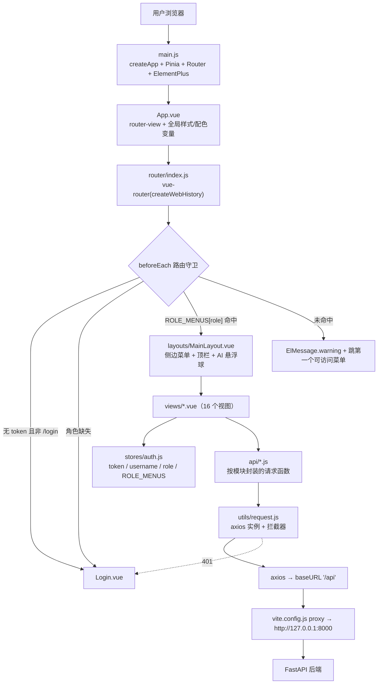
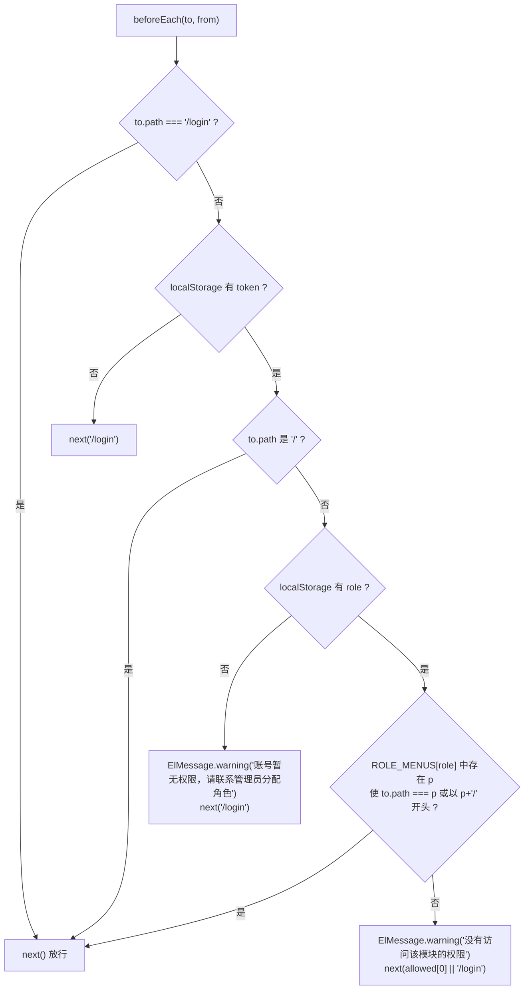
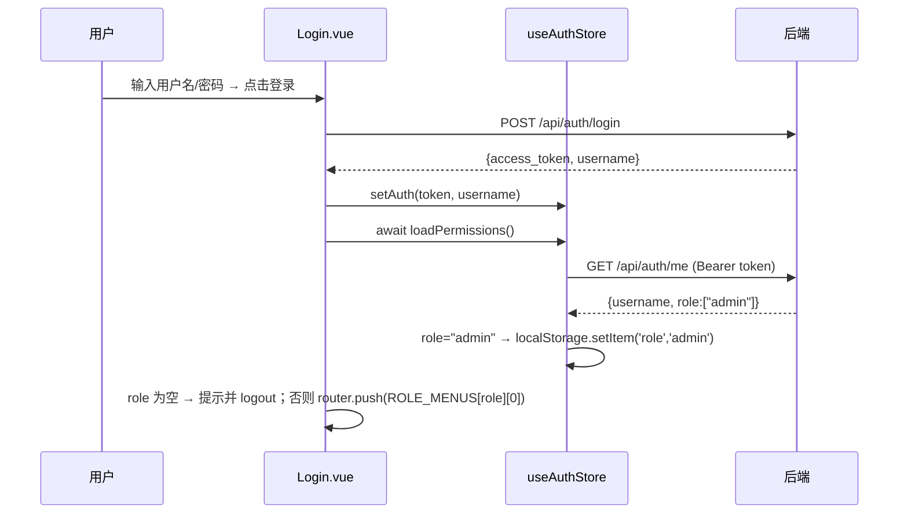
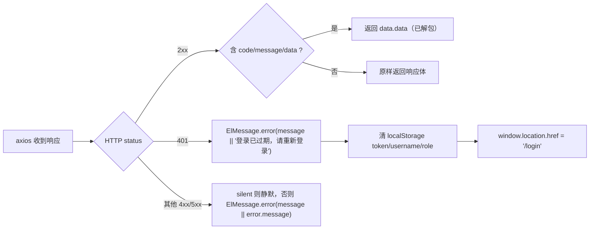
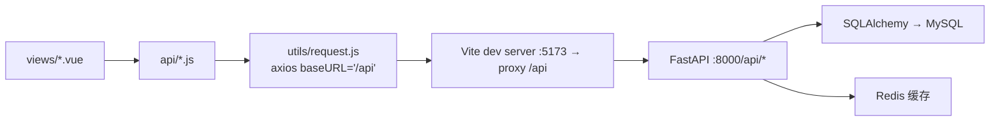
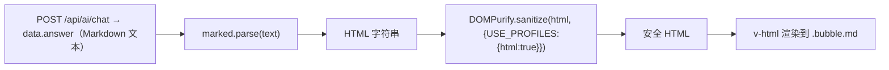

# 09 前端设计文档（Frontend Design）

> 项目：电商运营管理与智能分析平台　对应设计蓝图：第 10 章《前端后台管理系统设计》、4.1 节功能树
> **本文档逐文件核对真实前端代码得出**（`frontend/src/views/`、`api/`、`router/`、`stores/`、`layouts/`、`utils/`、`App.vue`、`main.js`、`vite.config.js`、`package.json`）。
> V1.0　核对日期：2026-09-21

## 1. 技术栈与依赖版本

取自 `frontend/package.json`（实际安装版本以 `node_modules` 为准）：

| 分层 | 依赖 | 声明版本 | 用途 |
|---|---|---|---|
| 框架 | `vue` | ^3.5.13 | 组合式 API（`<script setup>`） |
| 构建 | `vite` | ^6.0.5 | 开发服务器与打包 |
| 构建插件 | `@vitejs/plugin-vue` | ^5.2.1 | SFC 编译 |
| UI 组件库 | `element-plus` | ^2.9.0 | 表格 / 表单 / 弹窗 / 布局 |
| 图标 | `@element-plus/icons-vue` | ^2.3.1 | `main.js` 遍历注册全部图标 |
| 图表 | `echarts` | ^5.5.1 | 折线 / 柱状 / 饼 / 散点 |
| 状态管理 | `pinia` | ^2.3.0 | `useAuthStore` |
| 路由 | `vue-router` | ^4.5.0 | history 模式 + 守卫 |
| HTTP | `axios` | ^1.7.9 | 统一实例与拦截器 |
| Markdown | `marked` | ^18.0.13 | AI 回复渲染 |
| 安全 | `dompurify` | ^3.4.15 | AI 回复 HTML 消毒（防 XSS） |

脚本：`npm run dev` / `build` / `preview`。目录结构：

```
frontend/
├─ index.html
├─ vite.config.js            # port 5173，/api 代理到 127.0.0.1:8000
├─ package.json
└─ src/
   ├─ main.js                # createApp + Pinia + Router + ElementPlus + 注册全部图标
   ├─ App.vue                # 根组件 + 全局样式/主题变量
   ├─ router/index.js        # 路由表 + 权限守卫
   ├─ stores/auth.js         # Pinia auth store + ROLE_MENUS
   ├─ utils/request.js       # axios 实例 / 拦截器
   ├─ layouts/MainLayout.vue # 侧边栏 + 顶栏 + AI 悬浮按钮
   ├─ api/                   # auth, dashboard, orders, products, customers,
   │                         #   sellers, logistics, inventory, AI, users, logs
   └─ views/                 # 16 个视图组件（见第 3 节路由表）
```

## 2. 整体前端架构



关键设计点：

- **布局单例**：仅一个业务布局 `MainLayout.vue`；`Login.vue` 与 `Placeholder.vue` 不在其内。
- **两层收口**：接口 URL 全部收口在 `api/*.js`（视图不直接 `axios`）；token 与错误处理全部收口在 `utils/request.js`。
- **角色驱动**：菜单可见性（`MainLayout.visibleMenus`）、路由准入（`router.beforeEach`）、登录落地页（`Login.vue` 与路由 `redirect`）三处共用同一份 `ROLE_MENUS` 常量。

## 3. 路由表

定义于 `router/index.js`，`createWebHistory()`（需服务端回退到 `index.html`）。

| 路径 | name | 组件 | `meta.title` | 可访问角色（受 `ROLE_MENUS` 约束） |
|---|---|---|---|---|
| `/login` | Login | `views/Login.vue` | — | 公开 |
| `/` | — | `layouts/MainLayout.vue` | — | 重定向到 `ROLE_MENUS[role][0]` |
| `/dashboard` | Dashboard | `views/Dashboard.vue` | 经营总览 | admin、operator |
| `/orders` | Orders | `views/Orders.vue` | 订单管理 | admin、operator |
| `/orders/:id` | OrderDetail | `views/OrderDetail.vue` | 订单详情 | 继承 `/orders` 前缀校验 |
| `/products` | Products | `views/Products.vue` | 商品与类目 | admin、operator、warehouse |
| `/products/:id` | ProductDetail | `views/ProductDetail.vue` | 商品详情 | 继承 `/products` 前缀校验 |
| `/customers` | Customers | `views/Customers.vue` | 客户分析 | admin、operator |
| `/customers/:id` | CustomerDetail | `views/CustomerDetail.vue` | 客户详情 | 继承 `/customers` 前缀校验 |
| `/sellers` | Sellers | `views/Sellers.vue` | 卖家分析 | admin、operator |
| `/sellers/:id` | SellerDetail | `views/SellerDetail.vue` | 卖家详情 | 继承 `/sellers` 前缀校验 |
| `/logistics` | Logistics | `views/Logistics.vue` | 物流分析 | admin、operator |
| `/inventory` | Inventory | `views/Inventory.vue` | 库存管理 | admin、warehouse |
| `/ai` | AIChat | `views/AIChat.vue` | AI 运营助手 | admin、operator、warehouse |
| `/users` | Users | `views/Users.vue` | 系统用户管理（`meta.requiresAdmin: true`，**守卫未使用该 meta**） | admin |
| `/logs` | Logs | `views/Logs.vue` | 操作日志 | admin |
| `/:pathMatch(.*)*` | — | `views/Placeholder.vue` | — | 兜底，显示「该模块开发中（M3 补充）」 |

### 3.1 路由守卫逻辑



三点设计意图（源码注释已说明）：

1. 根路径 `/` 的 `redirect` 先取 `ROLE_MENUS[role][0]`，避免 `warehouse` 角色（无 dashboard 权限）被固定跳到 `/dashboard` 后弹出「没有权限」。
2. 二级路由（如 `/orders/:id`）通过 `to.path.startsWith(p + '/')` 判定，详情页自动继承列表页权限。
3. 已登录但角色为空时明确提示原因再回登录页，避免静默跳转造成困惑。

## 4. 角色 - 菜单矩阵

`ROLE_MENUS` 定义于 `stores/auth.js`，**前端硬编码**（与后端 RBAC 重复维护，见第 12 节 B-04）。

| 菜单路径 / 菜单名 | admin | operator | warehouse |
|---|:---:|:---:|:---:|
| `/dashboard` 经营总览 | ✅ | ✅ | — |
| `/orders` 订单管理 | ✅ | ✅ | — |
| `/products` 商品与类目 | ✅ | ✅ | ✅ |
| `/customers` 客户分析 | ✅ | ✅ | — |
| `/sellers` 卖家分析 | ✅ | ✅ | — |
| `/logistics` 物流分析 | ✅ | ✅ | — |
| `/inventory` 库存管理 | ✅ | — | ✅ |
| `/ai` AI 运营助手 | ✅ | ✅ | ✅ |
| `/users` 系统用户管理 | ✅ | — | — |
| `/logs` 操作日志 | ✅ | — | — |
| **可访问菜单数 / 登录落地页** | 10 / `/dashboard` | 7 / `/dashboard` | 3 / `/products` |

对应后端权限（推断，详见 08 文档 1.7 节）：

| 角色 | 期望具备的后端权限 |
|---|---|
| admin | 全部 11 个权限（含 `user:read` / `user:create` / `user:update`） |
| operator | `dashboard:read`、`order:read`、`product:read`、`customer:read`、`seller:read`、`logistics:read`（**不含** inventory 与 user 系列） |
| warehouse | `product:read`、`inventory:read`、`inventory:adjust` |

> **待补充**：上表为由前端菜单反推，实际绑定以运行库 `system_role_permission` 为准；`warehouse` 是否具备 `dashboard:read`（菜单无但 API 未限制）需核对种子数据。

### 4.1 菜单渲染（`MainLayout.vue`）

顶部维护全量菜单 `menus`（10 项），再用 `ROLE_MENUS[authStore.role]` 过滤：

| 菜单 | 图标 | 菜单 | 图标 |
|---|---|---|---|
| 经营总览 | `Odometer` | 库存管理 | `Box` |
| 订单管理 | `List` | AI 运营助手 | `ChatDotRound` |
| 商品与类目 | `Goods` | 系统用户管理 | `Setting` |
| 客户分析 | `User` | 操作日志 | `Document` |
| 卖家分析 | `Shop` | 物流分析 | `Van` |

## 5. 状态管理（Pinia）

仅一个 store：`stores/auth.js`（`useAuthStore`，id `auth`）。

| 分类 | 名称 | 实现 / 说明 |
|---|---|---|
| state | `token` | `localStorage.getItem('token') \|\| ''` |
| state | `username` | `localStorage.getItem('username') \|\| ''` |
| state | `role` | `localStorage.getItem('role') \|\| ''`，**单一角色名**（取 `role` 数组第 0 项） |
| getter | `isAdmin` | `state.role === 'admin'`（**当前无任何视图使用**） |
| action | `setAuth(token, username)` | 写入 state 与 `localStorage` |
| action | `loadPermissions()` | 调 `GET /api/auth/me`，取 `res.role[0]` 写入 `role` 与 `localStorage`；异常时置空并返回 `''` |
| action | `logout()` | 清空 state 与 `localStorage` 中的 token / username / role |

关键约束：**角色不随 token 返回**，登录后需再调一次 `/api/auth/me`；`localStorage.role` 是路由守卫唯一依据，故刷新后角色仍在。



## 6. 请求层设计

`utils/request.js`：

| 项目 | 值 / 行为 |
|---|---|
| `baseURL` | `/api`（由 Vite 代理转发到后端） |
| `timeout` | 15000 ms；AI 聊天单独覆盖为 60000 ms（`api/AI.js`） |
| 请求拦截器 | 读 `localStorage.token`，注入 `Authorization: Bearer <token>`；无 token 不加头 |
| 响应拦截器（成功） | 响应体同时含 `code`、`message`、`data` 三键 → 返回 `data.data`（**解包后视图直接拿业务数据**）；否则原样返回（兼容登录/注册/`/auth/me` 等裸 JSON） |
| 响应拦截器（失败） | 401 → `ElMessage.error` + 清空 localStorage + `window.location.href='/login'`；其他 → 若 `error.config.silent` 为真则静默，否则 `ElMessage.error` |



已知缺陷与细节：

- 错误文案优先级 `body.message` → `body.detail` → `error.message` → `'请求失败'`（`body` 即 `error.response.data`）。后端异常统一体为 `{code,message,data}`（见 `backend/app/main.py` 的 `HTTPException` 处理器），故优先读 `message`，`detail` 仅作兼容兜底。（该项原为缺陷 B-08，**已修复**，见第 12 节）
- `silent` 机制为预留能力：10 个 `api/*.js` 中 `getOrders` / `getInventory` / `getUsers` 透传了 `config`，但**无任何调用方实际传 `silent`**。
- 15 秒默认超时对 Dashboard 聚合类接口偏紧，可能出现超时。

开发期代理（`vite.config.js`）：`server.port = 5173`，`proxy['/api'].target = http://127.0.0.1:8000`，`changeOrigin: true`。即前端 `/api/xxx` → 后端 `127.0.0.1:8000/api/xxx`，规避跨域且无需双份 baseURL。



## 7. 接口封装清单（`api/*.js` 与后端路由一致性核对）

逐个核对前端封装 URL 与后端真实路由。**结论：47 个前端请求函数与后端路由一一对应，无路径拼写错误**（路径风格问题见第 12 节 B-18）。

| 前端文件 | 导出函数 | 请求 | 后端路由 | 一致 |
|---|---|---|---|---|
| `auth.js` | `login` / `register` / `getMe` | `POST /auth/login`、`POST /auth/register`、`GET /auth/me` | `/api/auth/*` | ✅ |
| `dashboard.js` | `getOverview` / `getAlerts` / `getOnTimeRate` / `getSalesTrend` | `/dashboard/overview`、`/alerts`、`/send_time`、`/trend` | 同名 | ✅ |
| `dashboard.js` | `getCategoryRanking(top)` / `getSellerRanking(top)` / `getProductsRanking(top)` | `/dashboard/category-ranking`、`/seller_ranking`、`/products_ranking` | 同名 | ✅ |
| `orders.js` | `getOrders(params, config)` / `getOrderDetail(id)` | `GET /orders`、`GET /orders/{id}` | `/api/orders`、`/api/orders/{order_id}` | ✅ |
| `orders.js` | `getOrderStatusDistribution` / `getOrderMonthlyTrend` | `/orders/status-distribution`、`/orders/monthly-trend` | 同名 | ✅ |
| `products.js` | `getProducts(params)` / `getProductDetail(id)` | `GET /products`、`GET /products/{id}` | `/api/products`、`/api/products/{products_id}` | ✅ |
| `products.js` | `getCategories` / `getCategoryAnalysis(top)` / `getRatingRank(top,order,min_reviews)` | `/products/categories`、`/category-analysis`、`/rating_rank` | 同名 | ✅ |
| `customers.js` | `getCustomers` / `getCustomerDetail(id)` / `getCustomerStates` | `/customers`、`/customers/{id}`、`/customers/states` | 同名 | ✅ |
| `customers.js` | `getCustomerRanking(top)` / `getCustomerRepurchase` / `getCustomerGeo` | `/customers/ranking`、`/repurchase`、`/geo` | 同名 | ✅ |
| `sellers.js` | `getSellers` / `getSellerDetail(id)` / `getSellerStates` | `/sellers`、`/sellers/{id}`、`/sellers/states` | 同名 | ✅ |
| `sellers.js` | `getSellerRank(top)` / `getSellerReview(top)` | `/seller/rank`、`/seller/review` | 同名 | ✅ |
| `logistics.js` | `getLogisticsOverview` / `getLogisticsGeo` / `getDelayRating` | `/logistics/overview`、`/geo`、`/delay-rating` | 同名 | ✅ |
| `inventory.js` | `getInventory(params, config)` / `getInventoryDetail(id)` | `GET /inventory`、`GET /inventory/detail?product_id` | 同名 | ✅ |
| `inventory.js` | `adjustInventory(id, data)` | `POST /adjust/{id}/` | `/api/adjust/{product_id}/` | ✅ |
| `inventory.js` | `getWarnings` / `getReplenish(days)` / `getInventoryLogs(params)` | `/inventory/warnings`、`/replenish`、`/logs` | 同名 | ✅ |
| `AI.js` | `chat(message)` | `POST /ai/chat`（timeout 60s） | `/api/ai/chat` | ✅ |
| `users.js` | `getUsers(params, config)` / `getUserDetail(id)`（**未被调用**） | `GET /users`、`GET /users/{id}` | 同名 | ✅ |
| `users.js` | `createUser(data)` / `updateUser(id, data)` | `POST /users`、`PUT /users/{id}` | 同名 | ✅ |
| `users.js` | `getRoles` / `assignRole(id, roleIds)` | `GET /roles`、`PUT /users/{id}/roles` | 同名 | ✅ |
| `logs.js` | `getLogs(params)` | `GET /logs` | `/api/logs` | ✅ |

**后端存在但前端未调用的接口（6 个）**：`GET /api/geolocation`、`/api/reviews`、`/api/payments`、`/api/order_items`、`/api/translation`（5 个原始表直读接口，且无鉴权、无统一响应），以及 `GET /api/users/{user_id}`（已封装未使用）。

## 8. 关键页面说明

以下逐页核对 `.vue` 源码。

### 8.1–8.3 登录 / 经营总览 / 订单管理

| 页面 | 目标 | 调用接口 | 图表 | 筛选条件 | 状态处理 |
|---|---|---|---|---|---|
| `Login.vue` | 用户名密码登录 + 注册弹窗 | `POST /auth/login`、`POST /auth/register`、`GET /auth/me`（经 store） | 无 | — | 按钮 `loading`；空输入 `ElMessage.warning`；角色为空则提示并 `logout()`；深蓝渐变 + 双径向光晕 + 毛玻璃卡片 |
| `Dashboard.vue` | 30 秒理解经营状态 | `getOverview`、`getAlerts`、`getOnTimeRate`（`Promise.all`）、`getSalesTrend`、`getCategoryRanking(10)`、`getSellerRanking(10)`、`getProductsRanking(10)` | ① 销售趋势折线+面积(350px) ② 类目 Top10 横向柱(420px) ③ 卖家 Top10(420px) ④ 商品 Top10(420px) | 无（固定 Top10、按月） | **无 `v-loading`、无空态、无错误态**；数值 `toLocaleString('zh-CN')`；空值 `-`；`onBeforeUnmount` 逐个 `dispose()` |
| `Orders.vue` | 订单分析 + 订单检索 | 分析：`getOrderStatusDistribution`、`getOrderMonthlyTrend`；列表：`getOrders` | ① 状态分布环形饼(360px) ② 月度趋势双轴柱+线(360px) | 状态下拉（8 值，`clearable`）、下单日期区间（`daterange`,`YYYY-MM-DD`）；查询回第 1 页，重置清空 | 表格 `v-loading`；`finally` 复位；Tab 切换时 `await nextTick()` 再 `init`（防隐藏容器宽高为 0）；无空态/错误态 |

`Dashboard.vue` 指标卡 6 张（`span=4`）：销售额(R$)、订单量、客单价(R$)、客户数、平均评分、准时率；预警区 3 项：低库存商品(红)、延迟订单(橙)、低评分卖家 <3 分(紫)。
`Orders.vue` 表格列：订单号(230)/客户ID(230)/状态(`el-tag` 着色)/下单时间/实际送达/预计送达/操作(详情)；分页 `page-sizes=[10,20,50,100]`；`fmtTime` 截取前 19 位、空值 `-`。

### 8.4–8.6 订单详情 / 商品与类目 / 商品详情

| 页面 | 目标 | 调用接口 | 图表 | 筛选 | 状态处理 |
|---|---|---|---|---|---|
| `OrderDetail.vue` | 订单完整链路 | `GET /orders/{id}` | 无 | — | 根节点 `v-loading`；无空/错误态；返回按钮 `router.back()` |
| `Products.vue` | 类目 + 商品维度分析 | `getProducts`、`getCategories`、`getCategoryAnalysis(10)`、`getRatingRank(20, order, minReviews)` | 类目销售额 Top10 横向柱(380px) + 同步类目明细表 | 类目分析固定 Top10；评分排行 `desc/asc` 单选 + 最少评论数(1–500，默认 10)；商品列表类目下拉(`filterable`) | 三处独立 `v-loading`；无空/错误态；非默认 Tab 懒初始化图表 |
| `ProductDetail.vue` | 展示商品属性（**无商城式展示**，数据无真实商品名） | `GET /products/{id}` | 无 | — | `v-loading`；无空/错误态 |

`OrderDetail.vue` 五段：① 订单信息（订单号/状态/5 个时间字段，3 列）② 客户信息（5 项）③ 商品明细表（明细ID/商品ID/卖家ID/单价/运费/发货期限）④ 支付信息表（序号/支付方式/分期数/支付金额）⑤ 订单评价（`v-if` `reviews.length > 0`，`el-rate` 只读评分 + 标题 + 内容）。
`Products.vue` 商品列表列：商品ID(230)/类目(170)/名称长度/描述长度/照片数/重量(g)/操作；评分排行列：商品ID/平均评分/评论数。

### 8.7–8.10 客户分析 / 客户详情 / 卖家分析 / 卖家详情

| 页面 | 目标 | 调用接口 | 图表 | 筛选 | 状态处理 |
|---|---|---|---|---|---|
| `Customers.vue` | 客户结构、消费、复购、地域 | `getCustomers`、`getCustomerStates`、`getCustomerRanking(10)`、`getCustomerRepurchase`、`getCustomerGeo` | ① 消费额 Top10 横向柱(460px) ② 复购构成环形饼(360px) ③ 各州客户分布横向柱(500px，**前端按 state 聚合后降序**) | 城市输入(回车)、州下拉(`@change` 即查)、查询/重置 | 列表 `v-loading`；图表按 Tab 懒加载；复购 Tab 有 3 张指标卡（总客户数/复购客户数/复购率%）；无空/错误态 |
| `CustomerDetail.vue` | 客户基本信息 | `GET /customers/{id}` | 无 | — | `v-loading`；2 列 descriptions（客户ID/唯一ID/邮编/城市/州） |
| `Sellers.vue` | 卖家排行与评分表现 | `getSellers`、`getSellerStates`、`getSellerRank(10)`、`getSellerReview(20)` | ① 销售额 Top10 横向柱(460px) ② **散点图** X=评论数、Y=平均评分(0–5) | 城市输入、州下拉、查询/重置 | 列表 `v-loading`；图表懒加载；无空/错误态 |
| `SellerDetail.vue` | 卖家基本信息 | `GET /sellers/{id}` | 无 | — | `v-loading`；结构同客户详情 |

`Sellers.vue` 散点图 tooltip 通过 `p.data.seller_id` 显示卖家 ID / 评分 / 评论数（每条数据带自定义 `seller_id` 字段）。
`Customers.vue` / `Sellers.vue` 表格列：ID(230)/邮编(100)/城市/州(80)/操作。

### 8.11 物流分析 `Logistics.vue`

| 项目 | 内容 |
|---|---|
| 目标 | 定位履约问题，验证延迟与评分的关系 |
| 调用接口 | `getLogisticsOverview()`、`getLogisticsGeo()`、`getDelayRating()`（三者 `Promise.all` 并行） |
| 指标卡（6 张，`span=4`） | 平均履约时长(天)、准时率(%)、延迟率(%)、已送达订单、准时订单、延迟订单 |
| 图表 | ① 延迟 vs 准时 评分对比柱（X：准时/延迟，Y：0–5，柱顶标数值，320px）② 各州物流表现双轴（柱=订单量、线=延迟率 0–100%，380px） |
| 筛选条件 | 无 |
| 状态处理 | **无 `v-loading`、无空态、无错误态** |

### 8.12 库存管理 `Inventory.vue`

| 项目 | 内容 |
|---|---|
| 目标 | 库存台账、按商品查询、调整、补货建议、流水追溯 |
| 调用接口 | `getInventory({page,page_size})`、`getInventoryDetail(productId)`、`adjustInventory(id,{change,reason,operator})`、`getReplenish(days)`、`getInventoryLogs({product_id,page,page_size})` |
| 台账 Tab（默认） | 商品ID搜索框（回车或「查询」）；命中弹窗展示商品ID/当前库存/安全库存；`data` 为 `null` 时提示「未找到该商品，请检查商品ID」；表格列：商品ID(230)/当前库存(120)/安全库存(120)/操作；分页 `layout="total, prev, pager, next"`（**无 page-sizes**） |
| 调整弹窗 | 变化量（`el-input-number`）、原因（占位「如：采购入库 / 销售出库」）；`operator` 取 `authStore.username`；成功 `ElMessage.success('调整成功')` 并刷新列表 |
| 补货 Tab | 补货周期 `el-input-number`(1–365，默认 30) + 刷新；列：商品ID/日均销量/当前库存/安全库存/建议补货量（`>0` 橙 tag，否则绿） |
| 流水 Tab | 商品ID**必填**（为空提示「请输入商品ID」）；列：ID/商品ID/变化量/调整前/调整后/原因/操作人/时间；分页无 page-sizes |
| 状态处理 | 三处独立 `v-loading`（`loading`/`replenishLoading`/`logsLoading`）；无空/错误态 |

### 8.13 AI 运营助手 `AIChat.vue`

| 项目 | 内容 |
|---|---|
| 目标 | 自然语言问答 + 工具调用结果解读 |
| 调用接口 | `POST /api/ai/chat`（`api/AI.js::chat`，**单独 timeout 60000 ms**） |
| 首屏空态 | `messages.length === 1`（仅开场白）时展示引导区：图标 + 标题 + 4 个示例问题标签（点击即发送）：「最近销售趋势怎么样？」「哪些商品库存不足？」「整体复购率是多少？」「物流准时率如何？」 |
| 消息渲染 | 用户消息纯文本右对齐蓝气泡；AI 消息左对齐白底气泡，经 **marked + DOMPurify** 后 `v-html` 渲染（见第 10 节） |
| 思考态 | `loading` 为真时追加 AI 气泡：「正在思考中」+ 3 个 `blink` 动画点 |
| 输入区 | 单行 `el-input`（回车发送、`clearable`、loading 时禁用）+ 发送按钮（`:loading`） |
| 状态处理 | 请求异常**不弹全局错误**（被 try/catch 捕获），改为追加 AI 消息「抱歉，请求失败了，请稍后重试。」；无内容时显示「（无返回内容）」 |
| 布局 | 高度 `calc(100vh - 130px)`；消息区 `overflow-y:auto`；输入区固定底部；`nextTick` 后滚动到底 |

### 8.14–8.17 用户管理 / 操作日志 / 占位页 / 主布局

| 页面 | 目标 | 调用接口 | 筛选 | 状态处理 / 已知缺陷 |
|---|---|---|---|---|
| `Users.vue` | 用户列表、新建、分配角色、重置密码 | `getUsers({page,page_size:20})`、`getRoles`、`createUser`、`assignRole`、`updateUser` | 无（仅分页） | 表格 `v-loading`；三个弹窗（新建/分配角色/重置密码）均校验必填；**分配角色不回显当前角色**（`openAssign` 清空 `roleIds`，提交即覆盖式重设）；未调用 `getUserDetail`；无用户角色列 |
| `Logs.vue` | 操作日志查询 | `getLogs({page,page_size})` | **无筛选** | `v-loading`；`action` 中文映射：`adjust_inventory`→调整库存、`create_user`→创建用户、`assign_role`→分配角色，其他原样；分页含 `page-sizes` |
| `Placeholder.vue` | 兜底 | 无 | — | `el-empty`，文案「该模块开发中（M3 补充）」；对应未实现菜单 |
| `MainLayout.vue` | 主布局 | 无 | — | 左栏 220px 深色（Logo + `el-menu` router 模式 + `default-active="$route.path"`）；顶栏显示 `meta.title` + 用户下拉（退出登录）；主区背景 `#f1f5f9`；右下 AI 悬浮胶囊按钮（`v-if path !== '/ai'`） |

`Logs.vue` 表格列：ID(80)/操作人(140)/操作类型(160,tag)/操作对象(230)/详情/时间(180)。
`Users.vue` 表格列：ID(80)/用户名/操作（分配角色、重置密码）；分页 `pageSize` 为固定常量 20（非响应式）。

## 9. ECharts 图表清单

共 **14 个图表实例**，均在视图内 `echarts.init(容器 ref)` 创建，并在 `onBeforeUnmount` 中 `dispose()`。

| # | 页面 | 图表 | 类型 | 数据接口 | 高度 |
|---|---|---|---|---|---|
| 1 | Dashboard | 销售趋势（按月） | line + areaStyle(smooth) | `/dashboard/trend` | 350px |
| 2 | Dashboard | 类目销售额 Top10 | bar（横向） | `/dashboard/category-ranking` | 420px |
| 3 | Dashboard | 卖家销售额 Top10 | bar（横向） | `/dashboard/seller_ranking` | 420px |
| 4 | Dashboard | 商品销售额 Top10 | bar（横向） | `/dashboard/products_ranking` | 420px |
| 5 | Orders | 订单状态分布 | pie（环形 40%–65%） | `/orders/status-distribution` | 360px |
| 6 | Orders | 月度订单趋势 | bar + line（双 Y 轴） | `/orders/monthly-trend` | 360px |
| 7 | Products | 类目销售额 Top10 | bar（横向） | `/products/category-analysis` | 380px |
| 8 | Customers | 客户消费额 Top10 | bar（横向） | `/customers/ranking` | 460px |
| 9 | Customers | 复购客户构成 | pie（环形） | `/customers/repurchase` | 360px |
| 10 | Customers | 各州客户分布 | bar（横向） | `/customers/geo` | 500px |
| 11 | Sellers | 卖家销售额 Top10 | bar（横向） | `/seller/rank` | 460px |
| 12 | Sellers | 卖家 评分 × 评论数 | scatter（symbolSize 12） | `/seller/review` | 460px |
| 13 | Logistics | 延迟/准时 评分对比 | bar | `/logistics/delay-rating` | 320px |
| 14 | Logistics | 各州物流表现 | bar + line（双 Y 轴） | `/logistics/geo` | 380px |

统一约定：

- 横向柱统一 `grid.left = 150`（为左侧标签留白），柱体 `borderRadius: [0,4,4,0]`。
- 品牌色：主蓝 `#2563eb`、绿 `#10b981`、橙 `#f59e0b`、紫 `#8b5cf6`、红 `#ef4444`。
- 饼图统一 `radius: ['40%','65%']`、`center: ['50%','45%']`、legend 置底。
- **图表延迟初始化模式**：非默认 Tab 在 `onTabChange` 中先 `await nextTick()` 再 `init`，避免容器隐藏时宽高为 0 导致白图（`Orders` / `Products` / `Customers` / `Sellers` 均采用）。
- **未处理场景**：所有图表均无 loading / 空数据 / 错误态；未监听窗口变化，无 `chart.resize()`（缩放下不重绘）。

## 10. AI 聊天页的 Markdown 渲染与 XSS 消毒

这是前端唯一使用 `v-html` 的位置，属安全关键路径。



```js
function renderMarkdown(text) {
  const html = marked.parse(text || '')
  return DOMPurify.sanitize(html, { USE_PROFILES: { html: true } })
}
```

| 设计要点 | 说明 |
|---|---|
| 不可信输入来源 | AI 回复可能夹带 `query_web` 联网检索到的外部网页内容，属不可信输入 |
| 消毒策略 | 白名单式 `USE_PROFILES: { html: true }`，过滤 `<script>`、`on*` 事件属性、`javascript:` 协议等 |
| 依赖 | `marked@^18` + `dompurify@^3.4` |
| 渲染样式覆盖（`:deep`） | `p`（下间距 8px，末段无间距）、`table`（`border-collapse` + 横向滚动 + 斑马纹 + 表头底色 `#f1f5f9`）、`ul/ol/li`、`code`（浅灰底 + 蓝字）、`strong`（加深为 `#0f172a`） |
| 与纯文本气泡差异 | AI 气泡加 `.md` 类且 `white-space: normal`；用户气泡保持 `white-space: pre-wrap` 纯文本，不解析 Markdown |
| 其他安全现状 | 代码中无 `eval` / `new Function` / 动态脚本注入；token 存于 `localStorage`（**非 httpOnly Cookie，存在 XSS 窃取风险**，见 B-06） |

> 设计蓝图 10.2 要求「AI 输出必须显示依据/数据时间范围」。当前依赖后端 system prompt 要求模型自行注明，**前端未做强制展示或标注**（见 B-14）。

## 11. 样式与响应式约定

**全局样式（`App.vue`）**：`* { margin:0; padding:0; box-sizing:border-box }`；`html, body, #app { height:100% }`；字体 `'Inter','Helvetica Neue',Helvetica,'PingFang SC','Microsoft YaHei',Arial,sans-serif`；`-webkit-font-smoothing: antialiased`；页面底色 `#f1f5f9`。

**主题变量（`:root` 覆盖 Element Plus 主色）**：

| 变量 | 值 | 变量 | 值 |
|---|---|---|---|
| `--el-color-primary` | `#2563eb` | `--el-color-primary-light-8` | `#dde6fb` |
| `--el-color-primary-light-3` | `#5b8def` | `--el-color-primary-light-9` | `#eef3fd` |
| `--el-color-primary-light-5` | `#93b4f3` | `--el-color-primary-dark-2` | `#1d4fd8` |
| `--el-color-primary-light-7` | `#c7d7f9` | `--sidebar-bg` / `--sidebar-active` / `--page-bg` | `#1e293b` / `#2563eb` / `#f1f5f9` |

**组件级约定**：`el-card` 去边框 + 圆角 12px + 双层柔和阴影；`el-table` 表头底色 `#f8fafc`、文字 `#475569` 加粗、边框 `#f1f5f9`；全局 `.page-title`（20px 加粗 + 品牌蓝图标）；滚动条宽 8px、滑块 `#cbd5e1`（hover `#94a3b8`）；各页自定义 `.filter-bar`（flex + gap 12px + `flex-wrap`，**未抽公共组件**）；数字格式 `toLocaleString('zh-CN')`（金额 `maximumFractionDigits: 2`），空值统一 `-`。

**响应式现状**：

| 项目 | 现状 |
|---|---|
| 布局断点 | **无一**。侧边栏固定 220px；指标卡固定 `el-col :span="4"`（6 列）；双图区固定 `:span="12"` |
| `el-row` gutter | 统一 16 |
| 小屏表现 | 指标卡挤压换行，图表宽度自适应但高度固定；无移动端适配，无 `el-menu` 折叠 |
| 图表 resize | 未监听窗口变化，无 `ResizeObserver` / `chart.resize()` |
| 结论 | 定位为**桌面端后台系统**，未做响应式设计（与蓝图 10.2「先完成信息架构，再做视觉优化」一致） |

## 12. 已知待整改项

### 12.1 功能缺失

| 编号 | 问题 | 依据 |
|---|---|---|
| B-01 | **`Placeholder.vue` 兜底路由仍在** | `router/index.js` 末尾 `/:pathMatch(.*)*` → 「该模块开发中（M3 补充）」，说明仍有未实现菜单 |
| B-02 | **缺「AI 配置」页面** | 蓝图功能树「系统管理 → 用户/角色、操作日志、**AI配置**」；前端仅实现用户与日志，无 AI 配置页，后端亦无对应接口 |
| B-03 | **缺独立的「角色 / 权限管理」页面** | 仅有 `PUT /users/{id}/roles` 分配弹窗；无角色增删改、无权限点勾选界面（蓝图 4.1「角色、权限」未落前端） |

### 12.2 架构与一致性

| 编号 | 问题 | 说明 / 依据 |
|---|---|---|
| B-04 | **角色-菜单映射前端硬编码，与后端 RBAC 重复维护** | `stores/auth.js::ROLE_MENUS` 与后端 `system_role_permission` 为两套独立来源，任一侧变更会导致「菜单可见但接口 403」或「有权限但无入口」 |
| B-05 | 前端仅支持**单角色** | `loadPermissions()` 只取 `res.role[0]`；后端返回数组，多角色用户会丢失其余角色权限 |
| B-06 | token 存 `localStorage` | 无法防 XSS 窃取；401 时靠 `window.location.href` 硬跳转（整页刷新，丢失 SPA 状态） |
| B-07 | `meta.requiresAdmin` 定义了但未使用 | `Users.vue` 路由声明该 meta，守卫实际只用 `ROLE_MENUS` 判定 |
| B-08 | ~~错误提示文案丢失~~ | **已修复**：`utils/request.js` 原来读 `error.response.data.detail`，而后端返回 `{code,message,data}`，403 等提示会退化为英文 axios 文案；现改为 `body.message \|\| body.detail`（与 08 文档 A-04 同源，修复记录见 12 文档 5.1 节） |
| B-09 | 死代码 / 预留能力未启用 | `api/users.js::getUserDetail` 无调用；`silent` 机制无调用方使用；`stores/auth.js::isAdmin` getter 未使用 |
| B-18 | 后端路径风格不统一，前端被迫跟随 | `sellers` 与 `seller` 前缀混用、`seller_ranking` 下划线 vs `category-ranking` 连字符、`/adjust/{id}/` 尾斜杠 |

### 12.3 交互与体验

| 编号 | 问题 | 说明 / 依据 |
|---|---|---|
| B-10 | **大量页面缺 loading / 空 / 错误三态** | Dashboard、Logistics 无 `v-loading`（加载中显示空壳）；所有表格与图表无 `el-empty` 空态；无一页有显式错误态（蓝图 10.2 明确要求「所有表格支持 loading、empty、error 状态」） |
| B-11 | 图表无 `resize` 响应 | 窗口缩放或侧边栏收起时图表不重绘 |
| B-12 | `Users.vue` 分配角色不回显当前角色 | `openAssign` 清空 `roleIds`，用户盲选，易误覆盖已有角色 |
| B-13 | `Logs.vue` 无任何筛选条件 | 无法按操作人 / 类型 / 时间筛选，大数据量下可用性差 |
| B-14 | AI 回答未在前端标注数据时间范围 | 蓝图 10.2 要求「避免让用户误以为是实时数据」，当前仅依赖模型自觉在文本中说明 |
| B-15 | `Inventory.vue` 库存流水必须手输商品 ID | 无法从台账行直接跳转流水；台账/流水分页均缺 `page-sizes` |
| B-16 | `Products.vue` 评分排行刷新按钮无 loading 联动 | `ratingLoading` 未绑定 `:loading`，慢查询无反馈 |
| B-17 | 重复实现未抽公共组件 | 筛选栏、`statusType` 状态色映射、`fmtTime` 时间格式化在多个视图重复（`Orders.vue` 与 `OrderDetail.vue` 各存一份状态色映射） |
| B-19 | 无面包屑、无页面级 404 提示 | 详情页仅靠「返回」按钮；访问不存在的 ID 只能看到空数据 |

### 12.4 待补充

- **`ROLE_MENUS` 与后端 `system_role_permission` 的实际一致性核对结果**：需导出后端 RBAC 种子数据后逐角色比对，确认是否存在「前端可见但后端 403」的菜单（当前 `backend/` 无种子脚本，无法静态核对）。
- **生产环境部署形态**：`vite.config.js` 仅配开发代理；生产环境 `baseURL='/api'` 需由同域后端或反向代理承接，具体方案待按《13 部署文档》确认后补入第 6 节。
- **浏览器兼容性基线**：`package.json` 未配置 `browserslist`，未声明支持的最低浏览器版本。