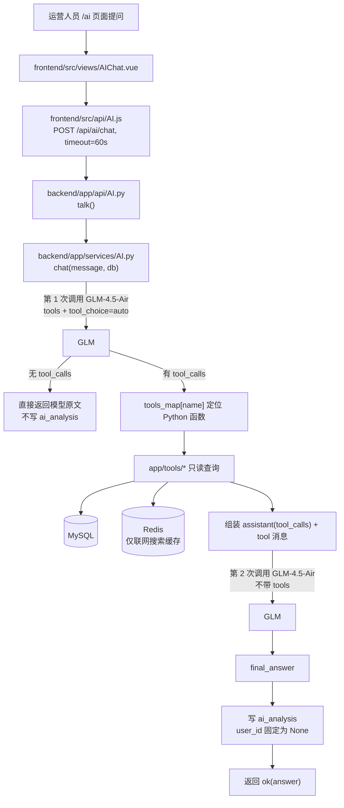
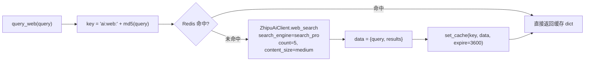

# AI 运营助手设计（AI Design）

> 项目：电商运营管理与智能分析平台
> 对应论文章节：智能分析模块实现
> 对应设计总纲：第 12 章（AI 智能运营助手）、第 13 章（Tool Calling 与联网搜索）、第 14 章（安全与日志）
> 实现代码：`backend/app/api/AI.py`、`backend/app/services/AI.py`、`backend/app/tools/*`、`backend/app/models/ai_analysis.py`、`frontend/src/views/AIChat.vue`、`frontend/src/api/AI.js`
> 文档状态：描述**当前真实代码实现**；与设计总纲不一致处已在第 9 章逐条列出。

## 1. AI 的定位

设计总纲 12.1 明确：**AI 是业务系统之上的智能分析层，不是系统本身**。因此本模块只做三件事：

| 做的事 | 不做的事 |
|--------|----------|
| 调用后端已有的只读查询函数，取得真实聚合数据 | 不让模型直接写 SQL |
| 把结构化结果交给 LLM 转成运营人员能读的分析 | 不让模型执行 INSERT/UPDATE/DELETE |
| 需要当前外部信息时调用联网搜索工具 | 不把 2016–2018 历史数据说成"当前实时数据" |

## 2. 模块结构与调用链



关键实现文件职责：

| 层 | 文件 | 职责 |
|----|------|------|
| Router | `app/api/AI.py` | 接收 `AIRequest`，返回统一响应 |
| Service | `app/services/AI.py` | 提示词、工具声明、工具映射、两轮 LLM 调用、落库 |
| Tools | `app/tools/*.py` | 只读查询的薄封装，转调 `services/` → `repositories/` |
| Model | `app/models/ai_analysis.py` | 问答记录 |
| Front | `AIChat.vue` + `api/AI.js` | 对话界面、Markdown 渲染、超时设置 |

## 3. 模型与 SDK

| 项目 | 取值 | 来源 |
|------|------|------|
| 供应商 | 智谱 GLM（BigModel） | `app/services/AI.py` |
| 对话模型 | `GLM-4.5-Air` | `client.chat.completions.create(model="GLM-4.5-Air")` |
| 对话 SDK | `zhipuai`（`from zhipuai import ZhipuAI`） | requirements.txt 中 `zhipuai==2.1.5.20250825` |
| 联网搜索 SDK | `zai`（`from zai import ZhipuAiClient`） | `app/tools/web_search.py`；requirements.txt 中 `zai-sdk==0.2.3` |
| 鉴权 | 环境变量 `ZHIPU_API_KEY` | `os.getenv("ZHIPU_API_KEY")` |

> **依赖缺口已闭合**：`zai-sdk==0.2.3` 已写入根目录 `requirements.txt`，按该文件重建环境不会 `ImportError`。→ 见第 9 章 AI-05。

## 4. 对话接口

### 4.1 接口定义

| 项 | 值 |
|----|----|
| 方法/路径 | `POST /api/ai/chat` |
| 路由注册 | `app.include_router(ai_router, prefix="/api/ai")` |
| 请求体（Pydantic `AIRequest`） | `{ "message": "string" }` |
| 响应体 | `{ "code": 0, "message": "success", "data": { "answer": "string" } }` |
| 响应模型 | `ApiResponse[AIResponse]`，`AIResponse.answer: str` |
| 鉴权 | **无**（路由器未声明 `dependencies`） |
| 超时（前端） | 60 秒，见 `frontend/src/api/AI.js` |

### 4.2 请求示例

```json
{ "message": "最近销售趋势怎么样？" }
```

```json
{
  "code": 0,
  "message": "success",
  "data": { "answer": "（GLM 生成的 Markdown 文本，可能包含表格）" }
}
```

## 5. Tool Calling 设计

### 5.1 两轮调用机制

系统采用**最多一轮 Tool Calling**：

| 轮次 | 入参 | 说明 |
|------|------|------|
| 第 1 轮 | `tools=tools, tool_choice="auto"` | 由模型自行决定是否调工具、调哪几个 |
| 工具执行 | `tool(db, **arguments)` | Python 侧同步执行，结果 `json.dumps(..., default=str)` 后放入 `role="tool"` 消息 |
| 第 2 轮 | `messages`（system + user + assistant.tool_calls + tool 结果），**不带 tools** | 让模型基于事实数据生成自然语言答案 |
| 终止条件 | 第 1 轮 `tool_calls` 为空 → 直接返回模型原文 | 不再调用第 2 轮 |

> 因为第 2 轮不传 `tools`，模型**无法基于工具结果继续追问新数据**（不支持多轮工具调用）。见第 9 章 AI-08。

### 5.2 工具声明与 Python 函数映射

声明位置：`app/services/AI.py` 的 `tools` 数组；映射位置：`tools_map` 字典。两者键名必须一致，当前共 **9 个工具**。

| 工具名 | 入参 schema | 参数含义 | Python 函数 | 底层实现 |
|--------|-------------|----------|-------------|----------|
| `query_sales` | 无（`properties: {}`，`required: []`） | — | `dashboard_tools.query_sales(db)` | `services.dashboard.get_sales_trend` → `repositories.dashboard.sales_trend` |
| `query_category` | `top: integer`（必填） | 返回销售额最高的类目数量 | `dashboard_tools.query_category(db, top)` | `get_category_ranking` |
| `query_product` | `top: integer`（必填） | 返回销售额最高的商品数量 | `dashboard_tools.query_product(db, top)` | `get_productsranking` |
| `query_order_status` | 无 | — | `order_tools.query_order_status(db)` | `get_order_status_distribution` |
| `query_inventory_warning` | 无 | — | `inventory_tools.query_inventory_warning(db)` | `repositories.inventory.get_warnings` |
| `query_review` | 无 | — | `review_tools.query_review(db)` | `repositories.dashboard.avg_reviews` |
| `query_logistics` | 无 | — | `logistics_tools.query_logistics(db)` | `repositories.logistics.get_logistics_overview` |
| `query_customer` | 无 | — | `customer_tools.query_customer(db)` | `repositories.customer.get_customer_repurchase` |
| `query_web` | `query: string`（必填） | 联网搜索关键词/问题 | `web_search.query_web(db, query)` | 智谱 `ZhipuAiClient.web_search` + Redis 缓存 |

> 约定：`db`（SQLAlchemy Session）由 `chat()` 通过 `tool(db, **arguments)` **注入**，模型不需要也看不到这个参数；工具函数的第一个形参必须命名为 `db`（`web_search.py` 中有对应注释）。

### 5.3 工具返回字段（与代码逐字一致）

**query_sales** → `list[{"month", "sales"}]`

| 字段 | 类型 | 说明 |
|------|------|------|
| month | str | `%Y-%m`，来自 `order_purchase_timestamp` |
| sales | Decimal | `SUM(order_items.price)`，已排除 `canceled` 订单 |

**query_category(top)** → `list[{"category_name", "sales"}]`，`sales` 保留 2 位小数，排除 canceled。

**query_product(top)** → `list[{"product_id", "sales", "sold_count"}]`，`sold_count` 为 `COUNT(order_item_id)`。

**query_order_status** → `{"items": [{"status", "count"}]}`，按 count 降序。

**query_inventory_warning** → `{"total": int, "items": [{"product_id", "quantity", "safe_stock"}]}`

| 字段 | 说明 |
|------|------|
| total | 满足 `quantity <= safety_stock` 的商品总数 |
| items | 上述清单的**前 15 条**（工具层切片，避免上下文过长） |

**query_review** → `{"avg_review_score": float}`（全部评价 `AVG(review_score)`，2 位小数）。

**query_logistics** → `{"avg_delivery_days", "total_delivered", "on_time_count", "delayed_count", "on_time_rate", "delay_rate"}`。

**query_customer** → `{"total_customers", "repeat_customers", "repurchase_rate"}`，客户口径为 `customer_unique_id`（排除 canceled）。

**query_web(query)** → `{"query": str, "results": [...]}`，`results` 为智谱搜索结果列表。

### 5.4 联网搜索与缓存



| 项 | 取值 | 依据 |
|----|------|------|
| 缓存 Key | `ai:web:{md5(query)}` | 与设计总纲第 11 章 `ai:web:{query_hash}` 一致 |
| TTL | 3600 秒（1 小时） | `set_cache(..., expire=3600)` |
| 搜索引擎 | `search_pro` | `client.web_search.web_search(...)` |
| 返回条数 | 5 | `count=5` |
| 内容长度档位 | medium | `content_size="medium"` |

## 6. 提示词设计

`SYSTEM_PROMPT`（`app/services/AI.py`）分三段约束，全文要点如下：

| 段落 | 关键约束（原文摘要） |
|------|----------------------|
| 数据规则 | 内部数据来自 Olist；时间范围主要为 2016-09 至 2018-10；**属于历史数据，不得描述为当前实时数据**；使用内部工具数据时须说明来源与时间范围；网络信息 / 内部历史 / 模型推理必须明确区分；不确定的信息不要编造 |
| 工具使用规则 | 问内部业务数据优先调对应工具；不调无关工具；工具返回是事实依据；数据不足要说明而不是编造；问当前政策/新闻/最新动态时"应调用 web_search 工具联网搜索"；联网搜索结果属"当前外部信息"，必须与 2016–2018 内部数据区分 |
| 回答要求 | 准确、简洁、易懂；涉及历史数据须注明时间范围；推断要标明是"分析或推断"而非原始事实 |

> **已知不一致**：提示词中工具写作 `web_search`，而 `tools` 里注册的实际工具名为 `query_web`，`tools_map` 也只认 `query_web`。二者不同名可能导致模型倾向直接回答而不调工具。见第 9 章 AI-06。

## 7. 问答记录（ai_analysis）

表结构（`app/models/ai_analysis.py`，由 `Base.metadata.create_all()` 创建）：

| 字段 | 类型 | 可空 | 实际写入值 |
|------|------|------|-----------|
| id | Integer PK, autoincrement | 否 | 自增 |
| user_id | String(50) | **是** | **恒为 NULL**（`chat()` 中硬编码 `user_id=None`） |
| question | Text | 否 | 用户原始问题 |
| tool_context | Text | 是 | 工具调用摘要 JSON：`[{"name": 工具名, "arguments": {...}}]`，**不保存工具返回结果** |
| answer | Text | 否 | 模型最终回答 |
| created_at | DateTime, `server_default=now()` | 是 | 数据库时间 |

写入时机（真实行为）：

| 场景 | 是否落库 |
|------|----------|
| 模型返回了 `tool_calls` | 是（`db.add` + `db.commit`） |
| 模型未调用任何工具（直接回答） | **否**（函数在第 231–232 行提前 return） |
| 工具执行过程中抛异常 | 否，且整个请求 500 |

表中**没有**"执行状态"字段，无法区分成功/失败/降级，与设计总纲第 14 章"记录结果状态"的要求不符。

## 8. 前端实现

| 项 | 实现 |
|----|------|
| 路由 | `/ai`，`name: AIChat`，标题「AI 运营助手」，角色白名单：admin / operator / warehouse |
| 接口封装 | `request.post('/ai/chat', { message }, { timeout: 60000 })`；`request` 的 `baseURL='/api'`，由 Vite 代理转发 |
| 渲染 | `marked.parse()` 渲染 Markdown → `DOMPurify.sanitize(html, {USE_PROFILES:{html:true}})` 消毒后 `v-html`（联网结果属不可信输入，必须消毒） |
| 交互 | 空态示例问题 4 条、回车发送、`loading` 时禁用输入并显示"正在思考中"动画、失败提示"抱歉，请求失败了，请稍后重试。" |
| 会话 | 消息仅保存在组件内存（`ref`），刷新即丢失；请求**不携带历史消息**，每次都是单轮问答 |
| 流式输出 | 未实现（整段返回，最长等待 60 s） |

## 9. 现状与改进项

### 9.1 缺陷 / 风险清单

| ID | 级别 | 问题 | 证据（代码位置） | 影响 | 建议 |
|----|------|------|------------------|------|------|
| AI-01 | 高 | AI 客户端在**模块导入期**初始化，`ZHIPU_API_KEY` 缺失即抛错 | `services/AI.py:15-17`（`client = ZhipuAI(api_key=api_key)`）；`main.py` 导入 ai_router，启动即执行 | 违背总纲 12.1「关闭 AI 不影响核心功能」，缺 Key 会导致**整个后端起不来** | 改为惰性单例（首次 `chat` 时创建）+ 捕获异常返回可读提示；或加 `AI_ENABLED` 开关 |
| AI-02 | 高 | `/api/ai/chat` **无鉴权、无权限校验** | `api/AI.py:10` 装饰器无 `dependencies` | 任意人可调用，消耗 GLM 配额、可写 `ai_analysis` 表 | 加 `Depends(require_permission("ai:chat"))`，并把提问人写入 `user_id` |
| AI-03 | 高 | 工具执行无异常兜底 | `services/AI.py:239-244`：`tools_map[tool_name]` 直接下标、`json.loads(arguments)` 无 try、`tool(...)` 无 try | 模型返回未注册工具名 → `KeyError` → 500；工具抛错 → 500 | 单工具 try/except，失败时以 `{"error": "..."}` 作为 tool 结果回喂模型并继续 |
| AI-04 | 中 | 未记录提问用户、无执行状态 | `services/AI.py:292-306`（`user_id=None` 硬编码） | `ai_analysis.user_id` 实测**全为 NULL**，无法按人审计 | 从 `get_current_user` 取值写入；增加 `status` 字段 |
| AI-05 | 中 | ~~`zai`（联网搜索 SDK）未声明在 `requirements.txt`~~ | **已修复**：根目录 `requirements.txt` 已补入 `zai-sdk==0.2.3`（与 `zhipuai==2.1.5.20250825` 并存） | 按该文件重建环境不再 ImportError | — |
| AI-06 | 低 | 提示词工具名与注册名不一致 | `SYSTEM_PROMPT` 写 `web_search`，实际工具为 `query_web` | 模型可能不调工具直接编答 | 提示词统一为 `query_web` |
| AI-07 | 中 | 残留 `print` 调试语句、全项目无 logging 配置 | `services/AI.py:223`、`:244`；全项目无 `logging.getLogger` | 生产环境无法按级别审计与排查；打印工具结果可能泄露业务数据 | 引入 `logging`，按总纲第 14 章输出结构化日志 |
| AI-08 | 中 | 仅支持**一轮**工具调用，第二轮不传 `tools` | `services/AI.py:280-283` | 复杂问题（如"先看趋势再看类目"）无法自动追查 | 改为循环：只要返回 `tool_calls` 就继续执行，设最大轮数（如 3） |
| AI-09 | 中 | 无流式输出 | 后端一次性返回；前端 60 s 超时 | 长回答等待久、体验差 | 上 SSE / `stream=True`，前端逐字渲染 |
| AI-10 | 低 | 未按总纲 12.4 固定答案结构 | 当前为模型自由 Markdown | 不保证包含"数据依据/时间范围/风险/建议" | 用结构化提示词模板约束输出小节 |
| AI-11 | 低 | 联网搜索缓存只写不失效、无失败降级；Redis 不可用时 `get_cache` 抛 `ConnectionError` | `core/redis.py:15-33`、`tools/web_search.py:15` | Redis 宕机时 AI 联网问答 500 | 缓存读写加 try/except，失败即跳过缓存 |

### 9.2 与设计总纲的对照

| 总纲要求 | 现状 | 结论 |
|----------|------|------|
| 12.1 AI 可关闭、不影响核心功能 | 缺 Key 时后端无法启动 | **未满足**（AI-01） |
| 12.3 工具清单 query_sales / query_orders / query_inventory / query_reviews / query_logistics / query_customer / query_category | 已实现，但命名为 `query_order_status` / `query_inventory_warning` / `query_review`，并额外提供 `query_product`、`query_web` | 基本满足（命名需在论文中说明） |
| 12.3 工具入参支持日期范围 / 类目 / 阈值 | 目前仅 `query_category`、`query_product` 有 `top`，其余无参 | **未满足**（工具参数过硬，问题范围无法收窄） |
| 13.3 流程：工具返回 → LLM 综合 → 保存 ai_analysis | 已实现，但"无工具调用""工具报错"两种路径不落库 | 部分满足（AI-04） |
| 13.4 数据工具只读 | 9 个工具全部为 SELECT 聚合，无任何写操作 | **满足** |
| 13.4 回答必须注明数据时间范围 | 仅靠提示词约束，无程序校验 | 部分满足 |
| 11 章 `ai:web:{query_hash}` 缓存 | 已实现，TTL 1 小时 | **满足** |
| 14 章 AI 请求记录 question / 工具摘要 / 结果状态 / 回答 | 记录 question、工具名+参数、answer；缺 user_id 与状态 | 部分满足 |

## 10. 测试要点

| 用例 | 预期 |
|------|------|
| 不带 token 调 `/api/ai/chat` | 当前返回 200（**缺陷**，应 401/403） |
| 问"最近销售趋势怎么样？" | 命中 `query_sales`，答案含 2016–2018 数据与月份区间 |
| 问"明天北京天气" | 应使用工具或明确说明无法回答，不得编造 |
| 问当前电商政策 | 应调用 `query_web`，答案区分"当前外部信息"与"内部历史数据" |
| 缺 `ZHIPU_API_KEY` 启动服务 | 当前后端起不来（**缺陷**）；目标为后端正常启动、AI 接口返回可读错误 |
| 模型返回未注册工具名 | 当前 500（**缺陷**）；目标为降级返回提示 |

实测结果见 `docs/12_test_report.md`。