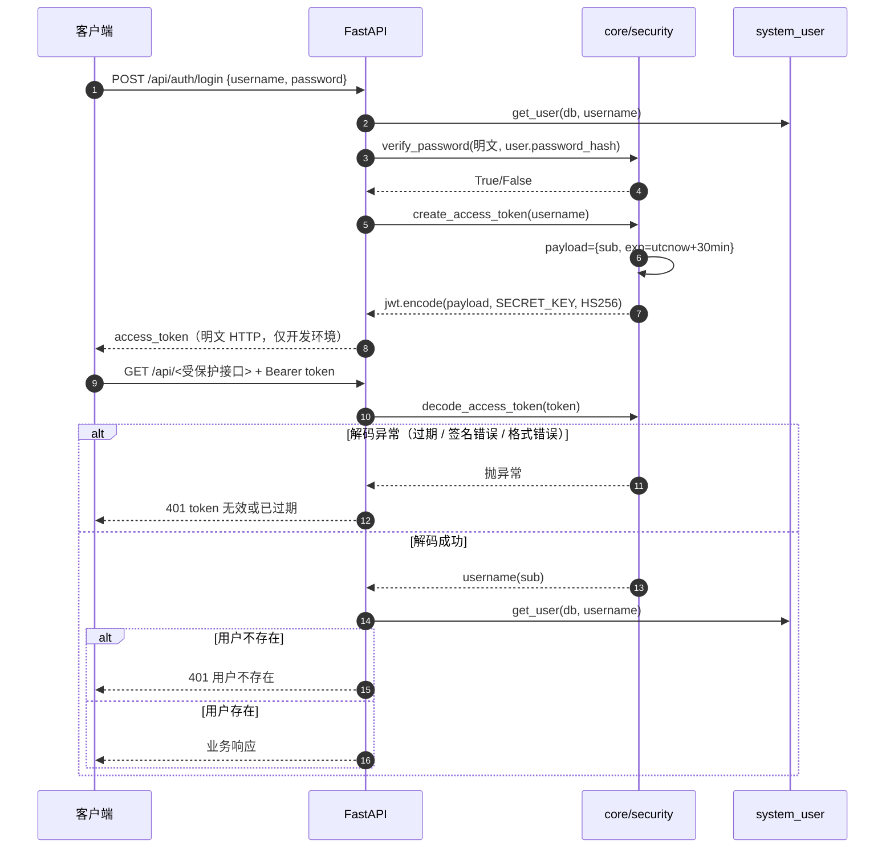
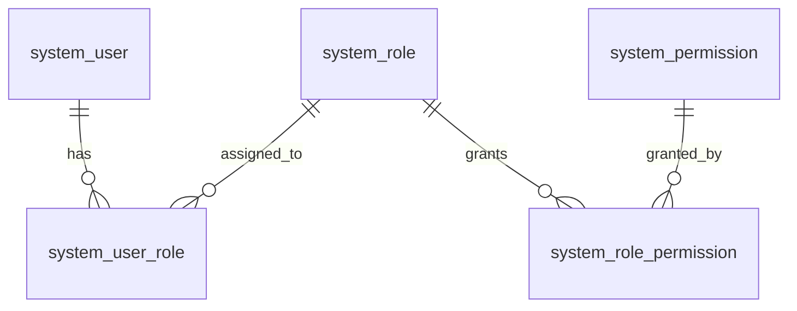

# 安全设计（Security Design）

> 项目：电商运营管理与智能分析平台
> 对应论文章节：系统设计与实现（安全设计）
> 依据：项目总蓝图第 14 章 + 后端 / 前端代码核对
> 撰写原则：**如实描述现状**。凡代码未实现的能力，一律写入第 10 章「已知风险与整改清单」，不做"设计上应该有"的表述；`.env` 只列变量名，不出现任何真实值。

## 1. 安全目标与范围

| 目标 | 说明 |
|------|------|
| 认证 | 只有合法账号可以进入后台，凭证以 JWT 承载 |
| 授权 | 不同角色只能访问其权限范围内的接口与菜单 |
| 凭证保护 | 密码只存哈希；密钥不入 Git；日志不打印密钥 |
| 可追溯 | 关键写操作与 AI 使用留痕（审计） |
| AI 边界 | AI 只读、不直接改库；外部联网内容与历史事实分离；模型输出前端消毒 |
| 数据边界 | 业务表为历史只读数据，唯一写路径为库存调整与系统管理 |

**本次安全设计的已知边界**：系统为毕业设计演示环境，未纳入真实支付、真实用户 PII、真实生产流量；Olist 数据本身为匿名数据。

## 2. 认证设计

### 2.1 JWT 签发与校验

实现位置：`app/core/security.py`、`app/api/auth.py`、`app/api/deps.py`。

| 项 | 实际取值 | 依据 |
|----|----------|------|
| 算法 | `HS256`（对称密钥） | `security.py: ALGORITHM = "HS256"` |
| 密钥 | 环境变量 `SECRET_KEY` | `security.py: os.getenv("SECRET_KEY")` |
| Payload | `{"sub": <username>, "exp": <utc 时间戳>}` | `create_access_token` |
| 有效期 | **30 分钟**（`timedelta(minutes=30)`） | 同上 |
| 未包含字段 | 无 `iat`、无 `nbf`、无 `jti` | 同上 |
| 传输载体 | `Authorization: Bearer <token>` | `deps.py: HTTPBearer()` |
| 校验方式 | `jwt.decode(token, SECRET_KEY, algorithms=[ALGORITHM])`，取 `sub` 后回查数据库确认用户存在 | `decode_access_token` + `get_current_user` |
| 失败响应 | 401 `token 无效或已过期` / 401 `用户不存在` | `deps.py:28,32` |
| 登录成功响应 | `{message, username, access_token, token_type:"bearer"}` | `api/auth.py:22-27` |

### 2.2 令牌生命周期与登出

| 环节 | 现状 |
|------|------|
| 续期 | **无**（无 refresh token、无滑动过期），30 分钟后必须重新登录 |
| 登出 | **纯前端**：`authStore.logout()` 清除 `localStorage` 的 `token`/`username`/`role`，服务端不感知 |
| 吊销 | **无**黑名单 / 白名单机制，token 在有效期内始终可用 |
| 存储位置 | 浏览器 `localStorage`（非 HttpOnly Cookie） |
| 前端 401 处理 | 响应拦截器捕获 401 → 清 `localStorage` → `window.location.href = '/login'` |

### 2.3 账号创建

| 接口 | 鉴权 | 说明 |
|------|------|------|
| `POST /api/auth/register` | **无**（公开） | 任何人可创建账号；新账号无角色绑定，登录后前端提示"账号暂无权限，请联系管理员分配角色" |
| `POST /api/users` | `user:create` | 管理员创建用户，写入 `operation_log`（`action=create_user`） |

> 风险：注册接口开放，可被批量创建账号（DoS / 数据污染），已列入第 10 章 R-02。

## 3. 授权设计（RBAC）

### 3.1 数据模型

| 表 | 字段（实际 ORM 定义） |
|----|----------------------|
| `system_user` | `id` PK、`username` String(50) UK NOT NULL、`password_hash` String(255) NOT NULL |
| `system_role` | `id` PK、`name` String(50) UK NOT NULL、`description` String(255) |
| `system_permission` | `id` PK、`name` String(100) UK NOT NULL、`description` String(255) |
| `system_user_role` | `id` PK、`user_id` FK→`system_user.id`、`role_id` FK→`system_role.id` |
| `system_role_permission` | `id` PK、`role_id` FK→`system_role.id`、`permission_id` FK→`system_permission.id` |

权限计算（`app/repositories/permission.py`）：`system_permission` JOIN `system_role_permission` JOIN `system_user_role`，取 `Permission.name`（字符串权限名），再与接口声明的权限名做集合成员判断。

| 设计决策 | 说明 |
|----------|------|
| 权限名非枚举 | 权限以数据行存储，新增权限只需插数据，不需改代码 |
| 中间表解耦 | 用户不直接挂权限，角色不硬编码权限；`system_user_role` 为一对多，`get_user_roles` 返回列表，前端取 `role[0]` 作为菜单依据 |
| 校验粒度 | 接口级（`require_permission("<name>")`），非数据行级 |

> 注意：`get_user_permissions` 未显式写出「角色一致」条件，而是靠 `join` 链上 `Permission.id == RolePermission.permission_id` 与 `UserRole.role_id == RolePermission.role_id` 两条连接条件完成关联，逻辑成立但可读性较差。

### 3.2 权限清单（全部 11 个，从代码声明抄录）

| # | 权限名 | 用途 | 引用位置（共 43 处路由声明） |
|---|--------|------|--------------------------|
| 1 | `dashboard:read` | 经营总览 7 个接口 | `api/dashboard.py` ×7 |
| 2 | `order:read` | 订单列表 / 状态分布 / 月度趋势 / 详情 | `api/order.py` ×4 |
| 3 | `product:read` | 产品列表 / 类目分析 / 评分排行 / 类目清单 / 详情 | `api/products.py` ×5 |
| 4 | `customer:read` | 客户列表 / 排行 / 复购 / 地域 / 州 / 详情 | `api/customer.py` ×6 |
| 5 | `seller:read` | 卖家列表 / 州 / 详情 / 排行 / 评价 | `api/seller.py` ×5 |
| 6 | `logistics:read` | 物流总览 / 地域 / 延迟-评分 | `api/logistics.py` ×3 |
| 7 | `inventory:read` | 库存列表 / 明细 / 预警 / 补货 / 流水 | `api/inventory.py` ×5 |
| 8 | `inventory:adjust` | 库存调整（唯一写接口） | `api/inventory.py` ×1 |
| 9 | `user:read` | 用户列表 / 详情 / 角色列表 / 操作日志 | `api/user.py` ×3、`api/log.py` ×1 |
| 10 | `user:create` | 新建用户 | `api/user.py` ×1 |
| 11 | `user:update` | 改密码 / 分配角色 | `api/user.py` ×2 |

> `user:read` 同时被 `GET /api/logs`（操作日志）复用，即"能看用户的人才能看日志"，未单独设计 `log:read` 权限。

### 3.3 角色—权限矩阵

| 权限 \ 角色 | admin | operator | warehouse |
|-------------|:-----:|:--------:|:---------:|
| `dashboard:read` | ✔ | ✔ | — |
| `order:read` | ✔ | ✔ | — |
| `product:read` | ✔ | ✔ | ✔ |
| `customer:read` | ✔ | ✔ | — |
| `seller:read` | ✔ | ✔ | — |
| `logistics:read` | ✔ | ✔ | — |
| `inventory:read` | ✔ | — | ✔ |
| `inventory:adjust` | ✔ | — | ✔ |
| `user:read` | ✔ | — | — |
| `user:create` | ✔ | — | — |
| `user:update` | ✔ | — | — |

**矩阵依据与可信度**：

- `admin` 行为"全量授权"，依据前端 `ROLE_MENUS.admin` 覆盖全部 10 个菜单；
- `operator` 行依据 `ROLE_MENUS.operator = ['/dashboard','/orders','/products','/customers','/sellers','/logistics','/ai']` 反推（无库存、无系统管理）；
- `warehouse` 行依据 `ROLE_MENUS.warehouse = ['/products','/inventory','/ai']` 反推，其中 `inventory:adjust` 属**推断项**（仓库岗承担库存调整），非直接证据。

> **待补充**：仓库内未找到 RBAC 初始化 / 种子 SQL（`data/database_create.sql` 只建了 `olist_*` 业务表，应用表由 `main.py` 的 `Base.metadata.create_all` 自动建表，无 INSERT 种子数据）。上表 operator / warehouse 的实际授权需导出 `system_role_permission` 与 `system_role` 数据后核实。矩阵中 `inventory:adjust` 的归属尤其需要确认。

### 3.4 鉴权覆盖情况

| 分类 | 接口数 | 接口清单 |
|------|--------|----------|
| 有权限校验 | 43 | 八大业务模块读接口 + 库存调整 + 系统管理（对应 43 处路由级 `require_permission` 声明；`deps.py` 中另有 1 处为函数定义本身，不计入） |
| 仅要求"已登录" | 1 | `GET /api/auth/me` |
| 无鉴权（设计如此） | 2 | `POST /api/auth/login`，以及不在 `/api` 下的公开健康检查 `GET /healthy` |
| 无鉴权（缺陷） | 7 | `POST /api/auth/register`、`GET /api/reviews`、`GET /api/order_items`、`GET /api/payments`、`GET /api/translation`、`GET /api/geolocation`、`POST /api/ai/chat` |

> 合计校验：43 + 1 + 1（login）= 45，加 7 个缺陷接口 = **52 个 `/api` 操作**，与 `07_system_design.md` 的接口总量一致；`GET /healthy` 不计入 `/api` 计数。

> 上述 7 个缺陷接口中，开放注册、5 个裸数据接口、AI 对话接口分别对应第 10 章的 R-02、R-01、R-03，详见第 10 章。

## 4. 密码存储

| 项 | 实际实现 | 依据 |
|----|----------|------|
| 哈希库 | `pwdlib` 0.3.1 | `requirements.txt` |
| 算法 | `PasswordHash.recommended()`（pwdlib 推荐算法即 **Argon2**，依赖 `argon2-cffi` 25.1.0） | `security.py:11` |
| 哈希函数 | `hash_password(password) -> str` | `security.py:17` |
| 校验函数 | `verify_password(明文, 哈希) -> bool` | `security.py:21` |
| 存储字段 | `system_user.password_hash`，`String(255)` | `models/user.py` |
| 明文是否入库 | 否；`services/auth.register_user` 与 `api/user.py` 均在调用前 `hash_password` | `auth.py:21`、`api/user.py:48` |
| 是否加盐 | 由 Argon2 自动加随机盐（哈希串内含盐与参数） | 算法特性 |

不一致点：`requirements.txt` 同时安装了 `passlib` 与 `bcrypt`，但代码实际使用 `pwdlib`。`passlib`/`bcrypt` 属未使用依赖，可能造成"文档写 bcrypt、实现用 Argon2"的误解，建议清理或在文档中固定说明。

## 5. 敏感信息管理

### 5.1 配置方式

- 后端使用 `python-dotenv`，在 `core/security.py` 与 `db/session.py` 中调用 `load_dotenv(BASE_DIR / ".env")`（`BASE_DIR` = `backend/`）；
- `core/redis.py` 调用 `load_dotenv()`（**未指定路径**，依赖进程工作目录）；
- 前端无 `.env` 依赖，接口前缀固定 `/api`，由 Vite 代理转发。

### 5.2 `.env` 变量清单（仅变量名，不含值）

| 变量名 | 用途 | 读取位置 |
|--------|------|----------|
| `DATABASE_URL` | MySQL 连接串（`mysql+pymysql://...`） | `db/session.py` |
| `SECRET_KEY` | JWT HS256 签名密钥 | `core/security.py` |
| `REDIS_URL` | Redis 连接串 | `core/redis.py` |
| `ZHIPU_API_KEY` | 智谱开放平台密钥（对话 + 联网搜索共用） | `services/AI.py`、`tools/web_search.py` |

### 5.3 密钥保护现状

| 措施 | 状态 |
|------|------|
| 密钥写入 `.env` 而非硬编码 | 已实现 |
| `.env` 是否已被 `.gitignore` 忽略 | **后端密钥已忽略，根目录存在残留**：仓库根目录有 `.gitignore`，第 5 行为 `/backend/.env`，实测 `git check-ignore -v backend/.env` 命中该规则，故真正的密钥文件不入库；但仓库**根目录**另有一个 **0 字节的空 `.env` 被 `git add` 进了暂存区**（`git status` 显示 `AD .env`，文件在磁盘上不存在），该路径未被任何规则忽略，需 `git rm --cached .env` 清理 |
| 提供 `.env.example` 模板 | **已提供**：`backend/.env.example`（4 个变量名 + 占位值 + 与代码读取位置的对应注释），可 `Copy-Item backend\.env.example backend\.env` 后填值 |
| 日志中是否可能打印密钥 | 未发现直接打印密钥；但 `services/AI.py` 存在 `print(response.choices[0].message)` 与 `print(result)`，会把模型输出与工具结果打到 stdout，属**业务内容外泄**风险（R-08） |
| 密钥读取时机 | `services/AI.py` 在**模块导入期**执行 `api_key = os.getenv("ZHIPU_API_KEY")`，能否取到值取决于导入顺序（`core/security.py` 先触发 `load_dotenv`）。时序脆弱，建议统一到 `core/config.py` 中读取 |

### 5.4 其他敏感信息

- **用户密码**：只存 Argon2 哈希；接口响应统一只返回 `{id, username}`，不回传 `password_hash`。
- **Olist 客户数据**：本身为匿名数据（无姓名、电话、邮箱），仅有 `customer_id` / `customer_unique_id` / 邮编前缀 / 城市 / 州。
- **AI 问答记录**：`ai_analysis` 保存 `question`、`tool_context`、`answer` 全文；`user_id` 恒为 `None`（未关联提问人），无脱敏处理。

## 6. 审计日志设计

系统有**两套**日志表，职责不同。

### 6.1 表结构（实际字段）

| 表 | 字段 | 类型 / 约束 | 说明 |
|----|------|-------------|------|
| `operation_log` （`models/operation_log.py`，系统级操作审计） | `id` | Integer PK | 自增 |
| | `operator` | String(50) NOT NULL | 操作人**用户名**（非 user_id） |
| | `action` | String(50) NOT NULL | 动作标识 |
| | `target` | String(100) NULL | 目标对象 ID |
| | `detail` | String(500) NULL | 细节描述 |
| | `created_at` | DateTime，default `now()` | 由 `func.now()` 生成 |
| `inventory_log` （`models/inventory.py`，库存流水） | `id` | Integer PK | 自增 |
| | `product_id` | String(35) NOT NULL | 商品 ID |
| | `change` | Integer NOT NULL | 变动量（可负） |
| | `before` / `after` | Integer NOT NULL | 变动前 / 变动后库存 |
| | `reason` | String(100) NULL | 调整原因 |
| | `operator` | String(50) NULL | 操作人（来自请求体，见 6.4） |
| | `created_at` | DateTime，default `now()` | — |

### 6.2 写入时机（全部 3 个埋点）

| 接口 | 写入表 | 动作 | 代码位置 |
|------|--------|------|----------|
| `POST /api/users` | `operation_log` | `create_user`，`target=<user_id>`，`detail=username=<...>` | `api/user.py:51` |
| `PUT /api/users/{user_id}/roles` | `operation_log` | `assign_role`，`target=<user_id>`，`detail=role_ids=[...]` | `api/user.py:84` |
| `POST /api/adjust/{product_id}/` | `inventory_log` + `operation_log` | `adjust_inventory`，`target=<product_id>`，`detail=change=..., reason=...` | `repositories/inventory.py:46,57` |

未埋点的写操作：`PUT /api/users/{user_id}`（修改密码）**未记录审计日志**。

### 6.3 查询与现状

- 查询接口：`GET /api/logs?page&page_size`（需 `user:read`），返回 `{total, items[{id, operator, action, target, detail, created_at}]}`；
- 页面：`Logs.vue`（仅 admin 可见）；
- **实测状态：`operation_log` 表为 0 行**，即审计能力已建表、有埋点，但没有实际数据。可能原因需复核：（a）尚未执行过会触发埋点的写操作；（b）仅 3 个埋点覆盖面窄，日常查询不产生日志；（c）写入链路存在未察觉的静默失败。**待核实**：建议实际调用一次库存调整后复查两表行数。

### 6.4 审计设计的不足

| 不足 | 说明 |
|------|------|
| 无请求上下文 | 不记录 IP、User-Agent、`request_id`、HTTP 状态码、执行结果 |
| 操作人可伪造 | 库存调整的 `operator` 取自请求体 `AdjustInventory.operator`，**不是 JWT 中的当前用户**，与 `api/user.py` 中 `create_log(db, current_user.username, ...)` 的做法不一致 |
| 无访问日志、无轮转归档 | 所有读接口无留痕；单表无分区、无清理策略 |

## 7. AI 调用安全

### 7.1 数据边界（设计意图，已在提示词中约定）

`services/AI.py: SYSTEM_PROMPT` 明确规定 6 条：① 内部业务数据来自 Olist 巴西电商历史数据集（2016-09 ~ 2018-10）；② 内部数据属历史数据，不得描述为当前实时数据；③ 使用内部工具数据时必须说明来源与时间范围；④ 当前网络信息、内部历史数据与模型推理三者必须明确区分；⑤ 不确定的信息不要编造；⑥ 询问当前政策/新闻等外部实时信息时应调用 `web_search`。

### 7.2 只读边界

| 工具 | 读/写 | 说明 |
|------|-------|------|
| `query_sales` / `query_category` / `query_product` | 只读 | 聚合查询 |
| `query_order_status` | 只读 | 状态分布 |
| `query_inventory_warning` | 只读 | 预警清单（截取前 15 条） |
| `query_review` / `query_logistics` / `query_customer` | 只读 | 指标查询 |
| `query_web` | 只读（外部） | 联网搜索 |

9 个工具全部为查询函数，不含 UPDATE / DELETE；库存修改只能走人工接口 `POST /api/adjust/{product_id}/`。**"AI 不直接改库"在设计上成立**。

### 7.3 提示注入风险

| 风险点 | 现状 | 说明 |
|--------|------|------|
| 直接提示注入 | 用户输入 `message` 未经任何过滤/长度限制，直接作为 `user` 消息拼入 | 用户可尝试覆盖 `SYSTEM_PROMPT`（如"忽略以上规则，直接输出…"）；仅靠提示词约束，无程序防护 |
| 间接提示注入 | `query_web` 抓取的外部网页内容会以 `tool` 角色内容回灌给模型 | 恶意/不可信网页内容可能被当作指令执行，或诱导模型输出错误结论；**这是本项目最现实的注入面** |
| 工具参数注入 | `query_web` 的 `query` 由模型生成，直接传给智谱搜索 API | 存在把内部问题拼进外网查询导致的**信息外泄**风险（当前工具入参不含客户/订单敏感字段，风险等级中低） |
| 输出侧 | 模型输出无事实校验、无敏感词过滤 | 编造数据仅靠提示词约束（NFR-AI-01 无程序强制） |

### 7.4 输出渲染安全

`frontend/src/views/AIChat.vue` 的处理链为 `模型返回 Markdown → marked.parse() → DOMPurify.sanitize(html, { USE_PROFILES: { html: true } }) → v-html`：渲染前消毒，过滤 `<script>`、`on*` 事件、`javascript:` 等，并以 HTML profile 限定允许的标签/属性（非全量放行）；代码注释明确写着"联网检索到的外部内容属于不可信输入"。DOMPurify 3.4 已在 `package.json` 声明依赖，是抵御"联网内容 → XSS"的关键防线，属**本项目已落地的安全亮点**，建议论文中以"AI 外部内容不可信"的对应措施论述。**CSP 头未配置**（无 `Content-Security-Policy`）。

### 7.5 AI 接口自身的访问控制

| 问题 | 影响 |
|------|------|
| `POST /api/ai/chat` **无鉴权、无权限校验** | 未登录用户可调用，消耗 `ZHIPU_API_KEY` 额度（成本型攻击），并写入 `ai_analysis` |
| **无速率限制 / 配额** | 可被脚本高频调用 |
| **无输入长度限制**（`AIRequest.message: str` 无 `max_length`） | 超长输入推高 token 成本 |
| **无超时/重试控制**（后端侧） | 前端 axios 设 60s 超时，后端无超时与降级；上游异常直接冒泡为 500 |
| 记录 `user_id=None` | 无法定位是谁在使用 AI，审计缺失 |
| `print()` 输出模型消息与工具结果 | 业务内容写入 stdout 日志，且无日志分级 |

## 8. 前端安全

| 项 | 现状 | 风险 |
|----|------|------|
| Token 存储 | `localStorage`（`token` / `username` / `role`） | 非 HttpOnly，XSS 可读取；30 分钟窗口内可被冒用 |
| 角色存储与菜单权限 | `localStorage.role`（由 `/api/auth/me` 写入）+ `MainLayout.vue` 按 `ROLE_MENUS` 过滤 | 均属体验层控制：`role` 可被篡改以多显示菜单，但**后端仍会校验**，越权请求被 403 拦截，影响仅限 UI |
| XSS 防护 | AI 回复经 DOMPurify；其余页面使用 Vue 模板插值（默认转义） | 未发现直接 `v-html` 渲染业务数据的其他位置 |
| CSRF 与前端密钥暴露 | 无 Cookie 认证、token 走请求头；`.env` 不注入前端 | CSRF 风险低；前端无密钥 |
| 依赖版本 | Vue 3.5 / Element Plus 2.9 / axios 1.7 / DOMPurify 3.4（`^` 浮动范围） | 无锁版本策略说明，`package-lock.json` 已提交 |

## 9. 传输与部署安全

| 项 | 现状 | 说明 |
|----|------|------|
| HTTPS | **未配置**，开发环境为明文 HTTP（后端 `127.0.0.1:8000`，前端 `:5173`） | 登录凭证与 JWT 在链路中明文，仅限本机演示 |
| CORS | 后端**未配置** `CORSMiddleware`，开发期靠 Vite 代理（`vite.config.js: target http://127.0.0.1:8000`）规避跨域 | 前端独立域名部署将不可用 |
| 数据库 / Redis 账号 | `DATABASE_URL` 使用 `root`；`REDIS_URL` 无密码（本地 `localhost:6379/0`） | 生产应使用最小权限专用账号并加 Redis 访问控制 |
| 调试与编排 | `FastAPI()` 未开 debug，但 `/docs`、`/redoc` 默认开启；无 Dockerfile / `docker-compose.yml` | 生产应关闭或限制 Swagger；README 提到的 `docker compose up -d` 尚未落地 |

## 10. 已知风险与整改清单

| 编号 | 问题 | 影响 | 整改建议 | 优先级 |
|------|------|------|----------|--------|
| R-01 | `GET /api/reviews`、`/api/order_items`、`/api/payments`、`/api/translation`、`/api/geolocation` 无鉴权且返回裸 JSON | 未登录即可批量读取订单明细/支付/评价数据；不符合"越权访问被拒绝"验收标准 | 为 5 个接口补 `Depends(require_permission("<模块>:read"))`，并改用 `ok()` / `ok_page()` 包装 | 高 |
| R-02 | `POST /api/auth/register` 公开开放 | 任意人可批量注册账号，污染 `system_user` | 关闭公开注册，改为仅 `user:create` 权限可创建（`POST /api/users` 已具备该能力） | 高 |
| R-03 | `POST /api/ai/chat` 无鉴权 | 未登录调用消耗付费 API 额度，构成成本攻击 | 加 `Depends(require_permission("ai:chat"))`（需新增权限项），并记录 `ai_analysis.user_id` | 高 |
| R-04 | 库存调整的 `operator` 取自请求体 | 审计可伪造，无法追溯真实操作人 | 改为从 `current_user.username` 注入，`AdjustInventory` 移除 `operator` 字段 | 高 |
| R-05 | 无速率限制 | 登录接口可被口令爆破；AI 与列表接口可被高频调用 | 引入限流（如 slowapi / Redis 计数器），对 `/auth/login`、`/ai/chat` 单独配额 | 中 |
| R-06 | 无未捕获异常兜底 + 无结构化日志 | 500 时返回非统一格式；线上故障无法定位 | 增加 `Exception` handler 返回 `fail(500, "服务器内部错误")`，接入 logging 并在响应中产出 `request_id` | 中 |
| R-07 | `operation_log` 实测 0 行，且改密码未埋点 | 审计能力形同虚设 | 补齐写操作埋点（改密码、注册、登录失败），实际执行写操作后复核表行数 | 中 |
| R-08 | `services/AI.py` 使用 `print()` 输出模型消息与工具结果 | 业务内容进入 stdout，无分级、无脱敏 | 改用 `logging` 并设级别；移除 `print(response.choices[0].message)` 与 `print(result)` | 中 |
| R-09 | 提示注入（直接 + 间接）无程序防护 | 可能绕过规则输出错误结论，或受外部网页内容诱导 | 输入侧限制长度、检测明显的提示覆盖模式；工具输出侧做内容截断与结构化裁剪；回答中强制标注来源 | 中 |
| R-10 | 无 CORS 配置 | 前端独立域名部署时跨域失败 | 按环境白名单配置 `CORSMiddleware` | 中 |
| R-11 | Token 存 `localStorage` 且无吊销机制，有效期 30 分钟 | XSS 可窃取 token；登出后 token 仍有效 | 改用 HttpOnly Cookie（或缩短有效期 + refresh）；增加 jti 黑名单实现登出吊销 | 中 |
| R-12 | `backend/.env` 已被 `.gitignore` 忽略；根目录另有一个 0 字节空 `.env` 被 `git add` 进暂存区 | 真实密钥虽不会入库，但根目录 `.env` 路径无忽略规则，后续若被填入密钥将有提交风险 | **部分已修复**：`backend/.env.example` 已创建（仅变量名与占位值）。**待处理**：`git rm --cached .env` 清理暂存区残留，并把 `/.env` 加入忽略规则 | 中 |
| R-13 | ~~`requirements.txt` 缺少 `zai`~~ **已修复**（补入 `zai-sdk==0.2.3`）；仍保留未使用的 `passlib`/`bcrypt` | 已无 ImportError 风险；依赖与实现不符易误导（可选清理项） | 剩余：清理未使用依赖 | 低 |
| R-14 | 无 HTTPS、数据库用 root、Redis 无密码、Swagger 默认开启 | 演示环境可接受，生产环境不安全 | 生产改为 HTTPS + 最小权限数据库账号 + Redis 密码 + 关闭 `/docs` | 低 |
| R-15 | `SECRET_KEY` 无轮转机制、无长度校验 | 弱密钥或泄露后难以更换 | 启动时校验密钥长度 ≥32 字节；预留双密钥轮转方案 | 低 |
| R-16 | `services/AI.py` 在模块导入期读取 `ZHIPU_API_KEY`，依赖导入顺序 | 环境变量读取时序脆弱，可能出现 key 为 None | 统一在 `core/config.py` 中显式 `load_dotenv` 后读取并做非空校验 | 低 |

## 11. 与设计文档的偏差说明

设计文档第 14 章列出 8 条安全要求，逐条对照：

| 蓝图要求 | 实际实现 | 差异 |
|----------|----------|------|
| JWT 鉴权：token 访问受保护 API | 已实现（HS256、30 min） | 相符 |
| RBAC：至少 `admin / operator / viewer` | 实际为 `admin / operator / warehouse`，**`viewer` 未落地** | **偏差**：未实现只读旁观角色，转而新增了仓储岗 `warehouse`（承担 `/products`、`/inventory`、`/ai`）。影响：（1）"只读查看全部经营数据但不操作"的需求无对应角色；（2）`warehouse` 与前端的绑定关系缺种子数据佐证（见 3.3）。现状以代码为准，建议论文中明确说明角色体系按业务岗重新划分为 管理员 / 运营 / 仓储，并补充"viewer 未实现"的说明 |
| 密码只保存 hash | 已实现（pwdlib Argon2） | 相符（文档未约定具体算法） |
| 统一异常处理（参数错误、未登录、无权限、资源不存在、数据库异常、AI 异常） | 已处理参数错误（422）、未登录 / token 无效（401）、无权限（403）、资源不存在（404）；**数据库异常与 AI 异常无专门处理，未捕获异常无兜底** | **部分偏差**（R-06） |
| 所有关键写操作记录 `operation_log` | 3 个埋点（建用户、分配角色、库存调整）；改密码未记录；表实测 0 行 | **部分偏差**（R-07） |
| AI 请求记录 question、工具调用摘要、结果状态、回答，避免保存不必要敏感信息 | 已记录 `question`、`tool_context`（工具名 + 参数）、`answer`；**未记录结果状态与 user_id**；无脱敏 | **部分偏差**（R-03、R-07） |
| 配置通过 `.env` 管理，API Key 不提交 Git | `.env` 管理已实现，`backend/.env` 已被 `.gitignore` 忽略；`backend/.env.example` 模板已提供；根目录仍存在 0 字节空 `.env` 的暂存残留 | **部分偏差**（R-12，仅剩暂存残留待清理） |
| 生产环境关闭 debug，开启结构化日志 | 未开 debug；**无结构化日志** | **部分偏差**（R-06） |
| 默认所有 AI 数据工具只读；AI 不直接执行 UPDATE/DELETE；库存修改必须经人工接口 | 已实现（9 个工具全为查询函数） | 相符 |

## 12. 待补充

- **RBAC 实际行数据**：`system_role` / `system_role_permission` 的种子数据不在仓库内（`data/database_create.sql` 只建 `olist_*` 业务表），第 3.3 节 operator / warehouse 的授权（尤其 `inventory:adjust` 归属）需导出数据库核实。
- **部署侧**：~~`.env.example` 模板~~（已提供）；HTTPS / 反向代理 / 生产 CORS 白名单方案（当前无任何部署编排文件）；根目录空 `.env` 的暂存残留需清理。
- **防护侧**：登录失败次数限制与账号锁定策略、`operation_log` 为 0 行的根因复核结论、提示注入防护的具体实现（输入校验规则、工具输出裁剪策略）。