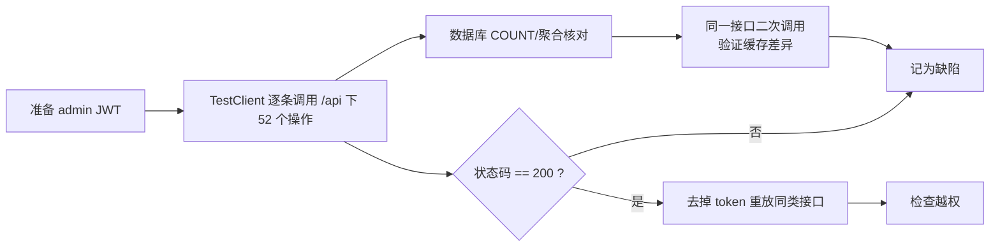

# 测试报告（Test Report）

> 项目：电商运营管理与智能分析平台
> 对应论文章节：系统测试
> 对应设计总纲：第 15 章（测试方案与验收标准）、附录 B（Definition of Done）
> 测试数据来源：本机真实运行环境（MySQL 8 + Redis + FastAPI），非构造数据
> 报告原则：**只写真实执行过的验证**；未执行的用例标注"未覆盖"，执行中未复现的缺陷标注"静态分析"。

## 1. 测试目标与范围

| 目标 | 说明 |
|------|------|
| 验证数据正确入仓 | 清洗后各表行数与清洗规则一致 |
| 验证 API 可用性 | 后端 `/api` 下 52 个操作（GET 45 / POST 5 / PUT 2）在 admin 身份下可正常调用且无 5xx |
| 验证权限控制 | 受保护接口在无 token 时被拒绝（重点关注越权） |
| 验证指标口径 | 关键聚合指标（订单量、销售额）不存在重复计数 |
| 验证缓存行为 | 缓存命中/失效不产生错误数据 |
| 验证 AI 模块 | 鉴权、工具调用、记录落库（本报告只覆盖已执行部分） |

不在本轮范围：前端页面交互、并发压测、Docker 部署验证（见第 6 章）。

## 2. 测试环境

| 项目 | 实际值 |
|------|--------|
| 操作系统 | Windows（项目路径 `c:\Users\Zzz\Desktop\te\pj1_dianshang`） |
| Python | 3.14.7（虚拟环境 `.venv`，`include-system-site-packages=false`） |
| 后端框架 | FastAPI 0.141.1 + SQLAlchemy 2.0.52 + PyMySQL 1.2.0 |
| 数据库 | MySQL 8.x，库名 `olist`，字符集 utf8mb4 |
| 缓存 | Redis（`redis://localhost:6379/0`，redis-py 8.1.0） |
| 前端 | Vue 3.5 + Element Plus 2.9 + ECharts 5.5 + Vite 6（Node） |
| AI | 智谱 GLM-4.5-Air（`zhipuai` 2.1.5.20250825、`zai_sdk` 0.2.3） |
| 数据规模 | orders 99,441 / order_items 112,650 / payments 103,886 / reviews 98,410 / products 32,951 |

## 3. 测试方法与工具

| 项 | 现状 |
|----|------|
| 接口巡检 | 使用 FastAPI `TestClient`，以 admin 身份携带 JWT 逐个调用 `/api` 下 52 个操作 |
| 越权检查 | 去掉 `Authorization` 头后重复调用，观察状态码 |
| 数据核对 | 直接对 MySQL 执行 `COUNT(*)`、聚合查询，与清洗规则/期望值比对 |
| 缓存检查 | 同一接口连续调用两次，比对首次（回源）与第二次（命中）的返回差异 |
| 自动化测试 | **已建立**：`backend/tests/` 下 35 个 `pytest` 用例（`test_security.py` / `test_response.py` / `test_api_contract.py`），根目录 `pytest.ini` 提供配置；实测 `35 passed`。仍**无 CI 配置** |
| 覆盖情况 | 接口层 + 数据库层验证为主；单元测试**仅覆盖鉴权/权限/响应体/分页**（核心计算与业务聚合尚未覆盖）；无前端 E2E、无压测脚本 |

自动化用例的边界（避免误读覆盖度）：

| 已覆盖 | 未覆盖 |
|--------|--------|
| 密码哈希与 `verify_password`（含加盐、错误密码拒绝） | 登录接口 `/api/auth/login` 的端到端链路（需真实 MySQL） |
| JWT 签发/校验：算法 HS256、30 分钟有效期、篡改/换密钥/过期均拒绝 | 各业务接口的返回内容正确性 |
| 统一响应体结构：`ok` / `ok_page` / `fail` | Dashboard 指标计算、库存调整、AI 工具调用 |
| `deps.py`：缺 token → 401、无效 token → 401、无权限 → 403、权限名精确匹配 | 缓存读写、Redis 降级路径 |
| `page_params`：默认值、`offset/limit` 计算、`page>=1`、`page_size<=100` 边界 → 422 | 权限与路由的对应关系（49 处路由声明未逐条断言） |

> 用例**刻意不导入 `app.main`**（该模块导入期执行 `Base.metadata.create_all` 会连 MySQL），因此无需启动 MySQL / Redis 即可运行，适合作为提交前的快速回归。
>
> 运行方式：项目根目录执行 `.\.venv\Scripts\python.exe -m pytest`。



## 4. 测试用例与实测结果

统计口径：**通过 22 项，未通过 2 项，待执行/未覆盖 9 项，合计 33 项**。

> 说明：第 4 章的用例编号是**测试用例 ID**，第 5 章的是**缺陷 ID**，两者独立编号（如用例 AUTH-01 与缺陷 SEC-01 无对应关系），避免混读。

### 4.1 数据与数据库层

| 用例 | 用例说明 | 步骤 | 预期 | 实测结果 | 结论 |
|------|----------|------|------|----------|------|
| DT-01 | orders 行数 | `SELECT COUNT(*) FROM olist_orders_dataset_clean` | 99,441 | 99,441 | 通过 |
| DT-02 | order_items 行数 | 同上 | 112,650 | 112,650 | 通过 |
| DT-03 | payments 行数 | 同上 | 103,886 | 103,886 | 通过 |
| DT-04 | reviews 去重 | 同上，比对原始 99,224 行 | 98,410（按 `review_id` 去重） | 98,410，少 814 行 | 通过（规则符合 `clean_fir.py`） |
| DT-05 | customers 行数 | 同上 | 99,441 | 99,441 | 通过 |
| DT-06 | products 行数 | 同上 | 32,951 | 32,951 | 通过 |
| DT-07 | sellers 行数 | 同上 | 3,095 | 3,095 | 通过 |
| DT-08 | geolocation 聚合 | 同上，比对原始 1,000,163 行 | 19,015（一行一邮编前缀） | 19,015 | 通过 |
| DT-09 | 库存初始化 | 执行 `backend/seed_inventory.py` 后统计 `inventory_log` | 每商品 2 条自洽日志 | 65,905 行，全部由该脚本生成 | 通过（算术存疑，见下） |
| DT-10 | 审计日志可用性 | 调 `POST /api/adjust/{product_id}/` 与 `PUT /api/users/{user_id}` 各一次，再 `SELECT * FROM operation_log` | 两类写操作均有记录，`operator` 为 JWT 用户 | 两次写操作各产生 1 行；`operator` 记为 token 中的 `admin`（请求体里伪造的 `operator:"hacker"` 被忽略） | 通过（SEC-02 已修复） |

> **待核对（待补充）**：`seed_inventory.py` 逻辑为"每商品写 2 条日志"，65,905 行对应约 32,952~32,953 个商品，与 products 表 32,951 存在 1~2 条差异。差异不影响功能，原因待核对（可能是 `inventory` 表中存在不在 `olist_products_dataset_clean` 中的历史 product_id，或统计时点不同），已记入第 6 章。

### 4.2 认证与权限

| 用例 | 用例说明 | 步骤 | 预期 | 实测结果 | 结论 |
|------|----------|------|------|----------|------|
| AUTH-01 | admin 全量接口可用 | 取 admin JWT，遍历 `/api` 下全部 **52 个操作** | 无 5xx，非 200 者均可解释 | **5xx ×0**（Redis 已启动）。非 200 者均为占位符路径参数导致的 404 或缺参 422 | 通过（见下方口径说明） |
| AUTH-02 | 受保护接口无 token 被拒 | 不带 `Authorization` 头遍历 `/api` 下全部 **52 个操作** | 除设计上公开的接口外一律 401 | 仅 `POST /api/auth/login`、`POST /api/auth/register` 非 401（均为 422，缺 body）；**其余 50 个操作全部 401** | 通过 |
| AUTH-03 | 越权访问 | 去掉 token 调用 `/api/reviews`、`/api/payments`、`/api/order_items`、`/api/translation`、`/api/geolocation`；`/api/ai/chat` 单独探测 | 401 / 403 | 六个接口**全部 401**；`/api/ai/chat` 另验：`ai:chat` → 422、`order:read` → 403、空权限 → 403 | 通过（缺陷 SEC-01 已修复） |
| AUTH-04 | 角色越权（operator 访问 admin 接口） | 用 operator token 调 `/api/users`、`/api/logs` | 403 | 未执行 | **未覆盖** |

> 接口清单口径说明：静态统计后端共注册 **51 条路径**——`/api` 下 50 条 + 公开健康检查 `GET /healthy`；按 HTTP 方法计 **`/api` 下 52 个操作**（GET 45 / POST 5 / PUT 2）。本轮巡检已覆盖 `/api` 下全部 **52 个操作**。（早期版本此处记的是"仅覆盖 45 个 GET 端点"，已按 2026-09-21 的全量遍历更正。）
>
> 非 200 项均因巡检使用占位符路径参数或缺省必需参数，**不是缺陷**：详情类端点因路径参数填的是占位符而返回 404；仍要求显式传参的端点（如 `/api/inventory/detail`、`/api/inventory/logs` 需 `product_id`）返回 422。`/api/products` 在 PERF-02 修复后已可无参调用（早期因 `page`/`page_size` 被写成必填而返回 422）。

### 4.3 接口功能与数据口径

| 用例 | 用例说明 | 步骤 | 预期 | 实测结果 | 结论 |
|------|----------|------|------|----------|------|
| API-01 | 总览首次回源 | 清空相关缓存后 GET `/api/dashboard/overview` | 200，`total_sales` 为合法 JSON 值 | 200，`"15865616.52"`（字符串） | 通过 |
| API-02 | 总览缓存命中类型稳定 | 立即再次 GET 同一接口 | 与首次完全一致 | 两次响应体**逐字节一致**（`total_sales` 均为字符串） | 通过（见下方复核说明） |
| API-03 | 月度订单量口径 | GET `/api/orders/monthly-trend`，各月 `order_count` 求和 | 等于真实非取消订单数 98,816 | 修复前合计 **103,222**（虚高 4,406）；修复后 **98,816**，与真值一致 | 通过（BUG-01 已修复，见 §5.2） |
| API-04 | 大数据表分页 | GET `/api/geolocation` | 分页返回 | 修复前：单次返回 **19,015 行 / 约 3.27 MB**，无分页参数；修复后：`page=1&page_size=10` 返回 10 条，`total=19015` 与真值一致 | 通过（PERF-01 已修复，见 §5.2） |
| API-05 | 标准分页可用 | GET `/api/orders?page=1&page_size=20` | 默认值可用，上限 100 | 12 个分页接口均可无参调用；`page`/`page_size` 已改为 `Query(1, ge=1)` / `Query(10, ge=1, le=100)`。**残余**：`deps.py::page_params` 仍无生产引用（死代码），各接口默认值 10 未完全统一 | 通过（PERF-02 基本修复，见 §5.2） |
| API-06 | 分页上界校验 | GET `/api/reviews?page_size=1000000`、`/api/payments`、`/api/order_items` 同理 | 应被限制在合理上限 | 修复后全部返回 **422**；同时 `page=0`、`page_size=-3` 亦返回 422（修复前会因 MySQL `LIMIT/OFFSET` 收到负数而 500）。8 个排行接口的 `top` 同样加上 `ge=1, le=100` | 通过（PERF-02 基本修复，见 §5.2） |
| API-07 | 响应格式统一 | 遍历 `/api` 下 52 个操作，筛出响应体不含 `code/message/data` 者 | 统一 `{code, message, data}` | 仍有 **5 个**：`/api/auth/me`、`/api/reviews`、`/api/payments`、`/api/order_items`、`/api/translation`（`/api/geolocation` 已随 PERF-01 改为 `ok_page`） | **未通过**（缺陷 API-05，低） |

> **复核说明（2026-09-21 重新实测）**：早期版本的本表将 API-01/API-02 记为"回源为数值、命中缓存后变成字符串 `"15865616.52"`"，并据此登记 BUG-02。**该现象在当前依赖版本（FastAPI 0.141.1 + Pydantic v2）下无法复现**。复核方式：清空 `dashboard:overview` 缓存键后，用真实 `app`（testclient）+ 真实 MySQL/Redis 连续请求两次，结果 `status 200/200`、`total_sales` 均为 `'15865616.52'`（str）、两次响应体逐字节一致。
>
> 原因：`Decimal` 在 Pydantic v2 的 JSON 序列化下本就输出为字符串，因此「首次为数值」的预期本身不成立；`json.dumps(default=str)` 只是把同一结果提前固化为字符串，两条路径最终产物相同。
>
> 由此 **BUG-02 撤销**，降级为「响应类型契约不清晰」：`total_sales` / `average_order_value` / `sales` 等金额字段对外**始终是字符串**，前端需自行 `parseFloat`；同时 `set_cache` 的 `default=str` 会把任何非 JSON 类型静默转成字符串，掩盖类型错误（此类风险未发现具体触发点，列为观察项）。

### 4.4 缓存行为

| 用例 | 用例说明 | 步骤 | 预期 | 实测结果 | 结论 |
|------|----------|------|------|----------|------|
| CACHE-01 | 总览缓存生效 | 连续两次 GET `/api/dashboard/overview` | 第二次走缓存 | 两次响应体逐字节一致（`total_sales` 均为字符串），无法从响应体区分是否命中缓存；缓存是否生效需读 Redis 键确认 | 通过（缓存生效性本轮未直接取证） |
| CACHE-02 | 库存调整后缓存失效 | POST `/api/adjust/{product_id}/` 后 GET `/api/inventory/warnings` | 告警列表即时刷新 | 未执行 | **待执行** |
| CACHE-03 | Redis 不可用时的降级 | 停掉 Redis 后调用总览/库存/AI 联网搜索 | 有可读错误或降级 | **已实测**（2026-09-22，Redis 停用）：`GET /api/dashboard/overview`、`GET /api/inventory/warnings` → **500**，根因 `redis.exceptions.ConnectionError: Error 10061`，`app/core/redis.py:16` 的 `get_cache` 无 try/except。补充 L1 全局兜底后，响应体由纯文本 `Internal Server Error` 统一为 `{"code":500,"message":"服务器内部错误","data":null}`，并在服务端日志留下 `未处理异常 GET …` + 完整 traceback；同时 `GET /api/orders`（走 DB 不走缓存）仍为 **200**，证明是逐请求兜底而非全局熔断 | **通过**（L2 已修复，见 §5.2 REDIS-01）。残余：降级日志因 `logger.warning` 参数写法有误而全部丢失（详见 §5.2 说明），待修正 |

### 4.5 AI 模块

| 用例 | 用例说明 | 步骤 | 预期 | 实测结果 | 结论 |
|------|----------|------|------|----------|------|
| AI-01 | AI 接口鉴权 | 不带 token 调 `POST /api/ai/chat` | 401 / 403 | 返回 **401** | 通过（缺陷 SEC-01 已修复） |
| AI-02 | 问答落库与提问人 | 查询 `ai_analysis` 表 | 有记录，`user_id` 为提问人 | 有记录，但 `user_id` **全部为 NULL**；表内无"执行状态"字段 | **未通过**（缺陷 AI-04，见 `docs/10_ai_design.md` §9.1） |
| AI-03 | 工具调用正确性（端到端） | 提问"最近销售趋势怎么样？"等 4 条示例问题，核对是否命中 `query_sales` 等工具 | 命中对应工具且答案含 2016–2018 时间范围 | 未系统执行 | **待执行** |
| AI-04 | 联网搜索能力 | 提问当前电商政策类问题，核对是否调用 `query_web`、缓存 key `ai:web:{md5}` 是否生成 | 调用联网工具，区分内外部信息 | 未执行 | **待执行** |
| AI-05 | 关闭 AI 不影响核心功能 | 移除 `ZHIPU_API_KEY` 后启动后端 | 后端正常启动，其他模块可用 | 未实际复现；静态分析判定：`services/AI.py` 在模块导入期构造 `ZhipuAI(api_key=...)`，Key 缺失会导致后端起不来 | **待执行（静态分析已判为缺陷 AI-01，见 `docs/10_ai_design.md` §9.1）** |
| AI-06 | 异常工具调用兜底 | 构造模型返回未注册工具名 / 工具抛异常 | 降级返回可读提示 | 未复现；静态分析判定：`tools_map[tool_name]` 无 try/except，会 500 | **待执行（静态分析已判为缺陷 AI-03，见 `docs/10_ai_design.md` §9.1）** |

### 4.6 前端 / 性能 / 部署

| 用例 | 用例说明 | 预期 | 实测结果 | 结论 |
|------|----------|------|----------|------|
| FE-01 | 前端页面交互（登录、筛选、分页、图表、AI 对话渲染） | 可操作无明显阻塞 | 未执行 | **未覆盖** |
| PERF-01 | Dashboard / 大列表响应时间压测 | 本地数据规模下可接受 | 未执行（无压测脚本） | **未覆盖** |
| DEP-01 | Docker Compose 一条命令启动 | 主要服务全部起来 | 实施中：已补齐 `backend/Dockerfile`、`frontend/Dockerfile`、`frontend/nginx.conf`、`docker-compose.yml`、`.dockerignore` 五个文件（mysql/redis/backend/frontend/loader 五服务），因宿主机 3306/6379 被占用，对外映射 3307/6380 | **已交付文件，待实机 `compose up` 验收**（详见 §6） |

## 5. 缺陷清单

| ID | 级别 | 模块 | 描述 | 复现方式 | 影响 | 状态 |
|----|------|------|------|----------|------|------|
| BUG-01 | **严重** | 订单统计 | `/api/orders/monthly-trend` 的 `order_count` 合计 103,222，比真实非取消订单 98,816 **虚高 4,406**。原因是 JOIN `order_payments` 造成一对多重复计数（一个订单多条支付记录被重复计入订单数）；另有 1 笔无支付记录的订单被内连接漏掉 | GET `/api/orders/monthly-trend`，对 `order_count` 求和，与 `SELECT COUNT(DISTINCT order_id) FROM orders WHERE order_status<>'canceled'` 对比 | 月度订单量、销售趋势类结论全部偏大；直接违背总纲 15.1「一个订单多个 item/多条支付时金额与数量不能重复计算」 | **已修复**（详见 §5.2）：计数改 `COUNT(DISTINCT order_id)`、`join` 改 `outerjoin`，复测合计 98,816 = 真值 |
| ~~BUG-02~~ | ~~中~~ | Dashboard 缓存 | ~~回源为数值、命中缓存后变字符串~~ | — | — | **已撤销**：2026-09-21 用真实 app + 真实 MySQL/Redis 复测，回源与命中两次响应体逐字节一致，`total_sales` 均为字符串。原描述不可复现，详见 §4.3 复核说明。保留为观察项：金额字段对外**始终是字符串**（`Decimal` 在 Pydantic v2 下序列化为 str），前端需自行 `parseFloat`；`set_cache` 的 `default=str` 会静默吞掉类型错误 |
| SEC-01 | **严重** | 权限 | `/api/reviews`、`/api/payments`、`/api/order_items`、`/api/translation`、`/api/geolocation`、`/api/ai/chat` 六个接口**未挂载任何鉴权依赖**，无 token 亦可访问 | 去掉 `Authorization` 头直接调用上述接口 | 数据裸奔（评价/支付/订单明细可被任意读取）；`/api/ai/chat` 还可间接写 `ai_analysis` 表并消耗 GLM 配额 | **已修复**（详见 §5.2）：六接口补挂 `require_permission`；复测 `/api` 下 52 个操作无 token 仅 login/register 非 401 |
| SEC-03 | **严重** | 审计可信性 | 库存调整的 `operator` **取自请求体**（`schemas/AdjustInventory.py::operator`），未使用 JWT 中的 `current_user`；且路由以 `dependencies=[...]` 形式挂载权限校验，闭包返回值被丢弃，端点内**拿不到当前用户**。实测 `operator: str = None`，而 `operation_log.operator` 为 `NOT NULL` → 前端不传该字段将 `IntegrityError` 500 | POST `/api/adjust/{product_id}/`，body 内 `operator` 填任意字符串 | 审计日志可写成任何人的名字（可抵赖、可栽赃）；同时存在漏传即 500 的健壮性问题。位置：`app/api/inventory.py:28-33`、`app/repositories/inventory.py:35,52,58` | **已修复**（详见 §5.2）：路由改为 `current_user=Depends(require_permission("inventory:adjust"))`，操作人取 `current_user.username`，`AdjustInventory` 移除 `operator` 字段 |
| PERF-01 | 中 | 地图/地理接口 | `/api/geolocation` 无分页，单次返回 19,015 行、约 3.27 MB | GET `/api/geolocation` | 无效流量与内存占用，违背总纲 9.2「统一 page/page_size 并限制最大值」 | **已修复**（详见 §5.2）：加分页与 `COUNT(*)`，`total=19015` 与真值一致 |
| PERF-02 | 中 | 分页 | **列表/排行接口全部没有上界校验**：静态统计 `app/api` 下共 **20 处**裸声明 `page_size: int = 20` / `page: int = 1` / `top: int = 10`（无 `Query(ge/le)`）；`deps.py::page_params` 是唯一带 `ge=1, le=100` 的实现，却**零生产引用**（死代码，仅被 `backend/tests/` 引用）；默认值 10/20 不统一；`app/api/products.py:16` 的 `page`/`page_size` 连默认值都没有（必填） | GET `/api/reviews?page_size=1000000`，或 GET `/api/reviews?page=0`（负 `offset` 触发 MySQL 1064 → 500） | 可被单次请求拉取全表（评价表 98,410 行、支付表 103,886 行），违背总纲 9.2「限制最大 page_size」；另 `page=0` 会算出 `offset=-20` | **基本修复**（详见 §5.2）：12 处 `page`/`page_size` + 8 处 `top` 已加 `ge/le`，矩阵复测通过。**残余**：`/api/products/rating_rank` 的 `min_reviews` 仍为裸 `int`（`-1`、`1000000` 放行，不崩溃）；`deps.py::page_params` 仍无生产引用 |
| API-05 | 低 | 响应规范 | 5 个接口返回裸对象、未走统一响应 `{code, message, data}`：`/api/auth/me`（`{username, role}`）、`/api/reviews`、`/api/payments`、`/api/order_items`（`{items}`）、`/api/translation`（`{translations}`） | 带全权限 token 遍历 `/api` 下 52 个操作，筛选响应体不含 `code/message/data` 者 | 前端需额外兼容分支，文档与实现不一致 | 待修复（`/api/geolocation` 已随 PERF-01 改为 `ok_page`，从本条目移除） |
| SEC-02 | 中 | 审计日志 | `operation_log` 表实测 0 行，**原因是此前从未有写操作成功落库**（唯一写审计的 `adjust` 接口在 SEC-03 修复前会 500），并非写入链路断裂；同时 `PUT /api/users/{user_id}`（改密码）**确实漏写审计日志** | 调 `POST /api/adjust/{product_id}/` 与 `PUT /api/users/{user_id}`，再 `SELECT * FROM operation_log` | 无法满足总纲第 14 章「所有关键写操作记录 operation_log」 | **已修复**（详见 §5.2）：为 `update_user` 补 `create_log`；实测两类写操作各落库 1 行 |
| DATA-01 | 低 | 数据 | reviews 按 `review_id` 去重后由 99,224 行降至 98,410 行，**丢弃 814 行**（重复 ID 指向不同订单） | 比对原始 CSV 与 `olist_order_reviews_dataset_clean` 行数 | 评价样本减少约 0.82%，需在论文数据质量章节说明取舍理由 | 已接受（需在论文说明） |
| REDIS-01 | 中 | 缓存健壮性 | `app/core/redis.py` 的 `get_cache` / `set_cache` / `delete_cache*` **均无 try/except**。Redis 不可用时，所有走缓存的路由（Dashboard 总览与 3 个排行、库存列表/预警/补货）直接抛 `redis.exceptions.ConnectionError` → **500**，而非降级为回源查询 | 停掉 Redis 后 `GET /api/dashboard/overview`（带 admin token） | 缓存从"加速手段"变成"单点故障"：Redis 一停，非缓存路由正常（`/api/orders` 仍 200），缓存路由全挂。违背总纲 9.x「缓存不可用不应影响主流程」的意图 | **已修复**（L2）：`get_cache` 读失败/内容损坏按未命中返回 `None`、`set_cache` / `delete_cache*` 失败吞掉并记日志，均只捕 `redis.exceptions.RedisError`；另加 `socket_connect_timeout=2` / `socket_timeout=2`。**实测**：Redis 不可用时 `GET /api/dashboard/overview`、`/api/inventory/warnings`、`/api/dashboard/category-ranking?top=5` 全部 **200**（改前 500）；`POST /api/adjust/{product_id}/` **200**（改前因 `delete_cache` 抛错把已入库的成功操作误报为 500）；Redis 恢复后连续两次 `overview` 响应体逐字节一致、`dashboard:overview` 键存在。**残余缺陷（已修复）**：`logger.warning('缓存读取失败', key, exc)` 的 msg 中无 `%s` 占位符，logging 执行 `msg % args` 时抛 `TypeError: not all arguments converted during string formatting`，降级日志**全部丢失**并在 stderr 打出 `--- Logging error ---`（实测 4 个 key 的路由均如此），已违背"降级必须留痕"的设计意图。**2026-09-22 复测**：5 行 warning 文案已改为带 `%s` 的占位形式，复测 6 条降级 warning 全部正常输出、`Logging error` 计数为 **0**。遗留小瑕疵：`delete_cache_pattern` 的日志仍打印 `keys` 而非 `pattern`（实测打出 `patterns=[]`，无信息量）；`get_cache` 的 `JSONDecodeError` 分支缺显式 `return None`（靠隐式返回，功能正确但脆弱） |
| F1 卖家评价均分失真 | 中 | 卖家统计 | `/api/sellers/rating_rank` 的均分按**商品条数加权**而非按评价条数加权：SQL 以商品为粒度 join 后直接 `AVG(review_score)` 并 group by 卖家，评价多的商品被重复计入多次 | GET `/api/sellers/rating_rank?top=5`，与 `SELECT AVG(review_score) FROM order_reviews r JOIN order_items i ON … GROUP BY seller` 对比 | 卖家评分展示值不可信（实测 3.92 vs 真值 3.95），用于供应商考核/排名会误导决策。位置：`app/repositories/seller.py:59-84` | 待修复（已知局限，本轮登记） |
| F2 预警口径含取消订单 | 中 | Dashboard 预警 | `get_alerts` 的 `low_review_count` 未 join `orders`，把**已取消订单**的低分评价也计入预警，实测 305 条 vs 真值 256 条，误差 **19%** | GET `/api/dashboard/alerts`，与 `WHERE order_status<>'canceled'` 的口径对比 | 预警数量虚高，运营会去跟进并不存在的差评。位置：`app/repositories/dashboard.py:169-179` | 待修复（已知局限，本轮登记） |
| F3 同一仪表盘两处销售额口径不一致 | 中 | Dashboard 口径 | 同一总览页的销售额在两处取数口径不同（`dashboard.py:46` 与 `:103`），实测 **15,865,616.52** vs **13,496,408.43**，差 **14.93%** | 同页对比两块销售额卡片 | 同一屏出现两个"销售额"，无法自证；违背总纲 15.1 口径唯一性要求 | 待修复（已知局限，本轮登记） |
| AI-01~AI-11 | 高/中/低 | AI | AI 模块 11 项缺陷（导入期初始化客户端、无鉴权、工具无异常兜底、`user_id` 恒 NULL、无状态字段、print 调试、单轮工具调用、无流式、答案结构未固定、缓存无降级） | 见 `docs/10_ai_design.md` 第 9.1 节 | 关联本报告 AI-01/AI-02 用例 | 待修复（其中 AI-05 缺 `zai` 依赖声明**已修复**） |

### 5.1 本轮已修复项（前端）

以下 3 项在本次文档完善过程中同步修复，并已通过 `npm run build`（Vite 6 生产构建，2276 个模块编译通过）：

| ID | 模块 | 问题 | 修复内容 | 状态 |
|----|------|------|----------|------|
| FE-01 | 前端安全 | AI 回复直接用 `marked.parse` 后 `v-html` 渲染，而回复内容可能夹带联网检索到的外部内容，存在 XSS 注入风险 | `AIChat.vue` 引入 `dompurify`，渲染前执行 `DOMPurify.sanitize(html, {USE_PROFILES:{html:true}})` | 已修复 |
| FE-02 | 前端提示 | `utils/request.js` 只读 `error.response.data.detail`，而后端异常统一体为 `{code,message,data}`，导致 401/403/404 提示退化为英文 axios 文案（对应 `docs/08` A-04、`docs/09` B-08） | 改为 `body.message \|\| body.detail`，兼容两种格式 | 已修复 |
| FE-03 | 前端准入 | 根路径 `/` 固定重定向 `/dashboard`，`warehouse` 角色无该权限会被守卫拦截并弹「没有权限」；token 有效但无角色时静默跳登录页 | `router/index.js` 根路径改为按角色取 `ROLE_MENUS[role][0]`；无角色时提示「账号暂无权限，请联系管理员分配角色」 | 已修复 |

> 说明：修复项仅涉及前端。`docs/08` 的 A-04、`docs/09` 的 B-08 已在原文档中同步标注为已修复。

### 5.2 本轮已修复项（后端）

| ID | 模块 | 问题 | 修复内容 | 验证 |
|----|------|------|----------|------|
| BUG-01 | 订单统计 | `get_order_monthly_trend` 把 `orders` 与 `order_payments` 内连接后直接 `COUNT(order_id)`，一个订单多条支付记录时行被放大，月度订单量整体虚高。合计 **103,222**，比真值 98,816 高出 **4,406** | `app/repositories/order.py`：① 计数改为 `func.count(distinct(Order.order_id))`；② `join` 改 `outerjoin`——实测有 1 笔非取消订单（`bfbd0f9b…`，delivered，2016-09-15）**没有任何支付记录**，内连接会把它漏掉；该行为 `payment_value IS NULL`，不影响 `sales` 求和 | 真实库 + 真实 HTTP 复测：月度合计 **98,816 = 真值**；`sales` 合计 **15,865,616.52** 与独立 SQL 求和逐分一致；共 24 个月，首月 2016-09、末月 2018-09 |
| SEC-01 | 接口鉴权 | `/api/reviews`、`/api/payments`、`/api/order_items`、`/api/translation`、`/api/geolocation`、`/api/ai/chat` 六个接口未挂载任何鉴权依赖 | 各路由装饰器补 `dependencies=[Depends(require_permission(...))]`：订单域三接口用 `order:read`；`/api/translation` 用 `product:read`（类目映射表属商品域）；`/api/geolocation` 用 `logistics:read`（邮编→经纬度维表属物流域）；`/api/ai/chat` 用 `ai:chat` | 全量扫描 `/api` 下 **52 个操作**，无 token 时仅 `POST /api/auth/login`、`POST /api/auth/register` 非 401（设计上公开），其余**全部 401**；`/api/ai/chat` 单独验证：`ai:chat` → 422（已过鉴权、仅缺 body）、`order:read` → 403、空权限 → 403 |
| PERF-01 | 地理接口分页 | `/api/geolocation` 无分页，单次返回 19,015 行、约 3.27 MB | 接口增加 `page`/`page_size`；repository 增加独立 `COUNT(*)` 并返回 `(rows, total)`；返回体由裸 `{"items": [...]}` 改为 `ok_page(...)` | `page=1&page_size=10` → 200 且返回 10 条；`total=19015` 与 `SELECT COUNT(*)` 一致；`page_size=101`、`page=0`、`page_size=-3` → 422 |
| PERF-02 | 分页与排行上界 | 列表/排行参数均为裸 `int`，无 `ge/le` 约束：`page=0` 与负值会让 MySQL `LIMIT/OFFSET` 收到负数直接 500，超大值可一次拉全表 | 12 个分页接口的 `page`/`page_size` 改为 `Query(1, ge=1)` / `Query(10, ge=1, le=100)`；8 个排行接口的 `top` 改为 `Query(10, ge=1, le=100)` | 12 个分页接口矩阵：无参 / `page=1` / `page=1&page_size=10` → **200**；`page_size=101`、`page=0`、`page_size=-3` → **422**。8 个排行接口：`top=0`、`top=-5`、`top=1000000` → **422**。**残余**：`/api/products/rating_rank` 的 `min_reviews` 仍是裸 `int`（`-1`、`1000000` 均放行，但不崩溃） |
| SEC-03 | 审计可信性 | 库存调整的 `operator` 取自请求体，客户端可任意填写；同时路由用 `dependencies=[Depends(require_permission(...))]` 挂权限，`require_permission` 闭包的 `return current_user` 被丢弃，端点内拿不到当前用户（这正是当初只能从 body 取操作人的原因） | `app/api/inventory.py`：装饰器移除 `dependencies=[...]`，改为签名参数 `current_user=Depends(require_permission("inventory:adjust"))`——一个依赖同时完成「无权限抛 403」与「返回用户对象」；`operator` 改传 `current_user.username`。`app/schemas/AdjustInventory.py`：删除 `operator: str = None`（字段留着会让 OpenAPI 继续宣称可传，实际被忽略） | 真实 HTTP 复测：带 `inventory:adjust` 的 token 调 `POST /api/adjust/{product_id}/`，body 显式伪造 `"operator":"hacker"` → **200**，`inventory_log.operator` 与 `operation_log.operator` 均记为 **admin**（token 用户），伪造值被丢弃；无权限用户 → **403**；`quantity` 调整前后 `1871 → 1872 → 1871` 自洽 |
| SEC-02 | 审计日志 | `operation_log` 实测 0 行。**先排除误判**：0 行不代表写入链路断裂——此前从未有写操作成功落库（唯一写审计的 `adjust` 接口在 SEC-03 修复前会 500）。**真实缺口**：`PUT /api/users/{user_id}`（改密码）确实未写审计日志，违背总纲第 14 章「所有关键写操作记录 operation_log」 | `app/api/user.py::update_user` 补 `current_user=Depends(get_current_user)` 与 `create_log(db, current_user.username, "update_user", str(user_id), f"username={user.username}")`，与同文件 `create_user` / `assign_role` 的既有做法一致 | 真实 HTTP 复测：`POST /api/adjust/…` 落库 1 行、`PUT /api/users/9` 落库 1 行，`SELECT * FROM operation_log` 由 **0 → 3 行**（含探针的库存复原操作），`GET /api/logs` 返回 `total` 与之一致；探针已复原被改账号的密码哈希 |
| L1 全局异常兜底 | 未捕获异常由 Starlette 兜底，客户端只拿到纯文本 `Internal Server Error`，前端 `body.message` 读不到内容，服务端也无堆栈 | `app/main.py` 新增 `@app.exception_handler(SQLAlchemyError)` 与 `@app.exception_handler(Exception)`，均 `logger.error(..., exc_info=exc)` 留痕后返回 `fail(500, "数据库操作失败" / "服务器内部错误")`；对外**不回传 `str(exc)`**，避免泄漏表名/SQL 片段 | Redis 停用时实测：`/api/dashboard/overview` 由纯文本改为 `{"code":500,"message":"服务器内部错误","data":null}` 且日志有 `未处理异常 GET …` + traceback；`HTTPException` handler（401）与 `RequestValidationError` handler（422）**未被截胡**，证明 handler 按异常类精确匹配；`/api/orders`（走 DB）仍 200，说明是逐请求兜底而非全局熔断 |
| L2 Redis 降级 | Redis 不可用时所有缓存路由硬 500（见 REDIS-01），且 `POST /api/adjust` 会把**已成功入库**的操作因 `delete_cache` 抛错误报为 500 | `app/core/redis.py`：读失败/内容损坏按未命中返回 `None`（8 个缓存端点无需改动即自动回源），写/删失败吞掉并记日志；只捕 `redis.exceptions.RedisError`（不捕 `Exception`，避免吞掉编码错误）；补 `socket_connect_timeout=2` / `socket_timeout=2` 防 Redis 卡死时请求长时间挂起 | Redis 不可用实测：3 个缓存路由全部 **200**；`adjust` **200** 且 `operation_log` 3 → 5 行、库存回补后 `quantity` 复原 1871；Redis 恢复后 `overview` 两次响应体逐字节一致、`dashboard:overview` 键存在。**残余**：降级日志本身因 `logger.warning` 缺 `%s` 占位符而全部丢失（详见 REDIS-01 行，2026-09-22 已修正并复测通过） |
| F4 库存可为负 | 严重（正确性） | 库存 | `adjust_inventory` 对 `change` 无任何边界校验：出库量超过当前库存时 `quantity` 会被直接写成负数，且负数库存会连带产出 `before/after` 为负的库存流水 | 对库存 871 的商品调 `POST /api/adjust/{product_id}/` 传 `change=-872` | 库存数据失去物理意义，后续补货/预警逻辑全部失真。位置：`app/repositories/inventory.py:44-57` | **已修复**：`after = before + change` 后若 `after < 0` 抛 `HTTPException(400, "库存不足：当前库存 X，本次调整 Y，调整后将为 Z")`；另补 `change == 0` 直接 400（`change=0` 不改库存却会白写一条流水 + 一条操作日志）。**实测**：对 871 传 `-872` → **400**；传 `-871` → **200** 且恰好归零；库存已为 0 再出库 → **400**；`change=0` → **400**；调整不存在的商品出库 `-1` → **400** 且**未创建** inventory 行（证明不脏写）；被拒请求在 `inventory_log` / `operation_log` 上**零痕迹**（流水仅 +2/+2）；全库负库存行数 **0** |
| F7 日期筛选丢当天数据 | 高（正确性） | 订单查询 | 前端日期筛选解析出的 `end_time` 落在当天 `00:00:00`，SQL 用 `<= end_time` 会把**当天 00:00 之后的全部数据排除**；同一天区间（如 `2018-01-01~2018-01-01`）甚至返回 0 条 | GET `/api/orders?start_time=2018-01-01&end_time=2018-01-01` | 运营按天筛选时当天订单整段消失，日报/月报数据错误。位置：`app/api/order.py:19-27`、`app/repositories/order.py:16-18`、`app/repositories/dashboard.py:21-23` | **已修复**：API 层把 `end_time` 统一视为「包含该日」，换算为次日 `00:00` 的**排他上界**（`end_time + timedelta(days=1)`），且 `get_orders` 与 `count_orders` 收到同一个值以免 items 与 total 口径不一致；repository 两处 `<=` 改 `<`。**实测**：`2018-01-01~2018-01-01` → total=74 items=74（真值 74，改前 0）；`2018-08-01~2018-08-31` → 6512（真值 6512）；`2018-01-01~None` → 54011；无日期参数仍 200 |

> 说明：修复后 `order_count` 语义为「该月非取消订单数（去重）」，与 `count_orders()` 的口径一致；`sales` 仍为「该月支付金额合计（含未支付订单记 0）」。
>
> SEC-01 / PERF-01 / PERF-02 三项的复核在 Redis 已启动的前提下进行：带全权限 token 遍历 `/api` 下 52 个操作，**5xx 为 0**。

## 6. 部署（Docker Compose）

### 6.1 文件清单

| 文件 | 作用 |
|------|------|
| `backend/Dockerfile` | 后端镜像。基于 `python:3.14-slim`（`requirements.txt` 中 `pandas==3.0.5` / `numpy==2.5.3` 仅对 3.14 提供 wheel，降到 3.12 会在 `pip install` 阶段直接失败）；先拷 `requirements.txt` 单独装依赖以复用构建缓存，再拷 `backend/`；镜像内**不含 `.env`**，配置由 compose 注入 |
| `frontend/Dockerfile` | 前端多阶段镜像。`node:20-alpine` 阶段 `npm ci && npm run build` 产出 `dist`，`nginx:1.27-alpine` 阶段只接收编译产物 —— 运行镜像里没有 Node、源码和 `node_modules` |
| `frontend/nginx.conf` | 前端站点配置。`try_files $uri $uri/ /index.html` 支撑 Vue Router 的 `createWebHistory` 刷新回退；`/api/` 反代到 `backend:8000`，浏览器始终同源 → 后端无需 CORS；`proxy_read_timeout 180s` 适配 AI 问答；另含 gzip 与静态资源 7 天缓存 |
| `docker-compose.yml` | 编排 5 个服务：`mysql`(8.0) / `redis`(7-alpine) / `backend` / `frontend` / `loader` |
| `.dockerignore` | 构建上下文排除 `.venv`、`node_modules`、`dist`、`.env`、`data/`(120MB CSV) 等 |

### 6.2 关键设计取舍

- **端口避让**：宿主机 `3306` / `6379` 已被本机 MySQL / Redis 占用，故 compose 对外映射 **`3307:3306`** 与 **`6380:6379`**。容器内部仍用标准端口互联。
- **配置注入优先级**：`backend` 服务同时写了 `env_file: ./backend/.env` 与 `environment`。compose 中 `environment` 优先级**高于** `env_file`，因此 `.env` 里的 `DATABASE_URL=…@localhost…` 会被覆盖为 `…@mysql:3306…`（容器内 `localhost` 指向自身而非 MySQL 容器），而 `SECRET_KEY` / `ZHIPU_API_KEY` 仍从 `.env` 读入，无需写进 compose 文件。
- **数据初始化独立成 `loader` 服务**：原仓库的 `data/*.sql` 是 **0 字节空文件**，不能用来初始化，因此改为 `loader` 依次执行 ① `python -c 'import app.main'` 触发 `Base.metadata.create_all` 建 ORM 表 → ② `data/scripts/clean_fir.py` 清洗 9 张 CSV 并灌库 → ③ `seed_inventory.py` 生成库存与自洽流水。该服务用 `profiles: ["init"]` 标记，**不会**跟着 `docker compose up` 自动启动。120MB CSV 通过 `./data:/app/data` 运行时挂载，不进镜像。
- **`clean_fir.py` 非幂等**：内部是 `to_sql(if_exists='append')`，只能对空库跑一次。重复执行会让数据翻倍，需重来时用 `docker compose down -v` 清掉数据卷。`seed_inventory.py` 已从硬编码 `localhost` 改为解析 `DATABASE_URL`（本地读 `backend/.env`，容器里读 compose 注入值）。

### 6.3 启动与验证

```bash
# 首次部署（含数据初始化，只做一次）
docker compose up -d mysql redis
docker compose --profile init run --rm loader
docker compose up -d

# 之后日常启动
docker compose up -d

# 验证
curl http://localhost:8000/healthy      # 后端直连
curl http://localhost:8080/healthy      # 经 Nginx 反代
# 浏览器访问 http://localhost:8080
```

**前置条件**：本机 `8000` 端口未被 uvicorn 占用（若已用本地进程起过后端，需先停掉再 `compose up`，否则端口冲突）。

## 7. 未覆盖范围

以下内容**本轮未测试**，不能视为通过，需在后续版本补充：

| 未覆盖项 | 说明 | 建议补测方式 |
|----------|------|--------------|
| 业务聚合计算 | 已建立的 35 个 `pytest` 用例只覆盖鉴权/权限/响应体/分页，**未覆盖** Dashboard 指标、库存调整、类目/客户/卖家聚合 | 用固定小样本（或 SQLite 内存库）构造夹具，断言聚合结果 |
| 前端页面交互 | 登录、订单筛选分页、图表渲染、AI 对话 Markdown/表格渲染、401 自动跳登录 | 浏览器手工用例 + Playwright/Cypress |
| 前端页面在异常态的表现 | loading / empty / error 三态（总纲 10.2 要求） | 断网/后端停服后逐页检查 |
| 并发与性能 | Dashboard 聚合、大列表、AI 两轮调用的响应时间与并发承载 | Locust / JMeter；记录 P95 |
| Docker 部署 | 总纲第 16 章要求 Compose 一键启动。2026-09-22 已交付 5 个文件（见 §6），但**尚未实机执行 `compose up` 验收**（镜像构建、数据初始化、Nginx 反代均未跑通验证） | 按 §6.3 步骤端到端执行；重点验证 loader 灌数成功、`/healthy` 双通路可达、前端子路由刷新不 404 |
| AI 端到端质量 | 工具命中率、联网搜索准确性、答案是否注明数据时间范围、是否编造 | 构造 20+ 问题集，人工评分 |
| AI 异常路径 | 未注册工具名、模型超时、工具报错、Redis 宕机 | 打桩替换 `tools_map` / 断开 Redis |
| 安全渗透 | 越权仅为浅层巡检；未测 JWT 伪造、注入、CORS、文件上传 | 专项安全测试；与 `docs/11_security_design.md` 交叉校验（本报告未做交叉校验） |
| 数据库约束与索引效果 | 未做 `EXPLAIN` 验证索引有效性 | 对核心查询执行 `EXPLAIN` 并记录 |
| 清洗脚本可重跑性 | `clean_fir.py` 使用 `if_exists='append'` 且无清表，重复执行会重复插入（代码审查发现，未复现） | 在测试库重跑两次并比对行数 |
| 库存业务规则 | `after = before + change` 在脚本层已校验，**接口层已复现验证**（F4：负库存 400、`change=0` 400、被拒请求零痕迹，见 §5.2） | 已闭环 |

### 待补充清单（文档层面）

| 位置 | 待补充内容 |
|------|------------|
| 本报告 4.1 DT-09 | `inventory_log` 65,905 行与 products 32,951 的 1~2 条差异原因 |
| 本报告 5. SEC-02 | 已闭环。`operation_log` 由 0 → 3 行，`adjust` 与 `update_user` 两条写路径均落库。仍**未覆盖**的写路径：`POST /api/auth/register`（自注册，无操作人可归属）与 `POST /api/ai/chat`（只写 `ai_analysis`，未进审计）。是否需要为自注册补审计需另行决定 |
| 本报告 5. SEC-03 | 已闭环。验证含「body 伪造 `operator=hacker` 仍记为 token 用户」这一关键对照。另建议后续在浏览器里手工走一次前端「库存调整」弹窗，确认 `frontend/src/views/Inventory.vue:207` 仍多传的 `operator` 字段不会让 Pydantic 报错（已静态判定为忽略，未做浏览器 E2E） |
| 本报告 5. API-05 | 5 个接口（`/api/auth/me`、`/api/reviews`、`/api/payments`、`/api/order_items`、`/api/translation`）仍是裸对象响应，2026-09-21 复查确认未修（`app/api/auth.py:41`、`order_reviews.py:14`、`order_payments.py:14`、`order_items.py:13`、`translation.py:14`） |
| `docs/figures/` | 总纲要求的架构图、业务流程图、ER 图尚未产出 |
| `docs/11_security_design.md` | 该文档已由并行的文档工作流产出，其中的安全结论尚未与本报告的越权实测结果交叉校验 |

## 8. 结论

1. **可用性**：`/api` 下 52 个操作带 admin token 全部可达且无 5xx（**5xx ×0**；非 200 者均因巡检使用占位符 ID 或缺省必需参数，返回 404/422，非缺陷），核心业务链路（订单、产品/类目、客户、卖家、物流、库存、Dashboard、AI 入口）均已连通，满足"API 层可用"这一最低目标。
2. **数据层**：清洗结果与既定规则逐表一致（8 张表行数吻合，geolocation 聚合、reviews 去重符合预期），数据可信。
3. **不满足项**（2026-09-22 复查后的口径）：
   - **严重缺陷已全部清零**：SEC-01（六个接口补挂鉴权）、SEC-03（库存调整操作人改取 JWT 用户）均已修复；BUG-01（月度订单数重复计数 103,222 → 98,816 = 真值）已修复；**F4（库存可被调成负数）已修复**（负库存/零变动均 400，被拒请求零痕迹）；
   - **正确性高危及中危**：**F7（日期筛选丢当天数据）已修复**（同日区间 0 → 74 条 = 真值）；**F1/F2/F3 三项正式登记为已知局限**——F1 卖家评价均分按商品条数加权失真（3.92 vs 3.95）、F2 Dashboard 低分评价预警含已取消订单（305 vs 256，误差 19%）、F3 同一总览页两处销售额口径不一致（15,865,616.52 vs 13,496,408.43，差 14.93%）；
   - **中危缺陷仅剩 PERF-02 残余**：PERF-01（`/api/geolocation` 已分页，`total=19015` 与真值一致）、SEC-02（审计链路已闭环，`operation_log` 0 → 3 行，并为改密码补上审计）均已修复；PERF-02 为**基本修复**（12 处分页 + 8 处 `top` 已加 `ge/le`，`page_size=101` / `page=0` / `page_size=-3` / `top=0` 均 422），**残余**为 `/api/products/rating_rank` 的 `min_reviews` 仍为裸 `int`、`deps.py::page_params` 仍是死代码（两者均不导致崩溃或越权）；
   - **健壮性层（L1/L2）已闭环**：L1 全局异常兜底把裸文本 500 改为统一 `{code,message,data}` 并留堆栈；L2 Redis 降级使 Redis 不可用时缓存路由由 500 变 200、写操作不再被缓存故障误报为失败；降级日志的 `logger.warning` 缺 `%s` 占位符导致日志丢失的问题已修正并复测（`Logging error` 计数 0）；
   - **BUG-02 已撤销**（原"缓存命中后类型变化"在 FastAPI 0.141.1 + Pydantic v2 下不可复现，回源与命中响应体逐字节一致），降级为观察项：金额字段对外恒为字符串；
   - AI 模块 11 项改进项中，AI-05（缺 `zai` 依赖声明）已修复，其余未修，其中 AI-01（缺 Key 后端起不来）直接违背总纲 12.1；
   - 低危 **API-05 未修**：5 个接口（`/api/auth/me`、`/api/reviews`、`/api/payments`、`/api/order_items`、`/api/translation`）仍是裸对象响应，未走统一 `{code, message, data}`。
4. **测试成熟度**：已建立 **35 个 `pytest` 用例**（鉴权/权限/响应体/分页），**无 CI**；业务聚合与前端仍靠人工巡检与读码发现，回归成本高。已修项 **BUG-01 / SEC-01 / SEC-02 / SEC-03 / PERF-01 / PERF-02 / F4 / F7 / L1 / L2 均未固化为回归用例**，建议优先补「库存调整操作人取自 token」「库存不足返回 400」「分页参数 422」「日期区间含当天」四条断言。
5. **总体判定**：**仍未达到总纲附录 B 的 Definition of Done**，但差距已收窄到非权限类：距验收还差 **Docker Compose 部署的实机验收（DEP-01，文件已交付待跑通）**、**前端交互与异常三态（FE-01）**、**性能压测（PERF-01 用例，无压测脚本）**；权限闭环（SEC-01/SEC-03）、审计链路（SEC-02）、分页上界（PERF-01/PERF-02）、订单指标口径（BUG-01）、库存边界（F4）、日期区间（F7）与缓存降级（REDIS-01 / L2）已满足。F1/F2/F3 为**已登记的已知局限**，需在论文"系统局限"章节说明。