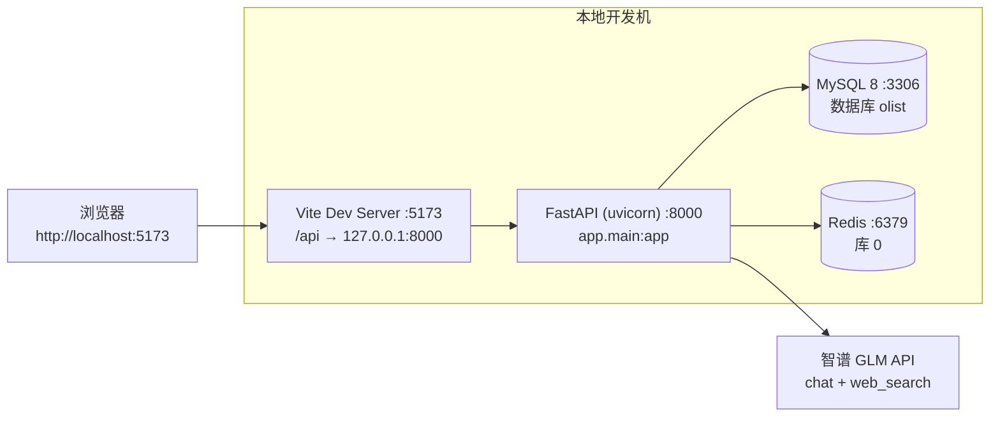

# 部署文档（Deployment）

> 项目：电商运营管理与智能分析平台
> 对应论文章节：系统实现 / 部署
> 对应设计总纲：第 16 章（Docker 部署与工程化）
> 现状：**手工部署可跑通**；Docker Compose 一键启动**尚未实现**（见第 6 章）。

## 1. 部署架构



| 组件 | 是否必需 | 缺失后果 |
|------|----------|----------|
| MySQL 8.x + `olist` 库 | 必需 | 所有业务接口 500 |
| Redis | 必需（当前实现） | 总览/趋势/排行/库存列表/库存预警/补货/AI 联网搜索等**缓存路径**接口 500 |
| 智谱 `ZHIPU_API_KEY` | 当前必需 | **后端进程无法启动**（客户端在模块导入期初始化，见 `docs/10_ai_design.md` AI-01） |
| Node 环境 | 仅前端需要 | 前端无法构建/启动 |

## 2. 环境要求

| 项目 | 版本/要求 | 本机实测 |
|------|-----------|----------|
| 操作系统 | Windows 10/11（PowerShell） | Windows |
| Python | 3.10+（本项目使用 3.14） | **3.14.7**（`.venv`，`include-system-site-packages=false`） |
| MySQL | 8.x，字符集 utf8mb4 | MySQL 8.x（库 `olist`） |
| Redis | 5.x+ | `redis://localhost:6379/0` |
| Node.js | 18+（Vite 6 要求） | 用于 `npm run dev/build` |
| 磁盘 | 原始 CSV 约 120 MB + 数据库约 1 GB 级 | — |

Python 依赖安装（在项目根目录）：

```powershell
# 使用仓库内置虚拟环境（推荐）
.\.venv\Scripts\Activate.ps1
pip install -r requirements.txt
```

> `requirements.txt` 已包含 `zai-sdk==0.2.3`（`backend/app/tools/web_search.py` 的联网搜索依赖）与 `pytest==9.1.1`（用例框架），按该文件重建环境即可直接跑测试。
>
> `requirements.txt` 按 `pip freeze` 全量导出，同时含 `jupyter`/`notebook` 等与运行无关的开发依赖，属已知冗余（不影响安装）。

## 3. 手工部署步骤

### 步骤 1：准备 MySQL 与 Redis

```powershell
# 1.1 启动 Redis（Windows 服务方式或前台运行）
redis-server

# 1.2 创建数据库（必须手工执行，见下方说明）
mysql -uroot -p -e "CREATE DATABASE IF NOT EXISTS olist DEFAULT CHARACTER SET utf8mb4;"
```

> **注意**：`data/database_create.sql` 第 1 行 `#create database olist;` 是**被注释掉的**，脚本内只有 `use olist;`。因此**必须先手工建库**，否则导入 DDL 会因库不存在而失败。

### 步骤 2：配置环境变量

在 `backend/` 下创建 `.env`（该文件已被 `.gitignore` 忽略，**不要把真实密钥写进文档或仓库**）。仓库提供了模板 `backend/.env.example`：

```powershell
Copy-Item backend\.env.example backend\.env
# 然后填入真实值
```

```dotenv
DATABASE_URL=mysql+pymysql://<user>:<password>@localhost:3306/olist?charset=utf8mb4
SECRET_KEY=<随机 32 字节以上的字符串>
REDIS_URL=redis://localhost:6379/0
ZHIPU_API_KEY=<智谱开放平台申请的 API Key>
```

| 变量 | 读取位置 | 缺失后果 |
|------|----------|----------|
| `DATABASE_URL` | `app/db/session.py`、`data/scripts/clean_fir.py` | 后端起不来；清洗脚本直接 `raise SystemExit` |
| `SECRET_KEY` | `app/core/security.py` | JWT 签发/校验失败 |
| `REDIS_URL` | `app/core/redis.py` | 缓存路径接口 500 |
| `ZHIPU_API_KEY` | `app/services/AI.py`、`app/tools/web_search.py` | **后端进程无法启动**（客户端在导入期初始化） |

> **本步骤必须在步骤 4（数据清洗）之前完成**：`clean_fir.py` 已改为从 `backend/.env` 读取 `DATABASE_URL`，未配置会直接退出。

### 步骤 3：导入建表脚本

```powershell
mysql -uroot -p olist < data/database_create.sql
```

该脚本当前包含：

| 内容 | 数量 | 说明 |
|------|------|------|
| 业务表 `olist_*_dataset_clean` / `product_category_name_translation_clean` | **9 张** | 与 9 个原始 CSV 一一对应 |
| 索引 | 9 个 | customers(customer_unique_id)、order_items(product_id/seller_id)、payments(payment_type)、reviews(order_id/review_score)、orders(customer_id/purchase_timestamp)、products(product_category_name) |
| 应用表 | **0 张** | 有意不写，由 `create_all` 创建（见下） |

9 张应用表（`system_user`、`system_role`、`system_permission`、`system_user_role`、`system_role_permission`、`inventory`、`inventory_log`、`operation_log`、`ai_analysis`）**不在该脚本内**，由后端启动时 SQLAlchemy 的 `Base.metadata.create_all(bind=engine)`（`backend/app/main.py` 最后一行）自动创建。

> **设计决策（不变）**：应用表由 `create_all` 负责创建，`database_create.sql` 只保留 9 张业务表 DDL + 索引。这样表结构只有 ORM 一个定义来源，避免"ORM 与 SQL 两份 DDL 漂移"。
> 代价是应用表无显式 DDL、无外键约束；并且**必须以 `uvicorn app.main:app` 启动**才会触发建表。

### 步骤 4：数据清洗与入库

```powershell
.\.venv\Scripts\Activate.ps1
python data\scripts\clean_fir.py
```

脚本路径与连接方式（**已改造完成**）：

| 项 | 现状 |
|----|------|
| CSV 路径 | 基于 `Path(__file__).resolve().parents[2]` 推导项目根目录，统一走 `RAW_DIR = <项目根>/data/raw`，**已无绝对路径** |
| 数据库连接 | `load_dotenv(<项目根>/backend/.env)` → `create_engine(os.getenv("DATABASE_URL"))`，**已无明文密码**；未配置时报 `未找到 DATABASE_URL，请先在 backend/.env 中配置` 并退出 |
| 输出位置 | 仍直接 `to_sql` 写 MySQL，**不落本地 CSV**（`data/processed/` 目录不存在，详见第 5 章） |

遗留问题：

| 问题 | 说明 | 处理建议 |
|------|------|----------|
| 重复执行会脏数据 | `to_sql(..., if_exists='append')` 且无清表 | 重跑前先 `TRUNCATE` 对应 9 张 `olist_*_clean` 表，或改为先删后插 |

### 步骤 5：初始化库存

```powershell
python backend\seed_inventory.py
```

| 项 | 说明 |
|----|------|
| 作用 | 为每个商品补全 `inventory` 记录，并**重建** `inventory_log`（每商品 2 条自洽日志：期初初始化 + 采购入库） |
| 硬编码连接 | `CONN = dict(host='localhost', user='root', password='mysql', database='olist', ...)`（同样建议改为环境变量） |
| 幂等性 | `inventory` 用 `ON DUPLICATE KEY UPDATE` 补缺；`inventory_log` 会先 `DELETE FROM inventory_log` 再重建（**有副作用**） |
| 实测结果 | `inventory_log` 65,905 行，全部由该脚本产生；脚本自带 6 项一致性校验（`before+change=after`、最新日志 `after` = 当前库存、无悬空外键） |

### 步骤 6：运行单元测试（可选，建议执行）

```powershell
# 项目根目录
.\.venv\Scripts\python.exe -m pytest
```

| 项 | 说明 |
|----|------|
| 用例位置 | `backend/tests/`（`test_security.py`、`test_response.py`、`test_api_contract.py`） |
| 配置 | 项目根目录 `pytest.ini`（`testpaths = backend/tests`、`pythonpath = backend`） |
| 覆盖范围 | 密码哈希与 JWT 签发/校验、统一响应体结构、`deps.py` 的登录鉴权（401）与权限校验（403）、分页参数边界（`page>=1`、`1<=page_size<=100`） |
| **不依赖外部服务** | 用例刻意不导入 `app.main`（该模块在导入期执行 `create_all` 会连 MySQL），因此**无需启动 MySQL / Redis 也能跑通** |
| 实测结果 | `35 passed`（0.6s 内） |

### 步骤 7：启动后端

```powershell
.\.venv\Scripts\Activate.ps1
cd backend
python -m uvicorn app.main:app --reload --port 8000
```

| 说明 | 内容 |
|------|------|
| 启动入口 | 必须是 `app.main:app`（`create_all` 写在该模块末尾，换成 `app:app` 会导致应用表不创建） |
| 启动副作用 | 导入 `app.api.AI` → 导入 `app.services.AI` → **立即构造智谱客户端**，缺 Key 时进程退出 |
| 自检 | 浏览器打开 `http://127.0.0.1:8000/healthy`，返回 `{"code":0,"message":"ok","data":null}` |

### 步骤 8：启动 / 构建前端

```powershell
cd frontend
npm install

# 开发模式（默认 5173，走 Vite 代理）
npm run dev

# 生产构建（产物在 frontend/dist）
npm run build
npm run preview
```

Vite 代理配置（`frontend/vite.config.js`）：

```js
server: {
  port: 5173,
  proxy: { '/api': { target: 'http://127.0.0.1:8000', changeOrigin: true } }
}
```

| 说明 | 内容 |
|------|------|
| 前端请求前缀 | 所有接口走 `/api`（`src/utils/request.js` 的 `baseURL='/api'`），因此**必须**有代理或反向代理把 `/api` 转发到后端 |
| 生产环境 | `npm run build` 产物需由 Nginx 等托管，并配置 `/api` 反向代理到后端；该 Nginx 配置**尚未提供（待补充）** |

## 4. 端口与访问地址

| 服务 | 端口 | 访问地址 | 说明 |
|------|------|----------|------|
| 后端 API | 8000 | `http://127.0.0.1:8000` | uvicorn |
| Swagger 文档 | 8000 | `http://127.0.0.1:8000/docs` | FastAPI 默认开启，未做鉴权 |
| 健康检查 | 8000 | `http://127.0.0.1:8000/healthy` | 唯一无 `/api` 前缀的接口 |
| 前端开发服务 | 5173 | `http://localhost:5173`（登录页 `/login`） | Vite；被占用时会自动换端口，但代理 target 不变 |
| MySQL | 3306 | `localhost:3306/olist` | — |
| Redis | 6379 | `redis://localhost:6379/0` | — |

## 5. 初始化数据与脚本清单

| 脚本 | 路径 | 作用 | 状态 |
|------|------|------|------|
| 建表 DDL | `data/database_create.sql` | 9 张业务表 + 9 个索引 | 可用；应用表由 `create_all` 创建（有意为之） |
| 原始质量检查 | `data/scripts/validate_raw.py` | 统计 9 张 CSV 的行数/缺失/重复/枚举/时间范围，输出 `data/quality/data_quality_stats.md`；使用相对路径，**可重跑** | 可用 |
| 清洗入库 | `data/scripts/clean_fir.py` | 清洗后 `to_sql` 直写 MySQL；相对路径 + 读 `backend/.env` 的 `DATABASE_URL` | 可用；**`append` 写入仍不幂等** |
| 库存初始化 | `backend/seed_inventory.py` | 补全 `inventory`、重建 `inventory_log` | 可用；**仍硬编码连接串** |
| 单元测试 | `backend/tests/` + 根目录 `pytest.ini` | 鉴权/权限/响应体/分页的 pytest 用例，不依赖 MySQL、Redis | 可用，`35 passed` |
| 本地 processed CSV | `data/processed/` | 存放清洗后的 CSV | **目录不存在**——实际在仓库中只有拼写为 `data/procsessed/` 的**空目录**（疑似笔误），`docs/05_data_processing.md` 与 `README.md` 中承诺的 processed CSV 尚未产出（待补充） |

目录现状（供部署核对）：

| 目录 | 内容 |
|------|------|
| `data/raw/` | 9 张原始 CSV（已 `.gitignore` 忽略，需从 Kaggle 自行下载解压） |
| `data/quality/` | `data_quality_stats.md` |
| `data/scripts/` | `validate_raw.py`、`clean_fir.py`、`test.ipynb`（后两者中 ipynb 已被忽略） |
| `data/procsessed/` | 空目录（**拼写与 README 不一致**） |
| `backend/tests/` | `conftest.py`、`test_security.py`、`test_response.py`、`test_api_contract.py` |
| 根目录 | `pytest.ini`、`requirements.txt`；`backend/.env.example` 为环境变量模板 |

## 6. 待完成的 Docker 化方案

设计总纲第 16 章要求 `docker compose up -d` 一键启动 backend / frontend / mysql / redis。**当前完全未实现**：

| 检查项 | 现状 |
|--------|------|
| `docker/` 目录 | 仅有一个空的 `__init__.py` |
| `Dockerfile`（后端/前端） | 不存在 |
| `docker-compose.yml` | 不存在 |
| `nginx.conf` | 不存在 |
| `.env.example` | **已存在**（`backend/.env.example`），总纲 16.1 的 `cp .env.example .env` 可执行 |
| `pytest.ini` / `backend/tests/` | **已存在**，可在构建阶段跑测试作为质量门 |

### 建议的服务清单

| 服务 | 基础镜像 | 端口映射 | 关键配置 |
|------|----------|----------|----------|
| `mysql` | `mysql:8.0` | `3306:3306` | `MYSQL_DATABASE=olist`、`MYSQL_ROOT_PASSWORD` 由 env 注入、`utf8mb4`、volume 持久化 `/var/lib/mysql`、把 `data/database_create.sql` 挂到 `/docker-entrypoint-initdb.d/` 首启执行、`healthcheck: mysqladmin ping` |
| `redis` | `redis:7-alpine` | `6379:6379` | 可不开持久化（缓存为主） |
| `backend` | 自建（`python:3.12-slim` 或与本地一致的 3.14） | `8000:8000` | `depends_on: mysql(healthy), redis`、`env_file: backend/.env`、启动命令 `uvicorn app.main:app --host 0.0.0.0 --port 8000`、把 `DATABASE_URL` 的 host 改为 `mysql`、`REDIS_URL` 改为 `redis` |
| `frontend` | 多阶段 `node:20-alpine` → `nginx:alpine` | `80:80` | 阶段 1 `npm ci && npm run build`；阶段 2 拷贝 `dist` 到 `/usr/share/nginx/html`，并配置 `location /api/ { proxy_pass http://backend:8000; }` |

### Dockerfile 要点

```dockerfile
# backend：仅要点，尚未落地
FROM python:3.12-slim
WORKDIR /app
COPY requirements.txt .            # 已含 zai-sdk==0.2.3
RUN pip install --no-cache-dir -r requirements.txt
COPY backend ./backend
WORKDIR /app/backend
CMD ["python", "-m", "uvicorn", "app.main:app", "--host", "0.0.0.0", "--port", "8000"]
```

```dockerfile
# frontend：多阶段构建要点
FROM node:20-alpine AS build
WORKDIR /app
COPY frontend/package*.json ./
RUN npm ci
COPY frontend .
RUN npm run build

FROM nginx:alpine
COPY --from=build /app/dist /usr/share/nginx/html
# 另需 nginx.conf：location /api/ { proxy_pass http://backend:8000; }
```

### 容器化必须一并解决的问题

1. `ZHIPU_API_KEY` 缺失导致后端起不来 → 需先做 AI 客户端惰性初始化，否则 compose 里 `backend` 容器会反复重启。
2. ~~`clean_fir.py` 的绝对路径与硬编码连接串~~ **已完成**：脚本现基于 `__file__` 定位项目根、连接串读 `backend/.env` 的 `DATABASE_URL`，容器内可直接执行（注意把 host 指向 `mysql` 服务名）。
3. 首次启动初始化耗时较长（清洗 100 万行 geolocation 等），建议做成一次性 job 容器或在文档中说明"首次需手工执行初始化"。
4. `frontend/dist` 的 `/api` 反向代理必须与 compose 服务名一致（`backend`）。
5. 应用表由 `uvicorn app.main:app` 导入期 `create_all` 建立 → 容器启动顺序必须是 `backend` 起来之后才可用，不能在 `mysql` 初始化脚本里假设应用表已存在。
6. 可在镜像构建阶段执行 `pytest` 作为质量门（用例不依赖 MySQL / Redis，适合放进构建流程）。

## 7. 常见故障排查

| 现象 | 原因 | 排查与处理 |
|------|------|-----------|
| **改了代码但接口行为没变** | **旧的后端进程仍占用 8000 端口**，新启动的 uvicorn 起在别的端口或被拒绝 | 先查占用：`netstat -ano \| findstr :8000` 或 `Get-NetTCPConnection -LocalPort 8000`；再强制结束：`Stop-Process -Id <PID> -Force`；确认释放后再启动。**这是本项目最常见的"新代码不生效"原因** |
| 前端突然跳回登录页 | `src/utils/request.js` 响应拦截器：状态码 **401** 会清空 `localStorage` 的 token/username/role 并 `window.location.href='/login'` | 正常行为。JWT 有效期 **30 分钟**（`create_access_token`），过期即 401，重新登录即可 |
| 前端接口提示"没有权限执行此操作" | 后端返回 **403**：token 有效但角色缺权限（`require_permission`） | 用 `/api/auth/me` 确认角色；核对 `ROLE_MENUS`（admin/operator/warehouse）与后端权限是否对齐 |
| 接口返回 `Not authenticated` | 未带 `Authorization` 头；`HTTPBearer` 对**缺失凭证返回 401**（实测，非 403），body 为 `{"code":401,"message":"Not authenticated","data":null}` | 检查前端 `request.js` 是否已附加 `Authorization: Bearer <token>` |
| 总览/库存/AI 联网搜索报 500 | **Redis 未启动**：`get_cache` 直接抛 `ConnectionError`，代码无降级 | 启动 Redis 并确认 `REDIS_URL` 可连通；长期方案是给缓存读写加 try/except（见 `docs/10_ai_design.md` AI-11） |
| 所有业务接口 500，日志显示连接错误 | MySQL 未启动、连接串错误或库不存在。注意 `create_engine` 在**导入期不建立连接**，因此错误会延迟到第一个请求才暴露 | 核对 `backend/.env` 的 `DATABASE_URL`，用 `mysql -uroot -p olist` 手工验证连通性 |
| 后端进程启动即退出，报 Key/鉴权相关错误 | 缺少 `ZHIPU_API_KEY`（AI 客户端在导入期初始化） | 补全 `backend/.env`；这是已知缺陷，长期方案为惰性初始化 |
| 报 `No module named 'zai'` | 当前环境未装联网搜索 SDK（`requirements.txt` 已声明 `zai-sdk==0.2.3`，通常是旧环境未重装） | `pip install -r requirements.txt`（或单独 `pip install zai-sdk==0.2.3`） |
| 前端 `/api/**` 404 或跨域报错 | Vite 代理未生效 / 后端不在 8000 / 该端口被旧进程占用 | 检查 `vite.config.js` 的 `proxy.target`；生产环境需 Nginx 反代 `/api` |
| `npm run dev` 端口变成 5174 | 5173 被占用，Vite 自动顺延 | 代理 target 仍指向 8000，一般不影响；也可先释放 5173 |
| 应用表（inventory / ai_analysis 等）不存在 | 9 张应用表无 DDL（有意设计），只在 `app.main` 导入时由 `create_all` 创建 | 确认以 `uvicorn app.main:app` 启动（`create_all` 写在 `app.main` 模块末尾） |
| 中文乱码 | 库/表/连接串字符集不一致 | 建库用 `utf8mb4`，连接串带 `?charset=utf8mb4` |
| 数据库文件被同步/锁定异常 | 项目曾位于 OneDrive 同步目录（`.venv/pyvenv.cfg` 记录的原始路径为 `C:\Users\Zzz\OneDrive\Desktop\...`） | 建议把项目放到非云同步目录，避免文件锁与同步冲突 |
| 清洗脚本报文件不存在 | `data/raw/` 下缺少原始 CSV | 从 Kaggle 下载 Olist 数据集并解压到 `data/raw/`（脚本按项目根定位，与脚本所在目录无关） |
| 清洗脚本报 `未找到 DATABASE_URL` | `backend/.env` 不存在或未配置 `DATABASE_URL` | 参照 `backend/.env.example` 创建并填写（见步骤 2） |

## 8. 部署检查清单

| # | 检查项 | 命令 / 判定 | 结果 |
|---|--------|-------------|------|
| 1 | 虚拟环境与依赖 | `.\.venv\Scripts\Activate.ps1` 后 `python -V` 正常；`pip install -r requirements.txt` 无报错（已含 `zai-sdk`、`pytest`） | ☐ |
| 2 | MySQL 已启动且 `olist` 库存在 | `mysql -uroot -p -e "SHOW DATABASES;"` 含 `olist` | ☐ |
| 3 | `backend/.env` 四项变量齐备 | 参照 `backend/.env.example` 创建；四个变量均非空 | ☐ |
| 4 | `.env` 未被提交 | `git status` 中不含 `backend/.env`（`.gitignore` 已忽略） | ☐ |
| 5 | 9 张业务表 + 索引已导入 | `SHOW TABLES;` 含 9 张 `olist_*_clean` | ☐ |
| 6 | 原始 CSV 已就位 | `data/raw/` 下 9 个 CSV | ☐ |
| 7 | 清洗入库完成 | `python data\scripts\clean_fir.py`；orders 99,441 / order_items 112,650 / geolocation 19,015 等行数核对通过 | ☐ |
| 8 | 库存初始化完成 | `python backend\seed_inventory.py` 输出各项校验为 0 异常行 | ☐ |
| 9 | 单元测试通过 | `.\.venv\Scripts\python.exe -m pytest` → `35 passed` | ☐ |
| 10 | 后端启动成功 | `http://127.0.0.1:8000/healthy` 返回 `code:0` | ☐ |
| 11 | 应用表已自动创建 | `SHOW TABLES;` 含 inventory / inventory_log / operation_log / ai_analysis / system_* 共 9 张 | ☐ |
| 12 | Redis 可连通 | 总览接口不报 500；`redis-cli ping` 返回 PONG | ☐ |
| 13 | 登录链路可用 | 用 admin 账号登录后能进入 Dashboard | ☐ |
| 14 | 前端依赖与启动 | `npm install` 成功，`npm run dev` 起在 5173 | ☐ |
| 15 | 前端代理生效 | 浏览器 Network 中 `/api/**` 请求返回数据而非 404 | ☐ |
| 16 | AI 问答可用 | `/ai` 页面提问能返回 Markdown 答案 | ☐ |
| 17 | 8000 端口无残留旧进程 | `Get-NetTCPConnection -LocalPort 8000` 只剩当前会话 | ☐ |
| 18 | 生产构建可用 | `npm run build` 生成 `frontend/dist` | ☐ |
| 19 | Docker 一键启动 | `docker compose up -d`（**尚未实现，待补充**） | ☐ |

## 9. 待补充事项

| 位置 | 待补充内容 |
|------|------------|
| ~~第 2 章~~ | ~~`requirements.txt` 需补 `zai-sdk==0.2.3`~~ **已完成**（同时补入 `pytest==9.1.1`） |
| ~~第 3 章步骤 2~~ | ~~应用表 DDL 固化进 `database_create.sql`~~ **已决策不做**：由 `app.main` 的 `create_all` 建表，保持单一 DDL 来源 |
| ~~第 3 章步骤 3~~ | ~~`clean_fir.py` 改为相对路径 + 环境变量连接串~~ **已完成**（仍剩 `append` 不幂等，见第 4 章） |
| 第 3 章步骤 5 | `seed_inventory.py` 仍需改为读取环境变量连接串（当前硬编码 `root/mysql`） |
| 第 3 章步骤 8 | 生产环境 Nginx 配置（静态托管 + `/api` 反代） |
| 第 5 章 | `data/processed/` 目录与清洗后 CSV 产出（当前仅有拼写错误的空目录） |
| 第 6 章 | 完整的 `Dockerfile`、`docker-compose.yml`、`nginx.conf`（`.env.example` 已具备） |
| 全篇 | 迁移工具：**已决策暂不引入 Alembic**（见 `docs/06_database_design.md` §7） |
| 全篇 | 部署后的性能基线（启动耗时、首屏耗时、接口 P95）未采集 |